# Deep Learning Lecture Notes

## 0. Introduction

### 0.1 General Introduction To Deep Learning

> Deep Learning is a class of machine learning methods that use neural networks to learn representations from raw data.

什么是 deep learning? 简单的说， deep learning 是利用深度神经网络学习数据的表示的一种机器学习方法。这里的“深度”指的是神经网络的层数，而“学习数据的表示”指的是神经网络的参数，也就是说，我们通过调整神经网络的参数来学习数据的表示。

> There're two kinds of model, one is the discriminative
> model from $X$ to $Y$ , the other is the generative model
> from $Y$ to $X$ .(Yi Wu)

更加数学化地，我们有一个目标函数 $f$ ,而我们希望用一个带参数的神经网络 $NN_\theta$ 去拟合 $f$ ，使得 $NN_\theta(x) \approx f(x)$ ,这就是深度学习想做的事情，而找到这个 $\theta$ 的过程就是 ~~炼丹~~ 训练(train)。

根据所学习的 $f$ 的不同，我们可以把任务分成两类，从而对应两类不同的模型：生成式模型(Generative Models)和判别式模型(Discriminative Models)。例如，当数据是手写数字的图片时，生成式模型的目标是给定一个数字，生成一张图片，而判别式模型的目标是给定一张图片，判断这张图片是什么数字。

这两者在数学上的本质区别实际上是 $f$ 的性质，判别式模型学习的 $f$ 是一个**映射** $f(x)=y$ ,也就是说给定一个 $x$ (一般称作data),我们就有唯一对应目标的 $y$ (一般称作label,或许你会说对于噪声图片 $x$ 似乎也没有我们想要对应的 $y$ ，但是这里的讨论中，把定义域先当成我们想要的图片(训练图片，测试图片...))，而生成式模型则是给定 $y$ ,希望输出一个 $x$ ,学习的是**映射的"反函数"** $f^{-1}(y)=x$ .(也许追求严谨的人到这里已经看不下去了，但别急，后面有详细的解释)

到这里，你可能会发现我们一直在回避一个定义上的问题，这个函数的定义域和值域究竟是什么？还是回到手写数字-标签的例子，对 $y$ 的值域 $Y$ 这是简单的，就是所有标签的集合，而对于 $x$ 的定义域，事实上，作为一个神经网络，它可以接受的 $x$ 自然是所有可能图片的集合，然而我们并不关心它在大多数噪声图片上的表现，而是只关心我们想要的真正的数字图片的识别效果，也就是说，加入我们把所有图片的集合设为 $\Omega$ ,那我们关心的只是 $\Omega$ 的一个小子集 $X_0$ ,代表所有手写数字的图片的集合。

对于判别式模型, 我们希望 $NN(x)\approx f(x)(x\in X_0$ ).

$X_0$ 究竟是什么呢?我们可以发现这和我们任务的定义有关，并没有数学上严格的说法。我们有什么？一般来说，我们有一个由一些满足 $f(x)=y$ 的 $(x,y)$ 构成的训练集 $P$ , 并且可以确定的是， $P$ 中的 $x$ 一定被 $X_0$ 包含，而我们凭借训练数据也知道不了更多了！所以，事实上，神经网络的训练只是关心 $NN(x) \approx f(x) (x\in P)$ , 而我们默认了 $X_0$ 有一些比较好的内在的性质，使得这可以让 $NN(x) \approx f(x) (x\in X_0)$ 也成立。这称为泛化能力(Generalization Ability)。

这个假设在数学上一般当然不成立，我们称满足 $NN(x) \approx f(x) (x\in P)$ 但是不满足 $NN(x) \approx f(x) (x\in X_0)$ 的现象为过拟合(Overfitting),而研究如何避免过拟合是判别式模型训练的重要内容,对于模型泛化能力的研究也是
深度学习理论研究的重点防线之一。你或许已经可以在上面我们问题的表述中想到一点如何避免过拟合的想法，我们将在下面的章节中详细讨论。

> “或许你overfit的模型，学到的正是某个平行世界中的特征”(Yao Seminar)

对于生成式模型，定义就更加模糊了。Generally speaking, 我们希望找到 $NN$ ,使得给定 $y$ ,我们可以生成一个 $NN(y) = x$ , 使得 $x \in X_0$ , 并且 $f(x) = y$ .

此时，我们的 $P$ 可以和之前一样，是满足 $f(x) = y$ 并且 $x \in X_0$ 的 $(x,y)$ , 但我们注意到这个时候没有标签的 $x \in X_0$ 也有了意义，因为我们可以通过它学到 $X_0$ 的信息！所以，根据训练数据是否有标签，我们可以把生成式模型的训练分成有监督(supervised learning),无监督(unsupervised learning)和半监督(semi-supervised learning)三种情况,分别对应数据全部有标签，全部无标签和部分有标签的情况。(显然，对于无监督情况，我们不能完成给定标签的生成)

当然，上面关于目标的定义显然可以找到很多cheat的方法，例如直接从训练集中找一张符合要求图片输出就可以达到目标，所以这里就涉及到评判模型好坏的标准了。

我们先说比较简单的评判判别式模型好坏的方法，一般来说是找 $X_0$ 的另一个子集 $P'$ ,称为测试集,然后用 $NN(x)$ 和 $f(x)$ 在 $P'$ 上的差距来衡量，
而有一些大家都认可的测试集，从而可以比较大家生成模型的好坏。

然而，对于生成式模型，就没那么简单了，首先 $X_0$ 没有明确数学定义，而
在判别式模型里我们只需要一个公认的 $X_0$ 的子集就行了，但在生成式模型里，我们似乎一定得搞明白 $X_0$ 究竟是什么！于是，这导致生成式模型到现在也没有一个universal的标准，而对于不同的生成式模型，我们也会有不同的评判标准，这在后面会详细讨论。但回到我们关于 $X_0$ 的定义，不就是“手写数字”的集合的主观定义嘛！所以有一个“耍赖”的评判标准——直接主观判断！这也是为什么许多生成式模型的论文里，往往会放很多生成的图片的原因，这也确实在某种方面上更加有说服力。

### 0.2 Training

深度学习发展至今，对于给定的网络结构，如何训练网络已经有了很多成熟的方法，其中的核心就是优化理论中的重要算法:梯度下降。

于是，模型的训练现在以及变成了一个程序化的过程:

- 1.定义模型结构
- 2.定义一个损失函数，表示模型的好坏
- 3.定义一个基于梯度下降的优化算法，使得损失函数最小化
- 4.根据算法优化损失函数，得到最终模型

所以，对于任何一个任务，我们就分成了四个步骤，而这四个步骤中的每一步都非常重要，直接关系到最终生成的结果。我们之后对于模型的介绍也基本会按照这个框架来进行。对于第三步，由于它和模型无关，所以我们会在下面先做讨论，对之后的所有模型，方法都是类似的。

### 0.3 Gradient Descent

#### 0.3.1 GD

当然，最简单的办法就是直接用梯度下降，也就是说，我们直接计算损失函数对于参数的梯度，然后按照梯度的方向更新参数。这个方法的优点是简单直接，但对于大多数情况来说，根本不现实，大部分训练集的规模都是非常大的，而计算梯度的时间复杂度也不低。

#### 0.3.2 SGD

于是，我们引入了SGD(Stochastic Gradient Descent),也就是说，我们不是计算整个训练集的梯度，而是每次只取数据集的一部分，称为一个batch，计算这个batch的梯度，然后更新参数。这样做可以显著减少计算量，这也是深度学习中常见的优化算法。(事实上，人们后来发现，SGD因为内在的随机性，还可以有效减轻过拟合问题)

实际应用中，为方便起见，一般都是直接把整个测试集分成若干个batch，然后每次取一个batch进行训练，对所有batch训练完一遍称为一个epoch，然后重复若干个epoch直到收敛。**之后的所有优化算法都是基于SGD的改进，核心思想都是通过减小震荡，加快收敛,具体的数学表达式可能比较复杂或者奇怪，而数学上的严格证明也大多和实际应用有一定的差距，所以我们在这里只做简单的介绍。~~不想看可以直接跳到下一节~~**

SGD的数学表达式可以写成这样:

$$
\theta_{t+1}=\theta_t-\eta \nabla E_{x \sim B}[L(\theta_t, x)]
$$

,
其中

$B$ 是一个batch, $\eta$ 是学习率， $L$ 是损失函数。

#### 0.3.3 Momentum

然而，SGD有一个问题，就是在到达最优点的时候，由于梯度的方向不断变化，可能会导致震荡，于是，我们引入了Momentum,也就是说，我们不仅仅考虑当前的梯度，还考虑之前的梯度，这样可以减小震荡，加快收敛。

Momentum的数学表达式可以写成这样:

$$
v_{t+1}=\gamma v_t+\eta \nabla E_{x \sim B}[L(\theta_t, x)]
$$

$$
\theta_{t+1}=\theta_t-v_{t+1}
$$

其中 $\gamma$ 是一个超参数，一般取0.9左右。(超参数指的是不通过训练得到的参数，而是需要人为设定的参数，区别于神经网络的参数)

#### 0.3.4 Adam(Adaptive Moment Estimation)

Adam是一种结合了SGD和Momentum的优化算法，它的优点是可以自适应地调整学习率，从而可以更好地适应不同的数据集。

Adam的数学表达式可以写成这样:

$$
m_{t+1}=\beta_1 m_t+(1-\beta_1)\nabla E_{x \sim B}[L(\theta_t, x)]
$$

$$
v_{t+1}=\beta_2 v_t+(1-\beta_2)(\nabla E_{x \sim B}[L(\theta_t, x)])^2
$$

$$
\hat{m}_{t+1}=\frac{m_{t+1}}{1-\beta_1^{t+1}}
$$

$$
\hat{v}_{t+1}=\frac{v_{t+1}}{1-\beta_2^{t+1}}
$$

$$
\theta_{t+1}=\theta_t-\eta \frac{\hat{m}_{t+1}}{\sqrt{{\hat{v}_{t+1}}+\epsilon}}
$$

其中 $\beta_1,\beta_2$ 是超参数， $\epsilon$ 是一个很小的数，一般取 $10^{-8}$ 左右。

## 1. Discriminative Model

### 1.1 Structure & Loss Function

回顾我们的目标,我们希望找到 $NN_{\theta}$ ,使得 $NN_{\theta}(x) \approx f(x) (x\in X_0)$ , 而我们有一些训练数据 $P:\{(x,y)\}$ ,满足 $y=f(x)$ . 于是，我们先训练 $NN_{\theta}$ ,使得 $NN_{\theta}(x) \approx f(x) (x\in P)$ . 然而，对于离散的label,我们很难定义一个比较好的可以求导的损失函数，于是我们引入一个重要的思想:让我们的 $NN_{\theta}$ 对每个标签生成一个概率 $p_{\theta,y}(x)$ ，而我们的目的则变为找到 $\theta$ 使得 $p_{\theta,f(x)}(x)$ 尽可能接近 $1$ .

于是，这就引出了我们的损失函数的定义:交叉熵(cross-entropy)损失函数:

$$
L(\theta)=-\frac{1}{|P|}\sum_{(x,y)\in P}\log p_{\theta,y}(x)
$$

(对于一般的两个概率分布 $p,q$ ,交叉熵定义为 $H(p,q)=-\sum_x p(x)\log q(x)$ ,而上面的损失函数就是 $p$ 与一个 $f(x)$ 处单点分布的交叉熵)

### 1.2 Layers

说了这么多， $NN$ 的结构究竟是什么样？事实上， $NN$ 的结构是非常灵活（你也可以发明你想要的结构！），这里我们介绍一些常见的结构和它们的特点

#### 1.2.1 Fully Connected Layer & Activation Function

最常见的结构就是全连接层，它的数学表达式可以写成:

$$
f: \mathbb{R}^n \rightarrow \mathbb{R}^m, f(x)=\sigma(Wx+b)
$$

其中 $W \in \mathbb{R}^{m \times n}, b \in \mathbb{R}^m$ . 全连接层十分灵活，并且具有很强的表达能力（拟合各种函数的能力），同时可以很方便地进行维度的转换，许多简单的判别任务仅通过全连接层（和马上要说的）激活函数就可以达到比较令人满意的效果。

激活函数 $\sigma$ 是全连接层的重要组成部分，很容易证明，如果没有激活函数的话，事实上多少个全连接层复合都和一个没有区别，并且最终得到的是一个线性的函数，这大多数时候是不够的。(大多数判别任务并没有线性的特征！例如数字识别，把两个0的图片加起来取平均，得到的标签可能是8)常见的激活函数有 $sigmoid(x) = \frac{1}{1+e^{-x}}, tanh(x)= \frac{e^x-e^{-x}}{e^x+e^{-x}}, ReLU(x)=\max(0,x)$ 等等，在不同的任务中，不同的激活函数可能会有不同的效果。

#### 1.2.2 Convolutional Layer

全连接层表达能力非常强，但是，它也存在两个缺点：首先，由于向量的维度一般很大，所以参数量也很大，导致训练时间长；其次，全连接层没有用到数据的任何特点，而是只看成一个向量，这可能会导致过拟合的问题，并且也会浪费我们所知道的关于 $f$ 的某些信息
所以，对于图片类型的数据（这也是深度学习主要应用之一），我们想要引入一个新的结构，这就是卷积层。

卷积层的intuition来自两个观察:首先，对图片， $f$ 具有一个很好的性质,那就是平移不变性（想象把一张数字2平移1个像素，它仍然是2,并且人眼几乎看不出区别，但如果转化成向量以后，这两个向量也许完全不同）；其次，来自于人判断图片的方式：根据局部的特征来判断图片的内容。于是，我们引入卷积层来获得图片的局部特征。

卷积层的数学表达式可以写成:

$$
f: \mathbb{R}^{C_1\times n\times m} \to \mathbb{R}^{C_2\times n'\times m'} 
$$

 

$$
f(x)_{c_2,i,j} = \sum_{k=1}^{k_1}\sum_{l=1}^{k_2}W_{c_1,c_2,k,l}x_{c_1,i+k,j+l}+b_{c_1,c_2,k,l}
$$

这看上去很恐怖，但实际上表达的意思就是，我们用 $k_1\times k_2$ 的方框来“扫描”这个图片的每个区域，然后通过一个线性函数（称为卷积核）得到这个区域所对应的值，从而得到新的“图片”，称为特征图。

为什么卷积可以提取局部特征？我们可以用一个简单的例子来直观感受一下，假如我们想确定一张图片（每个像素范围在[0,1]内）中有没有一条长为3的竖线，形如（ $\begin{bmatrix}0&1&0\\0&1&0\\0&1&0\end{bmatrix}$ ），我们可以用一个 $3\times 3$ 的卷积核 $\begin{bmatrix}-1&1&-1\\-1&1&-1\\-1&1&-1\end{bmatrix}$ 来扫描这个图片，如果这个图片中有一条竖线，那么最终得到的特征图中，这个位置所对应的值就应该是3,否则不可能达到3.这就是卷积层提取局部特征的原理，特征图中的每个值都对应着原来图片中的一个局部的特征。

到这里，我们也可以很自然的引入池化层的概念：比如在上面判别竖线的例子中，只有很大的值代表我们提取到的特征，而对于不大不小的值，事实上没有特别大的意义，所以我们可以用最大池化的方式，保留特征图的每个 $K\times K$ 中的最大值。（一个夸张的例子就是在上面的例子中，如果对输出的整个特征图做最大池化，那么最终的输出就是一个 $1\times 1$ 的特征图，如果是3，那么就是有竖线，否则没有）

卷积层（池化层）的优点是参数量小（想象在上面寻找竖线的例子里，如果要用全连接层，我们至少要图片维度大小量级的参数！但是卷积层则只需要9个），可以很好地利用图片的局部特征，而且也可以很好地处理平移不变性的问题。对于卷积层输出的每个值，在原来的图片上和这个值相关的区域成为感受野(receptive field).

PS: 在卷积的“扫描”过程中，我们每次移动的步长也可以不为1,这样就可以起到降维的作用，步长被称为stride.一般地说，如果原图大小为 $n\times m$ ,卷积核大小为 $k_1\times k_2$ ,stride为 $s_1\times s_2$ ,那么输出的特征图大小为 $\lfloor \frac{n-k_1}{s_1} \rfloor \times \lfloor \frac{m-k_2}{s_2} \rfloor$ . 为了调整输出的大小，我们可以在原图的周围加一圈0，这被称为padding. 如果padding的大小为 $p_1\times p_2$ （ $p_1,p_2$ 分别是上下,左右的padding行/列数）
,那么输出的特征图大小为 $\lfloor \frac{n-k_1+2p_1}{s_1} \rfloor \times \lfloor \frac{m-k_2+2p_2}{s_2} \rfloor$ .

其中in_channels是输入的通道数（特征图的个数），out_channels是输出的通道数，kernel_size是卷积核的大小，stride是步长，padding是padding的大小。

### 1.2.3 Batchnorm Layer

Batchnorm是一种用来稳定训练的层，它和pooling层一样没有可训练参数，作用就是把每一层的输出都归一化到均值为0，方差为1的分布，这样可以使得每一层的输出都在一个比较稳定的范围内，从而避免数值过大或者过小导致的梯度消失或者爆炸问题。

在pytorch中，batchnorm层可以用如下的函数实现：

```python
torch.nn.BatchNorm2d(num_features)
```

其中num_features是输入的通道数。

### 1.3 Prevent Overfitting

#### 1.3.1 Regularization & Data Augmentation

还记得我们在前面提到的过拟合问题吗?

一般地说，我们只能训练 $NN$ ,使得 $NN(x) \approx f(x) (x\in P)$ , 而我们希望 $NN(x) \approx f(x) (x\in X_0)$ . 这里当然要假定 $X_0$ 有一些比较好的性质，否则这两者之间可能毫不相关。由于 $X_0$ 本身就没有数学上的严格定义，它表示我们实际需要判别的图片，那么，我们可以来思考一下， $X_0$ 和 $P$ 之间可能有什么关系?

一个很自然的想法就是 $X_0$ 和 $P$ 应该比较接近，从而，如果我们的 $f$ 在比较接近的数据上表现不会差很多的话，效果应该比较好。然而，这一点并不好刻画，我们转而限制一个与之正相关的量：模型的参数大小，这多少蕴含了模型梯度的大小，于是可以起到一定的作用。具体地，我们在损失函数中加入一个正则项，这个正则项一般是参数的范数，这样可以使得参数不会过大，从而避免过拟合。根据加入正则项的不同，我们可以分为L1正则和L2正则，分别是参数的绝对值和平方的和。而这个正则项的系数是一个人为设定的超参数，称为正则化系数(weight decay)。

除了对 $f$ 加以限制以外，我们还有另一个自然的想法：根据实际的情况自己扩展 $P$ !因为 $X_0$ 本来就是基于某些主观特征和性质定义的东西，所以我们可以直接根据这些性质来生成一些数据拓展 $P$ ,从而让模型在 $P$ 和 $X_0$ 的表现上更一致。例如，在识别数字中，我们知道一个数字随机加一点点小的扰动还是这个数字，于是我们可以把训练的数据加上一点噪声，标签不变，成为新的训练数据。这个过程被称为数据增强(Data Augmentation),常见的数据增强方法有旋转，翻转，缩放等等。

#### 1.3.2 Dropout

Dropout也是一种用来防止过拟合的方法，它主要是为了避免一些偶然出现但不具备generalization能力的非常强的特征。它的思想很简单：在训练的时候，我们随机地让一些神经元失活，也就是说，让它们的输出为0，这样可以使得模型不会过分依赖某些神经元，从而避免过拟合。

#### 1.3.3 Early Stopping

还有一个耍赖的方法:早停(Early Stopping)。它的思想也很简单，既然在 $P$ 上的表现和在 $X_0$ 上表现的关系我们弄不清，而事实上我们最终是用测试集来表示 $X_0$ 得到表现，那我们直接把训练集划出一部分作为验证集，然后在验证集上表现不再提升的时候停止训练。这在最终测试集和训练集的分布比较一致的时候是有效的，但是如果训练集和测试集的分布不一致，那么早停可能会导致模型在测试集上表现不好。

### 1.4 Structure

#### 1.4.1 CNN

CNN 的结构是卷积层和池化层的交替，最后加上全连接层，这样的结构可以很好地提取图片的局部特征，而且也可以很好地处理平移不变性的问题。CNN的结构是深度学习中最常见的结构，也是最有效的结构之一。

#### 1.4.2 ResNet

在CNN中，我们可以很容易地发现一个问题：随着网络的加深，梯度消失和爆炸问题会变得越来越严重，从而导致训练困难。ResNet的提出就是为了解决这个问题，它的核心思想是引入了一个shortcut，也就是说，我们不是直接把输入传到输出，而是把输入和输出相加，这样可以使得梯度更容易传播，从而可以训练更深的网络。具体地说，一个ResBlock的结构是这样的:

$$
f(x)=x+C(x)
$$

其中 $C(x)$ 是一个卷积层（一般由两个卷积层组成），这样，我们就可以很容易地训练一个很深的网络，而且也可以很好地处理梯度消失和爆炸问题。

#### 1.4.3 DenseNet

DenseNet是另一种解决梯度消失和爆炸问题的方法，它的核心思想是引入了一个dense block，也就是说，我们不是把输入和输出相加，而是把输入和输出拼接在一起，这样可以使得梯度更容易传播，从而可以训练更深的网络。具体地说，一个DenseBlock的结构是这样的:

$$
x_0 = input
$$

$$
x_i = concat(x_{i-1},C_{i-1}(x_{i-1}))
$$

其中 $C$ 是卷积层， $concat$ 是拼接操作，在每一次操作后，可以发现特征图的个数都在增加，于是到若干层以后，我们使用一个transition layer来减少特征图的个数，这就构成了DenseNet的结构。

> Densenet 是CVPR17的best paper, 是姚班学长做出来的，但是颁奖的时候他们在外面旅游导致没人领奖，场面一度尴尬.(Yi Wu)

### 1.5 Code Implementation

接下来，我们展示一些基于Pytorch的简单代码实现，由于作者水平有限，如果代码哪里有bug请不要骂我.

全连接神经网络:

```python
import torch
import torch.nn as nn
import torch.optim as optim
import torch.nn.functional as F

class Net(nn.Module):
    def __init__(self):
        super(Net, self).__init__()
        self.fc1 = nn.Linear(28*28, 512)
        self.fc2 = nn.Linear(512, 10)
    def forward(self, x):
        x = x.view(-1, 28*28)
        x = F.relu(self.fc1(x))
        x = self.fc2(x)
        return x
```

卷积神经网络：

```python
import torch
import torch.nn as nn
import torch.optim as optim
import torch.nn.functional as F

class Net(nn.Module):
    def __init__(self):
        super(Net, self).__init__()
        self.conv1 = nn.Conv2d(1, 32, 3, 1)
        self.conv2 = nn.Conv2d(32, 64, 3, 1)
        self.fc1 = nn.Linear(9216, 128)
        self.fc2 = nn.Linear(128, 10)
    def forward(self, x):
        x = F.relu(self.conv1(x))
        x = F.max_pool2d(x, 2, 2)
        x = F.relu(self.conv2(x))
        x = F.max_pool2d(x, 2, 2)
        x = x.view(-1, 9216)
        x = F.relu(self.fc1(x))
        x = self.fc2(x)
        return x
```

ResNet:

```python
import torch
import torch.nn as nn
import torch.optim as optim
import torch.nn.functional as F

class ResBlock(nn.Module):
    def __init__(self, in_channels, out_channels):
        super(ResBlock, self).__init__()
        self.conv1 = nn.Conv2d(in_channels, out_channels, 3, 1, 1)
        self.conv2 = nn.Conv2d(out_channels, out_channels, 3, 1, 1)
    def forward(self, x):
        x1 = F.relu(self.conv1(x))
        x2 = F.relu(self.conv2(x1))
        return x+x2

class ResNet(nn.Module):
    def __init__(self):
        super(ResNet, self).__init__()
        self.conv1 = nn.Conv2d(1, 32, 3, 1, 1)
        self.res1 = ResBlock(32, 32)
        self.res2 = ResBlock(32, 32)
        self.fc = nn.Linear(28*28*32, 10)
    def forward(self, x):
        x = F.relu(self.conv1(x))
        x = self.res1(x)
        x = self.res2(x)
        x = x.view(-1, 28*28*32)
        x = self.fc(x)
        return x
```

DenseNet:

```python
import torch
import torch.nn as nn
import torch.optim as optim
import torch.nn.functional as F

class DenseBlock(nn.Module):
    def __init__(self, in_channels, out_channels):
        super(DenseBlock, self).__init__()
        self.conv1 = nn.Conv2d(in_channels, out_channels, 3, 1, 1)
        self.conv2 = nn.Conv2d(in_channels+out_channels, out_channels, 3, 1, 1)
    def forward(self, x):
        x1 = F.relu(self.conv1(x))
        x2 = F.relu(self.conv2(torch.cat([x, x1], 1)))
        return torch.cat([x, x1, x2], 1)

class TransitionLayer(nn.Module):
    def __init__(self, in_channels, out_channels):
        super(TransitionLayer, self).__init__()
        self.conv = nn.Conv2d(in_channels, out_channels, 1, 1)
        self.pool = nn.AvgPool2d(2, 2)
    def forward(self, x):
        x = F.relu(self.conv(x))
        x = self.pool(x)
        return x

class DenseNet(nn.Module):
    def __init__(self):
        super(DenseNet, self).__init__()
        self.conv1 = nn.Conv2d(1, 32, 3, 1, 1)
        self.dense1 = DenseBlock(32, 32)
        self.trans1 = TransitionLayer(96, 64)
        self.dense2 = DenseBlock(64, 32)
        self.trans2 = TransitionLayer(96, 64)
        self.fc = nn.Linear(7*7*64, 10)
    def forward(self, x):
        x = F.relu(self.conv1(x))
        x = self.dense1(x)
        x = self.trans1(x)
        x = self.dense2(x)
        x = self.trans2(x)
        x = x.view(-1, 7*7*64)
        x = self.fc(x)
        return x
```

## 2. Generative Models

### 2.0 Introduction

还记得我们在Introduction里下的并不严谨的定义吗？

> 我们希望找到 $NN$ ,使得给定 $y$ ,我们可以生成一个 $NN(y) = x$ , 使得 $x \in X_0$ , 并且 $f(x) = y$ .

首先的一个问题就是， $y$ 很少但 $x$ 很多，而我们希望的肯定不是对于每个 $y$ 都输出固定的图片,所以我们想要的 $NN$ 并不是一个数学上的映射！那它究竟是什么呢？由于我们想对 $y$ 输出不同的 $x$ ，于是我们容易想到两种方法：一种是 $NN$ 本身就是一个随机函数，对于固定的 $y$ ,有可能输出很多种不同的 $x$ ; 另一种则是给 $NN$ 增加一个随机参数 $z$ , 使得 $NN(y,z)$ 是一个映射，并且希望 $f(NN(y,z)) = y$ . 对于前者，我们介绍Energy-based Model,对于后者，我们介绍VAE，flow model和GAN. 事实上，我们在训练模型的时候发现，对于不同的 $z$ 的分量，当我们连续变化的时候，可以注意到 $z$ 的这个分量有时就代表着图片的某个human readable的特征，所以 $z$ 也被称为latent variable.

### 2.1 Loss Function: MLE Training

那么，我们应该怎么定义一个损失函数？看上去我们还没有想法，因为我们甚至没有定义清楚问题！我们在开头说的不能每种label记住一张图片的问题一定要在我们的损失函数中体现出来，以及如何刻画 $X_0$ 中的图片也是一个问题。我们先从后者切入，既然我们现在已经有了一个概率模型，并且 $P$ 中的图片确定在 $X_0$ 中（我们在接下来讨论中先不考虑标签），那我们不妨优化 $P$ 中图片的概率，然后希望它有好的泛化能力，然而， $\sum_{x\in P}p(x)$
并不是一个好的优化目标，因为它不仅有之前每种label记住一张图片就可以优化到1的问题，它的量级也非常小（想像整个图片的可能性有多大！），从而几乎难以训练。

所以，一个好的损失函数至少应该满足三个性质：

- 1.要能体现训练集上的图片的“好”( $P\subset X_0$ )；
- 2.不能是特别小的量(不能和 $p$ 同等量级)；
- 3.不能有trivial的极值使得模型只关注数据集中的少数图片

于是，这就引出了一个非常聪明的损失函数估计MLE(Maximum Likelihood Estimation):

$$
L=\frac{1}{|P|}\sum_{x\in P}\log p(x)
$$

我们要对 $L$ 做梯度上升使之最大化（或者如果不习惯梯度上升，也可以对 $-L$ 梯度下降）。我们可以发现看到这个函数通过增加一个log函数，非常巧妙地在保留性质1的同时完美地解决了性质2和3的问题，此时 $L$ 的理论最大值在 $p(x)$ 在 $P$ 里每处都取 $\frac{1}{|P|}$ 时取到，并且一但某个图片被忽略，概率极小，那么整个 $L$ 会受到很大影响。

接下来，我们将介绍几种模型架构，并且使用MLE的损失函数来训练。

#### 2.1.1. Energy-based Model

既然我们的模型就是一个概率分布 $p(x)$ , 那么最简单粗暴的方法当然就是直接对每个 $x$ 用某个函数来表示他的概率，同样为了让相对大小在正常的量级上方便计算(同时也受物理学方面的一些启发，以及早期的一些network结构的研究)，我们考虑去对于每个 $x$ 定义一个能量函数 $E(x)$ 正比于 $-\log p(x)$ ，这唯一确定了概率分布 $p(x)=\frac{1}{Z}e^{-E(x)}$ ，其中 $Z$ 是归一化因子。

##### 2.1.1.1 Hopfield Network:Intro

一个简单的典型例子是Hopfield Network,它的输出是 $\{-1,1\}^n$ 中的向量，而能量函数被定义为 $E(x)=-\frac{1}{2}x^TWx$ ，其中 $W$ 是一个对称矩阵，也是我们需要训练的参数。

（值得一提的是，事实上，Hopfield Network最初并不是一个概率生成模型，而是一个用来store pattern的确定的能量模型，注意到如果让 $w=xx^T$ ,那么就可以知道 $x$ 的能量唯一最小，对于一般的多个 $x$ ,我们也希望通过构造适当的 $W$ 让 $x$ 们是能量极小点，从而通过在网络中梯度下降寻找极小值来找到储存的 $x$ .然而，有论文证明了， $N$ 个点的Hopfield Network 最多储存 $O(N \log N)$
个pattern, 并且这个上界是否可以改进还并不知道，这也从某种角度上说明了前面我们所担心model 会记住数据集的“过拟合”的问题并没有那么严重。）

基于hopfield network的概率生成模型被称为Boltzmann Machine. 虽然能量看上去定义简单，可是稍微想一想就会发现两个问题：因为我们要进行梯度下降，所以计算梯度的过程中肯定要用到归一化系数 $Z$ ,可是 $Z$ 根本算不出来！(事实上，对这种最简单的network,有一些数学上方法可以算出 $Z$ ，可是一旦网络稍微复杂一点， $Z$ 的计算就会毫无想法，想象 $E(x)$ 是一个神经网络的情形！) 更致命的是，即使我们得到了一个好的模型参数 $W$ ，我们怎么生成图片?我们能得到的只是给定一个图片的概率（其实甚至概率都不是，因为还没有归一化）

这两个问题对一般的energy-based model并没有通用的解决方案，事实上，这也是energy-based model最大的问题之一。接下来我们针对Hopfield Network, 给出一个解决方案，这个解决方案也可以适用到一类比较好的 $E(x)$ 的energy-based model上。

##### 2.1.1.2 Hopfield Network: Solving the problem

我们先写一下一般的energy-based model的损失函数：

$$
L=\frac{1}{|P|}\sum_{x\in P}\log \frac{e^{-E(x)}}{Z}=\frac{1}{|P|}\sum_{x\in P}(-E(x)-\log Z)
$$

从而

$$
\nabla L = \frac{1}{|P|}[\sum_{x\in P}-\nabla E(x)]-\frac{\nabla Z}{Z}
$$

我们发现前面半段是容易的，直接用SGD就可以计算，但真正恶心的是后面的 $\frac{\nabla Z}{Z}$ 项，因为 $Z$ 根本算不出来！更不用说梯度了。那么我们怎么办呢？这个时候就体现出我们定义的这个概率函数的好处了，我们可以来进行一些简单的计算。

$$
Z= \sum_{x}e^{-E(x)}=\sum_{x}e^{\frac{1}{2}x^TWx}
$$

$$
\nabla_W Z = \sum_{x}e^{\frac{1}{2}x^TWx}\nabla_W(\frac{1}{2}x^TWx)=\sum_{x}e^{\frac{1}{2}x^TWx}\frac{1}{2}x^Tx
$$

所以

$$
\frac{\nabla_W Z}{Z} = \frac{\sum_{x}e^{\frac{1}{2}x^TWx}\frac{1}{2}x^Tx}{\sum_{x}e^{\frac{1}{2}x^TWx}}=\frac{\sum_{x}e^{\frac{1}{2}x^TWx}\frac{1}{2}x^Tx}{Z}
$$

$$
=\frac{1}{2}\sum_{x}\frac{e^{\frac{1}{2}x^TWx}}{Z}x^Tx
$$

我们发现一个神奇的事情， $\frac{e^{\frac{1}{2}x^TWx}}{Z}$ 正是我们取到 $x$ 的概率!所以实际上这个式子就是我们在计算 $E_{x \in D}x^Tx$ ，其中 $D$ 是我们的概率模型所代表的概率分布。这样，我们就可以通过采样来估计这个值，从而计算梯度。

总结一下，

$$
\nabla_{W}(L)=\frac{1}{|P|}(\sum_{x\in P}x^Tx)-E_{x \in D}x^Tx
$$

其中 $D$ 是当前的概率模型所代表的概率分布。（我们在下文中也采取这个记号表示当前模型所对应的概率分布）你可能会注意到我们丢掉了系数 $\frac{1}{2}$ ,这是因为我们之前假设 $W$ 是一个对陈矩阵，所以每个分量的梯度实际上被计算了两次，当 $W$ 不是对陈矩阵的时候，我们就需要加上这个系数。不过一般来说，这个系数并不重要，因为我们的目的是让梯度下降，而这个系数只是一个缩放。

前面一项可以直接计算（在SGD中就是对取出的batch计算），而后面的一项可以通过采样来估计，于是我们就完成了整个过程...吗？并没有！因为我们始终还没有解决一个重要的问题：如何从 $D$ 里面采样！

接下来，我们将介绍一系列sampling的方法，用来解决sampling的问题。形式化地，我们现在有一个很大的集合 $X$ ,以及一个 $X$ 上的概率分布 $D$ ,但是我们可以计算的只是对于单个的 $x$ 所对应的未归一化的概率 $p(x)$ ,我们希望从 $D$ 中采样,或者计算某些函数在 $D$ 上的期望。

##### 2.1.1.3 Sampling Methods

###### 2.1.1.3.1 Gibbs Sampling

Gibbs Sampling是一种常见的采样方法，它的基本思想是，我们先随机取一个 $x=(x_1,\dots,x_n)$ ,然后以概率 $(x_i|x_1,\dots,x_{i-1},x_{i+1},\dots,x_n)$ 更新 $x_i$ 的值，重复直到收敛（in pratice, 可能会出现在某个小范围震荡不收敛的情况，这个时候我们近似认为这个小区域内每个都差不多，于是实际的过程就是重复更新足够多次然后取一个）。

这在给定(n-1)个分量后， $p(x_1,x_2,\dots,x_{i-1},x_{i+1},\dots,x_n)$ 的条件概率是一个简单的分布的时候是非常有效的，例如在Hopfield Network中，条件分布事实上就是一个两点分布(别忘了我们的定义 $x_i\in\{-1,1\}$ ),然而，对于一般的条件概率不好算的连续分布，我们还需要更多的方法来计算。

###### 2.1.1.3.2 Importance Sampling

Importance Sampling 用来解决计算在某个分布下估计函数期望的问题，具体地，如果我们要估计 $E_{x \sim p}f(x)$ , 但从 $p$
中采样及其困难，因为我们只有未归一化的概率而没有归一化系数。那么，我们可以找一个简单，好采样的分布 $q$ , 然后估计 $E_{x \sim q}f(x)\frac{p(x)}{q(x)}$ ，这两个期望在数学上是相等的，然而通过“换元”我们得到了一个更好采样的分布。

我们可以用一个例子来理解Importance Sampling: 假如面前有 $N$ 箱不同的水果，每箱水果的种类和个数都不一样（单个箱子里的水果重量都是一样的），我们想通过采样来算出单个水果的平均重量。(重量代表 $f$ ,每箱水果代表一个 $x$ ,个数代表未归一化的 $p$ )

一个自然的想法是随机取若干个水果取平均，然而，由于箱子数太多，我们根本不能全打开，从而我们不知道水果的总个数，于是无法真正“均匀随机”取出水果！于是自然的想法就是我们均匀随机取1~N对应的箱子，对这些箱子中所有水果的重量取平均，这样我们就得到了一个估计值。这个估计值的期望就是我们想要的平均重量，这对应的是 $q$ 是uniform的情况。 $q$ 非uniform 的情况的intuition是，假如我们知道1~10号箱子里的水果特别多，占了总数的90%，然而在1~N的均匀随机取样中却有可能根本取不到这些箱子，导致估计值严重缺乏真实性。

于是，我们可以将这些箱子 $x$ 每个都拆成 $q(x)$ 个小“箱子”，这样就可以使取到的概率提升，但每箱中水果的个数就变成了 $\frac{p(x)}{q(x)}$ 个，这就对应了我们的公式。

从这个例子里可以看出，因为我们最理想的情况其实是均匀随机取出一个水果采样，所以最优策略是要让每个小箱子里水果数都一样，也就是 $p$ 和 $q$ 尽可能接近。从数学上可以证明，当它们正比时，估计值的方差最小。

###### 2.1.1.3.3 Metropolis-Hastings Algorithm

Metropolis-Hastings Algorithm 是Gibbs Sampling 的推广。想象我们在Gibbs Sampling的时候，相当于构造了一个随机过程，然后希望这个随机过程最终收敛到我们的概率分布。那么，我们是否可以构造一个更一般的随机过程，使得它最终收敛到我们的概率分布呢？这就是Metropolis-Hastings Algorithm的思想。

具体地，我们先任意构造一个proposal distribution $q(x'|x)$ , 希望表示在随机过程中 $x'$ 转移到 $x$ 的概率（密度），然而随便构造 $q$ 显然不能让这个随机过程的稳定分布是我们想要的概率分布，于是我们引入一个接受概率 $A(x\rightarrow x')$ ，这个概率表示在 $x$ 的情况下，我们接受 $x'$ 的概率，具体地，我们有

$$
A(x\rightarrow x')=\min\{1,\frac{p(x')q(x|x')}{p(x)q(x'|x)}\}
$$

最终，我们的随机过程定义为：对当前的 $x$ ,在 $q(x'|x)$ 下采样一个 $x'$ ,然后以概率 $A(x\rightarrow x')$ 接受 $x'$ ,否则保持 $x$ ，重复这个过程直到收敛。可以证明，在 $p$ 满足一些连续性条件的情况下，这个随机过程的稳定分布是我们的概率分布。

##### 2.1.1.4 Boltzmann Machine

现在我们有了采样方法，终于可以来训练基于Hopfield Network的Boltzmann Machine了！ 具体的训练过程如下

- 1.初始化 $W$
- 2.使用Gibbs Sampling采样，从而估计梯度，做梯度下降

$$
\nabla_W L = \frac{1}{|P|}(\sum_{x\in P}x^Tx)-E_{x \in D}x^Tx
$$

- 3.重复2直到收敛

在实际应用中，为了提高模型的表现力，我们可以让 $x$ 的维度实际上大于需要的图片的维度，只让 $x$ 的前面的维度代表生成的值，而剩余的维度被称为Hidden Neurons,通过增加Hidden Neurons的数量，我们可以大大增加模型的表现力。

加上了Hidden Neurons的Boltzmann Machine已经可以解决黑白图片去噪和补全的任务了，并且效果还比较令人满意。


然而，这样的Boltzmann Machine还有一个很大的问题，计算开销实在是太大了！我们每一次梯度下降的时候都需要进行采样，而采样是一个非常多步骤的Gibbs Sampling,更加致命的是还无法并行！于是，Paul Smolensky提出了Restricted Boltzmann Machine的想法， 并被Hinton实验成功。

具体的说，我们让最终矩阵是一个 $2\times 2$ 分块的矩阵，并且有两块是 $O$ ,也就是说，Visible Neurons两两之间的乘积的系数以及Hidden Neurons 两两之间乘积的系数都是0.
这样，我们发现可以对所有Hidden Neurons(Visible Neurons)并行地做Gibbs Sampling! 从而，我们更新一轮需要做Gibbs Sampling的次数从节点个数次直接下降到了2次，极大提高了效率。

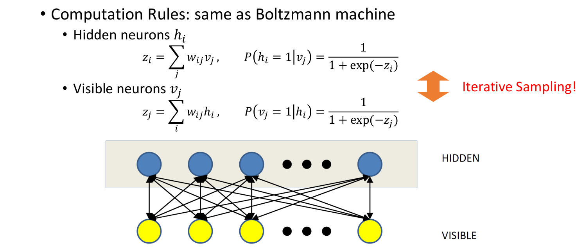

#### 2.1.2 Normalizing Flow

##### 2.1.2.1 Intro

Energy-based model非常灵活，并且理论上来说每个概率分布都可以对应一个energy-based model，所以事实上所有模型都可以理解成energy-based model. 但是最大的缺点就是实在太麻烦了！即使在使用很多优化的情况下，还是非常麻烦，因为始终避免不了取样！那么能不能简单一点呢？首先是随机性问题，那我们就直接开始给定一个随机的变量 $z$ ,然后训练一个确定的网络从 $z$ 生成 $x$ ,那 $x$ 不也有随机性了吗？这样的 $z$ 被称为隐变量(latent variable)，因为在实验中，人们发现它的一些维度恰好代表了某些human readable的特征，比如颜色，大小等等。这样一来，我们的生成就不需要从整个概率分布里采样（我们也不知道整个概率分布的密度函数），而是直接随机采样一个 $z$ ,然后生成 $x$ 就行了！

##### 2.1.2.2 Structure

为了生成 $x$ , 我们采用一系列变换层 $f_1$ , $f_2$ ,..., $f_k$ ,最终 $x=f_k\circ f_{k-1}\circ \dots \circ f_1(z)$ 。于是，采样的复杂问题直接解决了，但训练的时候仍然有一些问题。微积分的知识告诉我们，如果 $f_i$ 都是可逆函数的话，那么 $p(x)$ 就是 $p(z)$ 再乘上 $f_i$ 的雅可比行列式的乘积，这里 $z=NN^{-1}(x)$ 但Jacobi行列式需要 $O(d^3)$ 的复杂度!(其中 $d$ 是向量的维度)这么大的计算量是不可接受的。所以，flow model 最重要的目标就在于找到Jacobi行列式好算的，同时表现力又比较强的函数 $f$ .

##### 2.1.2.3 Planar Flow

Planar Flow 的想法来源于数学上的Matrix Determinant Lemma:

$$
\det(A+uv^T)=(1+v^TA^{-1}u)\det A
$$

从而，如果我们构造

$$
f(z)=z+u\cdot tanh(w^Tz+b)
$$

（其中 $u,w,b$ 是参数， $\cdot$ 代表分量对应相乘）
这样，我们可以发现

$$
\det(\frac{\partial f}{\partial z})=\det(I+h'(w^Tz+b)uw^T)
$$

 

$$
=1+h'(w^Tz+b)u^Tw
$$

从而我们可以在 $O(d)$ 的时间里计算出Jacobi行列式！

##### 2.1.2.4 RealNVP

planar flow的想法固然高级，可是函数似乎只是对着lemma凑出来的，为了让Jacobi行列式计算简单，真的要这么复杂吗？事实上并不用！我们发现有一类行列式计算非常简单：三角矩阵的行列式！而Jacobi矩阵是三角矩阵的条件其实就是 $f(x)$ 的第 $i$ 个分量只依赖于 $x_1,x_2,\dots,x_i$ ,但这个限制实际上并不会很强！并且我们可以在不同的 $f$ 之间对 $x$ 进行重排，这样大大增加了模型的表达能力。由此，便引出了RealNVP的结构：

$$
f:x \to z
$$

$$
z_{1:m} = x_{1:m}
$$

$$
z_{m+1:d}=x_{m+1:d}\cdot e^{\alpha(x_{1:m})}+\mu(x_{1:m})
$$

其中 $\alpha,\mu$ 是待训练的神经网络。

下图右侧是RealNVP的生成结果，可以看到已经达到了很高的水平


同时，通过对 $z$ 的插值，先取定四个值 $z^0,z^1,z^2,z^3$ ，然后让 $z=cos \alpha (cos \beta z^0 + sin \beta z^1)+ sin \alpha (cos \beta z^2 + sin \beta z^3)$ ,可以观察到图片的特征连续变化的过程。
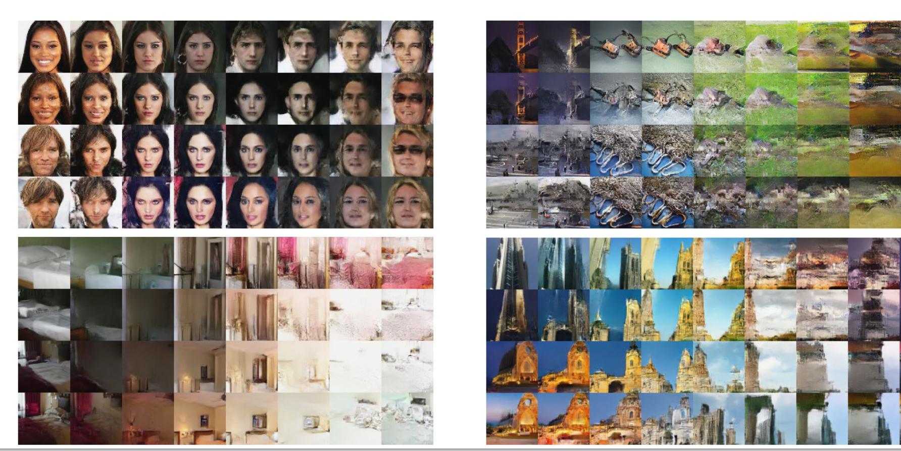

##### 2.1.2.6 Autoregressive Flow

在说Autogegressive flow之前，我们先说一下Autoregressive(自回归)的概念，它是一个数学上的概念，表示用 $x_1,x_2,...x_{i-1}$ 来预测 $x_i$ (和之前的区别是用自己预测自己！之前是 $z_1,z_2,...,z_{i}$ 获得 $x_i$ ).也就是说，我们是不是可以 $f(x)$ 的第 $i$ 个分量不仅仅依赖于 $z$ ,而是也依赖于前面的分量？

从而，我们可以定义Autoregressive Flow的结构:

$$
f:x \to z
$$

$$
x_i = e^{\alpha_i}z_i+\mu_i
$$

$$
\alpha_i =\alpha(x_1,x_2,...,x_{i-1})
$$

$$
\mu_i = \mu(x_1,x_2,...,x_{i-1})
$$

其中 $\alpha,\mu$ 是神经网络
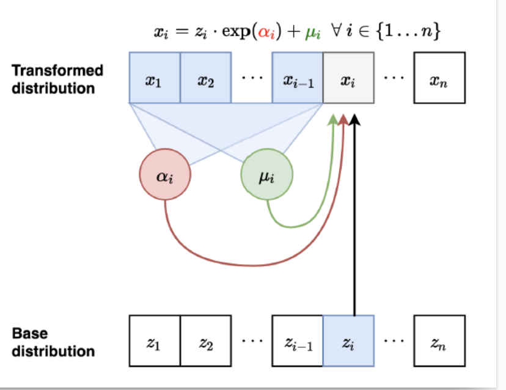

在这里，你可能会注意到一个问题，在不同的计算过程中 $\alpha$ 和 $\mu$ 接受的参数个数不一样！如何解决这个问题呢？其实很简单，我们直接让它们接受的参数个数就是维度 $d$ ,然后把第 $i$ 维之后的全部设成0就行了，这个过程称为mask.具体实现就是让输入逐分量乘上一个 $mask=(1,\dots,1,0,\dots,0)$ .

我们介绍一个相关的工作:Pixel CNN.

它的想法是仍然保持图片的形状 $N\times N$ ,然后 $\alpha$ 和 $\mu$ 是卷积层，并且通过卷积核mask掉后一半的方式保证autoregressive. (也就是说, $x_{ij}$ 实际上依赖于 $x_{uv}(|u-i|\le d,|v-j|\le d)$ 且 $x_{uv}在x_{ij}$ 前面的那些 $x$ )

更加细节地，你可能会注意到如果我们连续经过多层这样的卷积，那么第 $j$ 层的 $x_{u,v}$ 最多获得前一层 $x_{u,v-1}$ 的信息，从而最多获得第 $j-2$ 层 $x_{u,v-2}$ 的信息，这样下去足够多层以后每个像素都会变成0（越界默认为0）从而，我们只在第一层mask掉中间的像素，剩余每层不mask掉中间的像素，这样经过多层以后， $x_{ij}$ 仍然有最初层 $x_{i,j-1}$ 的信息！

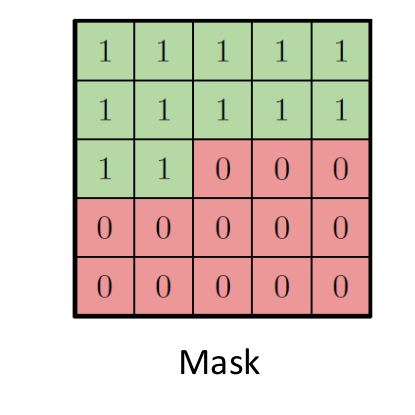

如果你足够细心的话，你可能会发现，即使经过足够多层这样的操作， $x_{i,j}$ 获得的信息也并不是初始的所有在 $x_{i,j}$ 之前的像素的信息，而是会有视野盲区（想想为什么！或者可以看下面的图），但这并不会有特别大的影响，而也可以采用某些修正（你能想到吗？）避免这个问题，这被称为Gated Pixel CNN.


##### 2.1.2.7 AF v.s. IAF

回到上面关于AF的讨论，我们发现，当 $x\to z$ 的时候，所有的 $\alpha,\mu$ 可以并行计算，从而训练的速度很快，然而在从 $z$ 生成 $x$ 的时候因为有相关性，无法并行计算，只能一个一个元素计算，导致生成的速度会比较慢。

与之相对应的是IAF，其思路也很简单：既然 $x\to z$ 是双射，那我把 $x$ 当成隐变量， $z$ 当成生成结果不就行了？或者如果你觉得不能理解的话，也可以把原来的 $\alpha,\mu$ 接受的参数改成 $z$ 的对应分量而非 $x$ . 这样生成速度就可以得到很大的提升，但是训练速度就会变慢。
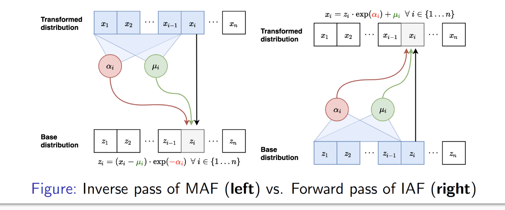

有了AF和IAF，一个很自然的问题就是，我们能不能结合它们，让生成和训练的速度都很快？这就引出了一个著名的工作：Parallel WaveNet.

这个工作的想法是这样的，首先我们可以训练出来一个AF，它的训练很快，但是生成很慢。我们希望有一个IAF，但是IAF训练太耗时间了，那么我们能不能通过已经训练好的AF加速IAF的训练？

我们发现IAF训练慢的原因就在于给定 $x$ 算 $z$ 无法并行，但是我们的 $AF$ 刚好可以做到这一点！那么为何不让我们搞好的 $AF$ 帮它算 $z$ 呢？但其实这没有任何道理，因为两个模型的定义和过程都不一样，所以我们希望训练出来的IAF实际上和我们的AF就是一样的，然后就可以让AF帮他算了！也就是说我们IAF的目标并不是之前的MSE估计了，而是和这个AF的接近程度！

于是，我们的训练过程如下：

- 训练一个AF 模型，被称为teacher
- 训练一个IAF 模型，称为student,损失函数定义为和AF 模型输出的差距(KL divergence)，而 $x \to z$ 的部分让teacher帮他算，从而加速
- 最后使用这个IAF模型，从而可以快速生成

#### 2.1.3 Variational Autoencoder

##### 2.1.3.1 Intro

在flow model里，我们相当于定义了 $z$ 到生成的图片的一个映射，而可否简单一点，直接定义 $p(x|z)$ ?这就是VAE的思想。在这之前，我们先来generally计算一下MLE损失。

##### 2.1.3.2 Design the structure

我们仍然采取和之前一样的的MLE估计，此时，

$$
L=\frac{1}{|P|}\sum_{x\in P}\log(\sum_z p(x,z))
$$

简单起见，我们考虑求和中的一项 $\log(\sum_z p(x,z))$ ,
由于这个式子本身就不好计算，梯度更加难算，我们用1.3.1中的Importance Sampling来估计这个值，具体地，我们引入一个分布 $q(z)$ ,然后我们可以估计这个值为

$$
\log p(x)=\log \sum_z q(z)\cdot \frac{p(x,z)}{q(z)}
$$

$$
\ge^{Jensen}\sum_z  q(z)\log \frac{p(x,z)}{q(z)}
$$

我们称右侧的这个下界为ELBO(Evidence Lower Bound)。
从而，我们可以通过从 $q$ 中sample来估计后者从而估计前者。同时，为了让前后尽可能接近，我们训练 $q$ 使得两者误差最小。注意到右侧事实上是

$$
ELBO=\sum_z q(z)\log \frac{p(z|x)p(x)}{q(z)}=\log p(x)-KL(q(z)||p(z|x))
$$

所以，在主训练步骤中，我们想要让 $\log p(x)$ 尽量小，从而达到更好的效果，在训练 $q$ 的过程中，我们想让它和 $p$ 尽量接近，从而让取样模拟真实情况，方差更小。这时候再看上面那个式子，我们惊奇地发现，事实上这两件事都是在让ELBO最大化！所以，我们的两个过程都可以用一个统一的损失函数ELBO来训练。（你可能会注意到，这里虽然一切都吻合地非常好，但是也都是intuition,没有特别的必然性，所以其中的步骤仍然有调整的空间， $\beta-VAE$ 就是修改我们的ELBO，在KL散度前面加系数，使之取得更加灵活的效果）

**所以，我们的损失函数可以定义为上面的ELBO!**

至此，我们已经做出了一个比较完整的分析，在进入训练步骤之前，我们还需要考虑一个小小的改动。前面为了偷懒，我们只考虑了一个 $x$ 的情形，然而，我们不能对每个 $x$ 训练一个单独的 $q$ ,于是我们转而考虑训练一个神经网络 $q(z|x)$ . 于是，我们的总体目标变成了训练两个神经网络 $q_{\phi}$ 和 $p_{\theta}$ ,使得

$$
ELBO=\frac{1}{|P|}\sum_{x\in P}\sum_z q(z|x)\log\frac{p(z,x)}{q(z|x)}
$$

$$
=\frac{1}{|P|}\sum_{x\in P}\sum_z q(z|x)\log\frac{p(x|z)p(z)}{q(z|x)}
$$

$$
=E_{x\sim Uni(P)}[E_{z\sim q(z|x)}[\log p(x|z)]-KL(q(z|x)||p(z))]
$$

经过上面的数学变形，我们发现，这个loss有了直观的意义：第一项称为reconstruction loss, $q$ 就像一个编码器，把图片 $x$ 编码成特征 $z$ ，而 $p$ 则想以最大概率恢复原来的图片，第二项称为KL散度，它想让 $q$ 和 $p$ 尽量接近，从而让 $q$ 的取样和真实情况更接近。

总结：
我们通过importance sampling的下界，找到了一个关键的损失函数 $ELBO=\sum_z q(z|x)\log \frac{p(z,x)}{q(z|x)}$ ,它有两种表示

$$
ELBO=\log p(x)-KL(q(z|x)||p(z|x))
$$

$$
ELBO=E_{x\sim Uni(P)}[E_{z\sim q(z|x)}[\log p(x|z)]-KL(q(z|x)||p(z))]
$$

第一种表示说明它在生成模型的训练和proposal的训练中都起到了evaluation的作用，所以可以作为统一的损失函数，而第二种表示则给出了直观的意义，同时变为了方便采样计算的结构。

##### 2.1.3.3 choose of $q$ and $p$

为了计算方便，我们取

$$
p_{\theta}(z)=N(0,I)
$$

$$
p_{\theta}(x|z)=N(f_{\theta}(z),I)
$$

$$
q_{\phi}(z|x)=N(\mu_{\phi}(x),diag(\exp(\sigma_{\phi}(x))))
$$

其中 $f_{\theta},\mu_{\phi},\sigma_{\phi}$ 都是神经网络。

##### 2.1.3.4 Training

回到 $ELBO$ 的可采样形式

$$
ELBO=E_{z\sim q_{\phi}(z|x)}[\log p_{\theta}(x|z)]-KL(q_{\phi}(z|x)||p_{\theta}(z))
$$

我们注意到第二项就是两个高斯分布的KL散度，可以直接计算，而第一项则是一个期望，我们可以通过采样来估计。
具体地，当计算第一项对 $\theta$ 的梯度的时候，可以从 $q_{\phi}(z|x)$ 中采样若干个 $z$ ，计算梯度平均值。而计算对 $\phi$ 的梯度的时候，由于“采样”无法求导，我们可以通过一个小技巧，即把 $N(a,b)$ 看成 $a+b\cdot N(0,1)$ , 这样我们的采样只涉及从标准正态分布中采样，从而总函数可以对 $\phi$ 求导。一般来说，由于数据的随机性已经足够强，我们只进行一次采样估计。

综上所述，总训练过程如下：

- 1.初始化
- 2.训练
  - 2.1 训练 $\theta$
    - 2.1.1 从 $q_{\phi}(z|x)$ 中采样 $z$
    - 2.1.2 通过采样估计 $\nabla_{\theta}ELBO$
    - 2.1.3 更新 $\theta$
  - 2.2 训练 $\phi$
    - 2.2.1 从N(0,I)中采样 $\epsilon$ ,根据它生成 $z$
    - 2.2.2 估计 $\nabla_{\phi}ELBO$
    - 2.2.3 更新 $\phi$
- 3.生成
  - 3.1 从 $p$ 中采样 $z$
  - 3.2 从 $p_{\theta}(x|z)$ 中采样 $x$

##### 2.1.3.5 Others

###### 2.1.3.5.1 impainting

为了图片补全，我们需要 $x\to z$ 的过程尽量robust, 这样我们就可以用需要补全的图片生成 $z$ ，然后用 $p_{\theta}(x|z)$ 生成图片。此时，我们可以在训练过程中随机mask掉一些neurons，从而让模型学会robust的特征。

###### 2.1.3.5.2 $\beta$ -VAE

就是在上面已经说明的，通过在KL散度前面加一个系数 $\beta$ ，从而可以调整reconstruction loss和KL散度的权重，从而可以调整模型的表现。

###### 2.1.3.5.3 Conditioned VAE

当数据有标签的时候应该如何处理？
此时， $p$ 变为 $p_{\theta}(x|y,z)$ ,
$q$ 变为 $q_{\phi}(y,z|x)$

对有标签的数据，我们只需要在loss中加入一项cross-entropy loss between $q(y|x)$ 和 $y$ 即可

对无标签的数据，我们让KL penalty 变成 $KL(q(z)||p(z))+KL(q(y)||p(y))$ , 对于 $p(y)$ 我们可以取一个uniform distribution. 而 reconstruction loss 则变成 $E_{z,y\sim q(z,y)}[\log p(x|z,y)]$ 但此时 $y$ 会变得难以sample从而不好计算梯度，当种类比较少的时候可以通过每一类枚举来计算，而种类比较多的时候我们将要使用一些特别的办法来处理.(~~我也不会~~)

### 2.2 Generative Adversarial Network (GAN)

#### 2.2.1 Intro

至此，我们介绍了这么多生成模型，而每一种都需要做一些优化和限制，使得计算方便，而这一切痛苦的根源就在于我们在开始提出的似乎很完美的损失函数MLE.但我们有没有别的选择？回到我们原来的问题：

> 我们希望找到 $NN$ ,使得给定 $y$ ,我们可以生成一个 $NN(y) = x$ , 使得 $x \in X_0$ , 并且 $f(x) = y$ .

在没有标签的时候，我们的目标实际上是：

> 我们希望找到 $NN$ ,使得可以生成一个 $x$ , 使得 $x \in X_0$ .

然而，我们有的只是一个已知的 $X_0$ 的子集 $P$ ,而关于 $X_0$ 我们也只能知道这么多了！(以及一些平移不变等简单特征),我们发现这事实上很像神经网络干的事情！所以事实上，我们可以让一个神经网络学习 $P$ 的特征，然后用它来评估！这就是GAN的思想。

简单地说，我们同时训练两个神经网络，一个生成器 $G$ 和一个判别器 $D$ ,其中 $G$ **的目标是从一个随机的Latent variable $z$ 生成一个** $x$ **,使得** $D$ **无法判断它是不是真实的，而** $D$ **的目标是尽可能准确地判断** $x$ **是不是真实的**。对于这样最基本的GAN，我们的目标就是

$$
\min_\theta\max_\phi E_{x\sim p_{\text{data}}}[\log D(x;\phi)]+E_{\hat{x}\sim G}[\log (1-D(\hat{x};\phi))].
$$

可以看到，第一项代表着真的数据被判断为真的概率尽量大，而第二项代表Generator的生成图片被判断为假的概率，因此G希望这一项尽量小，而D希望这一项尽量大。

GAN的训练过程也很容易，只需要按照上面objective的定义进行优化即可：实际上，一般在每一个epoch训练一次Discriminator，再训练一次Generator，不断重复。

看起来这已经结束了，实际上2014年GAN的Paper也得到了很好的成果。但我们并不满足于此，转而探讨更深的知识内容。

#### 2.2.2 Math Of GAN

我们首先考虑数学上，这个objective的真正含义。首先，容易看出 $D$ 的最佳行为：对于一个 $x$ ，他对loss的贡献是

$$
p_{\text{data}}(x)\log D(x)+p_G(x)\log (1-D(x))
$$

因此，我们可以解出discriminator的最优解 $D(x)^{*}$ ：

$$
D(x)^*=\frac{p_{\text{data}}(x)}{p_{\text{data}}(x)+p_G(x)}.
$$

我们进而可以把这个表达式代入，得到 $G$ 的优化目标：

$$
L(\theta)=E_{x\sim p_{\text{data}}}\left[\log \frac{p_{\text{data}}(x)}{p_\text{data}(x)+p_G(x)}  \right]+E_{\hat{x}\sim G}\left[\log \frac{p_G(x)}{p_\text{data}(x)+p_G(x)}  \right]
$$

这实际上恰好是数学上的所谓 **Jenson-Shannon Divergence(JSD)**：

$$
\text{JSD}(p||q):= \frac{1}{2}KL\left(p||\frac{p+q}{2}\right)+\frac{1}{2}KL\left(q||\frac{p+q}{2}\right).
$$

进而我们可以写出

$$
L(\theta)=\text{JSD}(p_{\text{data}}||p_G)-\log 4.
$$

数学上指出，JSD是一种不错的distance：它不仅对称、非负，而且它的平方根还满足三角不等式。我们因此看到，GAN在理论上可以到达全局最小值，也就是 $p_G=p_{\text{data}},p_D=\frac{1}{2}$ 。

总结一下，GAN好在哪里？首先，最关键的区别在于它不需要计算概率，从而避免了采样的困难；其次，它的loss function 是一个neural net，这听起来就比之前的MLE training 更加强大。最后，我们也看到了GAN的理论优势，它有一个理论上的最优解，而这正是我们想要的。

但是：
> There is no free lunch! 

#### 2.2.3 Issues
##### 2.2.3.1 How to evaluate my GAN?
当我们失去了 $p(x)$ ，减少头疼的采样的同时也让我们失去了评估这个Generative Model的手段。那么我们如何**评估**一个GAN呢？这是一个非常困难的问题，我们来介绍一些前人的尝试。

一个想法是训练一个classifier $f(y|x)$ 。对于一张真的图片，我们会期待它在各个class上面的概率分布几乎是one-hot的，因此我们希望GAN生成的图片也是这样的；而我们还希望GAN能够生成各种类别的图片，也就是说

$$
E_{x\sim G}[f(y|x)]\approx \text{Uniform}(y).
$$

把他们结合起来，就是 **Inception Score**：我们定义

$$
\text{IS}=\exp\left(E_{x\sim G}[\text{KL}(f(y|x)||p_f(y))]\right),
$$

其中

$$
p_f(y)=E_{x\sim G}[f(y|x)].
$$

可以看到，如果GAN生成的图片乱七八糟（第一种失败），那么 $p_f(y)$ 和 $f(y|x)$ 都近似uniform，因此KL divergence很小；另一方面，如果GAN生成的图片都是一类的，那么 $p_f(y)$ 和 $f(y|x)$ 都近似one-hot，因此KL divergence也很小。

但这个简单的评估标准会给GAN一些cheating的机会：如果GAN对每一类 $y$ 都学会一张图片，可以看到 $p_f(y)$ 也会是 uniform的，而 $f(y|x)$ 也会是 one-hot的，从而得到一个很高的分数。换句话说，inception score 只能评估GAN生成的图片的真实性，而不能评估多样性（或者和 $p_{\text{data}}$ 的相似性）。

由此改进出一个新的指标： **Frechet Inception Distance(FID)**。它的思想是把生成图片和真实图片经过一个预训练的神经网络，得到一个高维的feature。随后，我们把feature看成一个高维的高斯分布，通过计算 $\mu_G,\Sigma_G,\mu_{\text{data}},\Sigma_{\text{data}}$ 来计算两个高斯分布的Wasserstein distance：

$$
\text{FID}=||\mu_G-\mu_{\text{data}}||^2+\text{tr}(\Sigma_G+\Sigma_{\text{data}}-2(\Sigma_G\Sigma_{\text{data}})^{1/2}).
$$

这个指标（越低越好）有效地估计了Generator生成图片和数据集中图片分布的相似性。实验上发现这一评分标准和人的主观评价有很好的相关性——如果给图片模糊或加噪声，那么Inception Score不怎么敏感，但是FID会很快上升。

##### 2.2.3.2 Why my GAN keeps outputing identical images??

GAN的一个巨大问题就是Mode Collapse。有时候，GAN会只生成一张图片；此外，有时候它还可能随着训练过程在各个图片打转。这个问题的根源在于GAN的loss function。回顾之前我们指出，GAN的数学本质是优化 $p_G$ 和 $p_{\text{data}}$ 之间的JSD。还记得之前介绍inclusive KL和exclusive KL的时候我们讲到过，inclusive KL可以涵盖很多的mode，而exclusive只是会简单地靠近概率最大的mode。这里不幸的是，**JSD本身类似exclusive KL**，因此我们的GAN也只能学会几个少数的pattern。更加不幸的是

> There is no fundamental solution for mode collapsing in GAN.

##### 2.2.3.3 Why is my GAN training so instable???

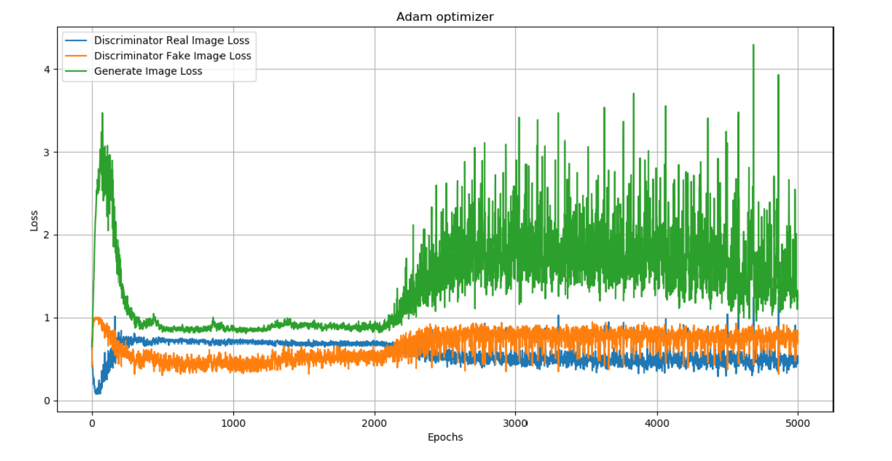

如果你真的自己去训练一个GAN，那么你很大概率就会体验到GAN训练的不稳定性。很有可能，前一个epoch discriminator的准确率已经上升到百分百，下一个epoch就立刻降到0。这不是你的问题，而是GAN本身就像一个两个人竞争的game，很难达到Nash Equilibrium。举一个简单的例子：假设 $x$ 和 $y$ 两人同时优化

$$
J=-xy,
$$

$x$ 希望 $J$ 最大， $y$ 希望 $J$ 最小。一个Nash Equilibrium是 $x=y=0$ ，但是实际上并不能真的到达这个点。

这样的情况为训练带来了很大的痛苦——即使你现在看着你的模型给你吐出完美的噪声，你也不知道是否应该放弃：也许几个epoch之后情况会完全变化。换句话说，很难找到一个 stopping criterion。另外一个直接结果是，模型很可能瞬间崩溃——前一个epoch还在生成完美的数字，下一个epoch就成为了全白的噪声。

不仅如此，GAN还饱受梯度消失的折磨。直观上看，Generator 从一个 $\sim 100$ 维的hidden state生成一个 $28\times 28$ 维度以上的图片，而Discriminator只需要在 $28\times 28$ 的高维空间用一刀切开真假图片。这听起来就不公平，的确也是如此：discriminator 很容易就很快达到百分百准确率，此时generator的梯度就很快会消失。

#### 2.2.4 Let's make GAN work!

##### 2.2.4.1 DCGAN (Deep Convolutional GAN)
第一个伟大的尝试是DCGAN。在这个结构里，我们只用convolutional layer，**不加任何pooling**，除了改变大小用的projection layer也**不加任何MLP layer**。特别地，我们不能用那些supervised learning中强大的结构作为Discriminator。

此外，它指出应当使用**Batch Normalization**。但是，在Generator的最后一层和Discriminator的第一层不能加入Batch Normalization，这样Generator才能学会图片像素的绝对大小，而非相对大小。它还指出一个batch 必须要么全是真的要么全是假的，这样才能保证Batch Normalization的效果。

最后，我们为了避免gradient vanishing，在discriminator中不采用ReLU，而是用**Leaky ReLU**。实验上很推荐的数值是0.2。在Generator中，ReLU是推荐的，但最后一层的激活要使用tanh。

除了网络结构，在训练方向它也给出了一系列很好的参数：lr=0.0002, Adam optimizer, batch size=128, momentum $\beta = 0.5$ .

DCGAN是一个巨大的成功，同时也揭示了很多有意思的知识。比如说，对latent space可以作加减法：

$$
G(z_1)=\text{man with glasses}\\
G(z_2)=\text{man without glasses}\\
G(z_3)=\text{woman without glasses}\\
\Longrightarrow G(z_1-z_2+z_3)=\text{woman with glasses}.
$$

##### 2.2.4.2 Improved Training Techniques for GAN
一系列GAN的训练技巧又诞生了。首先是 **Feature Matching**。为了**避免 Gradient Vanishing**，我们不只是保留最后Discriminator的输出，还要取出经过Discriminator几层卷积之后提取出的feature。随后，我们加上这样一个loss：

$$
L_{\text{feature matching}}=|E_{x\sim G}[f(x;\phi)]-E_{x\sim \text{data}}[f(x;\phi)]|^2
$$

其中 $f$ 代表discriminator从 $x$ 中提取出的 feature。这样，Generator可以获得来自数据集的统计信息。

一个重要的（一定程度上）**避免mode collapse**的办法是 **Minibatch Discrimination**。直观上看，怎么避免Generator生成相同的图片呢？我们很容易评估Generator的图片的相近程度，因此我们也可以给Discriminator加入这个功能，只要它看输入图片差不多就立刻判断成假的。具体地，我们给discriminator加入一个projection tensor $T$ ，然后对于输入 $x_i$ 卷积若干层后得到的 $f(x_i)$ 作以下操作：

$$
M_{ibc}=f(x_i)T_{ibc}\\
s(x_i,x_j)_b=\exp(-||M_{ib}-M_{jb}||_1)\\
o(x_i)_b=\sum_{j\neq i}s(x_i,x_j)_b\\
$$

（注意这里的 $b$ 可不是batch中的编号，而是引入的一个新的维度的index）然后把得到的 $o(x_i)$ 加入到原来的feature中。简单来说，这里把输入的一系列图片投影到一个空间，并在那个空间内部

**Historical Averaging**是用来**稳定训练**的一个技巧。这个思路说起来很直接——我们只需要引入一个额外的loss

$$
\left|\theta-\frac{1}{T}\sum_{t=1}^T\theta_t\right|^2
$$

即可。

**One-sided Label Smoothing**也是用来**避免 Gradient Vanishing**的一个技巧。直观上看，我们希望Discriminator不要太自信。换句话说，原来的

$$
\text{CrossEntropy}(D(x),1)+\text{CrossEntropy}(D(G(z)),0)
$$

变成了

$$
\text{CrossEntropy}(D(x),0.9)+\text{CrossEntropy}(D(G(z)),0).
$$

这样，Discriminator即使是对于真实的图片，也最多有90%的确信程度。这就给Generator带来了一线机会。我们也可以理解为什么不能把第二项设成0.1：否则Generator可能会生成随机的噪声图片，还不受到太多惩罚。

**Virtual Batch Normalization**处理的问题是，前面引入的Batch Norm导致一个batch中的图片之间的关系太强（比如说，实验上看到它们都是一个色调）。解决的办法是，我们引入一个虚拟的batch，然后用这个虚拟的batch来给出统计数据计算Batch Norm。这样，我们就可以避免同一个batch中图片的依赖性。当然具体实践中采用的写法也和这里简单的介绍并不完全相同。

##### 2.2.4.3 And more techniques...
GAN的训练技巧还有很多，大部分都可以在网上搜索找到。但是注意具体情况具体分析——很多别人认为至关重要的技巧很可能在你的超参选取或者模型结构的基础上几乎没有任何效果。不过无论如何……
> "Keep calm and train a GAN"

#### 2.2.5 WGAN: How about improving GAN from its root?

##### 2.2.5.1 Changing the loss

我们还记得之前指出，GAN的训练等价于优化JSD。但是JSD本身具有许多问题。比如说之前提到的mode collapse。不仅如此，它还会造成Gradient Vanishing。我们可以发现，如果 $p_{\text{data}}$ 和 $p_G$ disjoint，那么

$$
\text{JSD}(p_{\text{data}}||p_G)=\log 2.
$$

是一个常数。这有点违背我们对divergence的直觉——作为一种“距离”，即使是两个分布disjoint，也应该大概能反映一些它们之间差距的信息，而不是应该是常数。一个数学上的可行候选人是 **Wasserstein Distance**：

$$
W(P,Q)=\inf_{\gamma\in \Pi(P,Q)}E_{(x,y)\sim \gamma}[||x-y||]
$$

其中 $\Pi(P,Q)$ 代表 $\gamma$ 从所有的二元分布中选取，并且必须满足

$$
\int \gamma(x,y)dx=q(y),\int \gamma(x,y)dy=p(x).
$$

直观上怎么理解这个距离呢？我们可以把它想象成**搬土堆**（因此它也叫做 Earth Mover's distance）：原来土堆的形状是 $p(x)$ ，需要把它的形状变成 $q(y)$ ，假设把 $x\sim x+dx$ 的土堆搬到 $y\sim y+dy$ ，那么就产生消耗

$$
\gamma(x,y)dxdy\cdot ||x-y||.
$$

总的最小消耗就是 $W(P,Q)$ ，而两个约束刻画了土堆必须完全被搬过去。

首先，我们立刻可以看到这个距离即使在两个分布完全disjoint的时候也具有有限大小的梯度——它大概线性相关于两个分布的中心距离。其次，我们也大概能猜到，这个距离可以接受多个mode，而不是像JSD一样集中在某个mode上面。唯一的问题是，怎么计算这个距离？在给定两个逆天的要求下求inf，听起来就不是一个neural network可以做的事情。但是所幸我们有一个重要的数学恒等式——**Kantorovich-Rubinstein duality**：

$$
W(P,Q)=\sup_{||f||_L\leq 1}\left(E_{x\sim P}[f(x)]-E_{y\sim Q}[f(y)]\right).
$$

这里的sup是对所有1-Lipchitz的函数求。自然地，我们可以用一个神经网络实现 $f$ （虽然已经没有明确的意义，但也可以叫“discriminator”），而用 generator实现 $Q$ 来拟合data distribution $P$ 。这样，WGAN（**Wasserstein GAN**）就诞生了：

$$
L(\theta,\phi)=\min_{\theta}\max_{||f||_L\leq 1}\left(E_{x\sim p_{\text{data}}}[f(x;\phi)]-E_{\hat{x}\sim G_\theta}[f(\hat{x};\phi)]\right).
$$

现在唯一的问题就是如何保证 $f$ 是1-Lipchitz的。这里，一个重要的思想是 **Weight Clipping**：只要我们参数的绝对值不太大，那么我们就可以保证 $f$ 是1-Lipchitz的。实际上我们简单粗暴地

$$
\phi_i \to \text{clip}(\phi_i,-c,c)
$$

其中 $c$ 是一个比较小的数，比如0.01。在一些训练技巧的使用下（比如使用RMSProp without Momentum，多update几次 $f$ 再update $G$ ），WGAN完全吊打DCGAN，取得了完全的成功。


WGAN具有很好的训练稳定性，大幅避免了gradient vanishing和mode collapse。同时，不管网络结构选的多么糟糕，WGAN总能最终克服困难（如图）。但是，WGAN的原始论文也指出，weight clipping是一个很粗暴的方法，它会导致一些问题，比如需要很长时间才能使得 $f$ 稳定，或者多层网络导致的梯度消失。WGAN还有一段路要走。

##### 2.2.5.2 Improved Training of WGANs

我们前面也看到，WGAN的训练最难的一点是如何限制 $f$ 是1-Lipchitz的。前面粗暴的Weight Clipping方法不能很好地刻画这个要求。这时，有一个很好的想法出现了：我们限制 $f$ 是1-Lipchitz的，那么取到最大值的时候， $f$ 一定梯度基本上处处为1.因此，我们可以**直接限制 $f$ 的梯度模长为1**。这个方法被称为 **Gradient Penalty**。此时，我们就可以定义一个新的目标：

$$
L(\theta,\phi)=\min_{\theta}\max_{\phi}\left(E_{x\sim p_{\text{data}}}[f(x;\phi)]-E_{\hat{x}\sim G_\theta}[f(\hat{x};\phi)]+\lambda E_{\tilde{x}}[(|\nabla_{\tilde{x}}f(\tilde{x};\phi)|^2-1)^2]\right),
$$

其中 $\tilde{x}$ 来自一个数据集和生成集合的混合分布：

$$
\tilde{x}=(1-\epsilon)x+\epsilon \hat{x},\epsilon\sim \text{Uniform}(0,1).
$$

实验上，这个方法十分有效：weight clipping不仅对clipping constant $c$ 十分敏感，而且还会导致weight 集中在 $\pm c$ ；但所这个方法得到的 $f$ 的各个weight则是符合一个非常美观的分布。同时，这个方法对于不同的architecture（尤其是网络特别深的时候）也有很好的效果。当然，其代价也很明显——要计算gradient over gradients，这导致计算量非常大。

#### 2.2.6 GAN Extensions

有了前述理论基础和大量的training techniques之后，GAN的发展就变得非常快速。我们在这里简单介绍一些GAN的扩展。

##### 2.2.6.1 GAN for Semi-Supervised Learning

我们考虑用GAN作semi-supervised learning：假设现在收集了一些data，一部分是labeled $(x,y)$ ，另一部分只有图片，是 $x$ 。如何把GAN提升到可以应用于含有标签的数据呢？我们可以让G和D的任务分别变成

$$
G(z,y)\to x, D(x)\to (p_1,\cdots,p_K,p_{K+1}(\text{fake}))
$$

这里 $K$ 代表总共的label个数。对于labeled data，我们的loss写为

$$
L_{\text{labeled}}=\text{CrossEntropy}(D(x),y)
$$

而对于unlabeled data，我们有：

$$
L_{\text{unlabeled}}=1-\text{CrossEntropy}(D(x),K+1)
$$

因为Discriminator获得了更多信息，Conditional GAN相比于普通GAN更加强大。

##### 2.2.6.2 Representation Learning and BiGAN
我们有一个可以从latent space $z$ 映射到图片 $x$ 的 generator 

$$
 x=G(z) 
$$

。一个自然的想法就是，能否再训练一个从 $x$ 到 $z$ 的网络，专门负责从图片中提取出latent space的信息？这个网络被称为 **encoder** 

$$
z = E(x)
$$

这个想法就被称为 **Representation Learning**。实际上，我们可以把这个encoder和generator结合起来，然后让Discriminator 读入 $x$ 和 $z$ ，输出 

$$
D(x,z)=\Pr\left( (x,z)\text{ comes from }(x,E(x))   \right)
$$

。这就形成了一个 **BiGAN**。
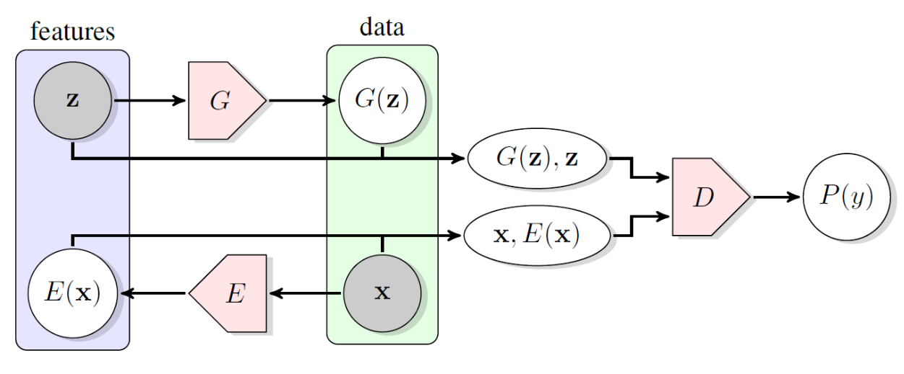

可以发现，最终理想状态是 $D$ 完全区分不出来哪个是从 $z$ 得到 $x$ ，哪个是从 $x$ 得到 $z$ 。因此，这样的模型等价于学习了一个**Autoencoder**。但实际上看到，这样的Autoencoder比普通的更为强大。

在BiGAN的基础上也有一系列发展，比如BigBiGAN等等。它们除了则增大训练的scale之外，也引入了一些更复杂的技巧。

##### 2.2.6.3 GAN for Style Transfer

还记得GAN最开始给出Generator的目标：从一个latent variable $z$ 生成 $x$ 。这时，我们注意到 $z$ 不仅可以是一些简单的随机数——它完全可以是另外一张图片！这样，我们就可以实现**style transfer**：输入一个没有经过加工的原始图片 $z$ ，输出一个经过加工的图片 $x$ 。

2017年的**Pix2Pix**就是一个典型的例子：它输入一个黑白简笔画（只有边缘）作为 $z$ ，而输出一个有色的图片作为 $x$ 。具体的实现方式也相对直观：首先我们注意到反方向操作都是相对容易的，只需要一些简单的模型就可以把边缘从图片中提取出来。因此，我们很容易收集大量paired data。接下来，让Generator 从 $z$ 输出 $x$ ，而Discriminator 判断 $(z,x)$ 中的 $x$ 是不是假的。最后，我们对于每一个 $(z,x)$ pair，得到 $x'=G(z)$ 再分别计算

$$
D(z,x),D(z,x')
$$

即可。当然，实际上一个重要的优化是加入一项loss

$$
\lambda E_{x\sim \text{data}}|x-G(z)|，
$$

因为如果不加上这一项，只从Discriminator的信息来获得，Generator很难学出真正的对应关系。

一个有趣的事实是，即使我们没有paired data $(x,y)$ ，只有大量的 $x$ 组成的数据集 $X$ 和大量的 $y$ 组成的 $Y$ ，我们也可以通过GAN来实现这个任务。这个方法被称为 **CycleGAN**。它的思路是，我们有两个Generator，一个是 $G:x\to y$ ，另一个是 $F:y\to x$ .同时，我们还有 $D_X(x)$ 和 $D_Y(y)$ 两个 discriminator。在训练时，每一次拿一个 $x$ （或者 $y$ ），得到 $G(x)=y$ ，让 $D_Y$ 鉴别；再得到 $F(y)=x'$ ，比较 $x'$ 和 $x$ 的接近程度。这样，我们就可以同时学习两个方向的style transfer。为了刻画接近程度，我们在GAN的loss基础上加入一个 **cycle consistency loss**：

$$
L_{\text{consistency}}=\lambda E_{x\sim X}[|F(G(x))-x|]+\lambda E_{y\sim Y}[|G(F(y))-y|].
$$


CycleGAN可以实现很多有意思的应用：比如把马和斑马的照片相互转化、把白天变成黑夜、把梵高的画变成莫奈风格等等。

## 3. Sequence Modeling

### 3.1 Introduction

在上面的讨论中，我们都默认了 $x$ 是一个已知维度的向量，然而，生活中还有一类数据形式：序列。序列数据是一种非常常见的数据形式，比如文本，音频，视频等等。它的特点是维度未知，例如文本的长度，并不确定。那么我们如何处理这种数据呢？一个简单的办法是卷积，然而卷积的感受野的大小也是固定的，对于输入很长的数据，并不能有效处理。于是，我们需要一些新的网络结构。

### 3.2 Recurrent Neural Network(RNN)

#### 3.2.1 Intro

循环神经网络(Recurrent Neural Network)的思路很简单，我们希望通过一个神经网络不断循环地处理数据，同时保存一个"hidden state"作为这个神经网络的记忆。这样，我们就可以处理任意长度的数据了！具体地，我们有

$$
h_t=f(h_{t-1},X_t)
$$

$$
Y_t=g(h_t)
$$

其中 $h_t$ 是hidden state, $X_t$ 是输入， $Y_t$ 是输出。RNN的示例图如下：


我们也可以更简单地化成下面的形式：


#### 3.2.2 Backpropagation Through Time(BPTT)

对于一个RNN，我们如何计算梯度?一般来说，RNN的损失函数是关于输出序列 $Y$ 的函数，设为 $L(Y)$ ,那么我们的目标是求 $\nabla_{\theta}L(Y)$ ,其中 $\theta$ 是所有的参数。所以，我们事实上可以通过链式法则，从后往前累积梯度，这个过程被称为BPTT.

#### 3.2.3 Issues

上面的想法看上去很美好，但事实上这个结构存在一些严重的问题。我们先考虑一个简单的只有线性层的RNN，那么，它的结构可以表示为:

$$
h_t=W_1h_{t-1}+W_2X_t
$$

从而，我们可以得到

$$
h_t=W_1^th_0+\sum_{i=1}^tW_1^{t-i}W_2X_i
$$

我们发现，如果 $W_1$ 的特征值大于1,那么 $h_t$ 会随着 $t$ 的增大而指数增长，这就是所谓的梯度爆炸。而如果 $W_1$ 的特征值小于1,那么 $h_t$ 会随着 $t$ 的增大而指数减小，这就是所谓的梯度消失。现在，让我们再加上激活函数 $f$ ,也就是说

$$
h_t=f(W_1h_{t-1}+W_2X_t)
$$

我们发现，

$$
\frac{\partial Y_{t+1}}{\partial h_0} \propto \prod_{i=1}^t W_1f'(W_1h_{i-1}+W_2X_i)
$$

$$
= W_1^t\prod_{i=1}^tf'(W_1h_{i-1}+W_2X_i)
$$

但我们一般的激活函数的导数小于1,于是这个梯度在 $W_1$ 的特征值小于1的时候会消失，而在大于1的时候会爆炸，而就算 $W_1$ 特征值比较好，仍然会有梯度消失的问题。（当然，也许你可能会觉得，没准 $W_1$ 特征值大于1,和f'小于1正好起到抵消的效果，但这其实几乎不可能，因为 $f'$ 的大小和数据关系很大，当序列很长的时候，这种情况几乎不可能发生）

事实上，我们并没有很好的通用办法解决这些问题，在应用中，我们只能用一个妥协的办法：Gradient Clipping,也就是说，当梯度的大小超过一个阈值的时候，我们把它截断。另外，我们让 $W_1$ 的初始最大特征值为1,这样可以减缓梯度爆炸的问题。但是，当循环次数过多(一般7次左右),末态对初始值梯度消失的问题仍然得不到好的解决，于是，我们需要一些新的结构。这就引出了著名的LSTM.

### 3.3 Long Short-Term Memory(LSTM)

#### 3.3.1 Intro

LSTM 的想法是这样的，既然很多轮之前的数据因为经过了太多次的activation而消失，我们不如再加上一个cell来记录一个长时记忆，这就是LSTM的思想。

#### 3.3.2 Structure

具体地，我们有

$$
f_t=\sigma(W_f[h_{t-1},X_t]+b_f)
$$

$$
i_t=\sigma(W_i[h_{t-1},X_t]+b_i)
$$

$$
o_t=\sigma(W_o[h_{t-1},X_t]+b_o)
$$

$$
\tilde{C_t}= tanh(W_c[h_{t-1},X_t]+b_c)
$$

$$
c_t=f_t\circ c_{t-1}+i_t\circ\tilde{C_t}
$$

$$
h_t=o_t\circ \tanh(c_t)
$$

这看上去有点复杂，但其实很直观，我们保存两个东西，一个是长时记忆 $c_t$ ,一个是短时记忆 $h_t$ .

$c_t$ 的更新通过两个门确定:一个是 $f_t$ ，被称为遗忘门(forget gate)来控制 $c_{t-1}$ 在 $c_t$ 中的系数，另一个门是 $i_t$ ，被称为输入门(input gate)，来控制 $\tilde{C_t}$ 的系数。 $\tilde{C_t}$ 是根据当前的短时记忆和输入计算出来的。

而 $h_t$ 则是通过一个门控 $o_t$ 来控制输出。这样，我们就可以通过一个cell来控制长时记忆和短时记忆的交互，从而解决了梯度消失的问题。实验上，LSTM 大约能记住100个时间步的信息。

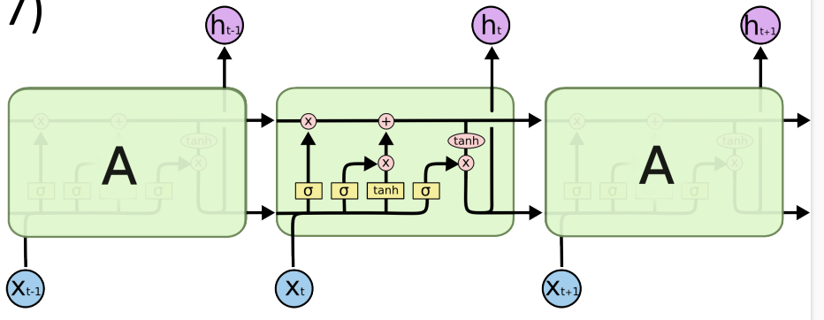

#### 3.3.3 Invariants

现实生活中，根据需求的不同，也有许多人在LSTM上进行了一些调整，产生了一些变种。

##### 3.3.3.1 Peephole Connection

Peephole Connection的想法是，我们可以让 $f_t,i_t,o_t$ 不仅仅依赖于 $h_{t-1},X_t$ ,还依赖于 $c_{t-1}$ ,这样可以增加一些信息的传递。

数学上说，实际上就是把

$$
f_t=\sigma(W_f[h_{t-1},X_t]+b_f)
$$

$$
i_t=\sigma(W_i[h_{t-1},X_t]+b_i)
$$

$$
o_t=\sigma(W_o[h_{t-1},X_t]+b_o)
$$

变成

$$
f_t=\sigma(W_f[h_{t-1},X_t,c_{t-1}]+b_f)
$$

$$
i_t=\sigma(W_i[h_{t-1},X_t,c_{t-1}]+b_i)
$$

$$
o_t=\sigma(W_o[h_{t-1},X_t,c_{t-1}]+b_o)
$$

这样可以在参数翻倍的代价下，取得更好的效果。

##### 3.3.3.2 Simplified LSTM

Simplified LSTM的想法是，我们可以把 $f_t$ 和 $i_t$ 合并成一个门，这样可以减少参数的数量，同时也可以减少一些计算量, 事实上，如果我们假设它的“记忆量”不变的话，我们可以不用计算 $f_t$ ，而是直接用 $1-i_t$ 代替，这就是Simple LSTM。

##### 3.3.3.3 GRU

看了前面的小改动之后，有一个更新的想法，我们能不能把 $c$ 和 $h$ 合并到一起？事实证明确实可以，这就是GRU(Gated Recurrent Unit)的想法。它的结构如下：

$$
z_t=\sigma(W_z[h_{t-1},X_t])
$$

$$
r_t=\sigma(W_r[h_{t-1},X_t])
$$

$$
\tilde{h_t}=tanh(W[h_{t-1},r_t\circ X_t])
$$

$$
h_t=(1-z_t)\circ h_{t-1}+z_t\circ \tilde{h_t}
$$

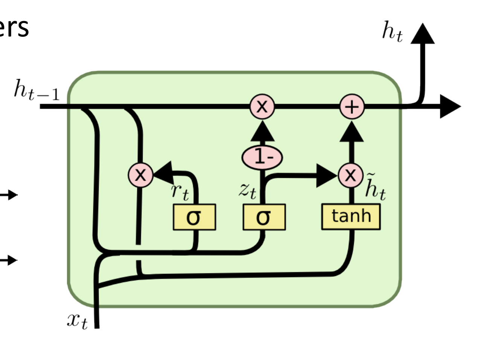

### 3.4 Language Model

#### 3.4.1 LSTM Language Model

我们接下来关注一类特殊的模型:Language Model.
具体地，我们要训练一个模型，给定 $x_1,x_2,...,x_{t-1}$ ,我们希望预测下一个词 $x_t$ 的概率分布

$$
p(x_t|x_1,x_2,...,x_{t-1})
$$

LSTM Language Model的结构很简单，我们只需要把LSTM的输出接一个softmax层即可。

$$
P(x_t|x_{i<t})= Y_t
$$

$$
h_t,c_t,Y_t = LSTM(h_{t-1},c_{t-1},x_{t-1})
$$

如果我们定义一个句子的概率为

$$
P(x_1,x_2,...,x_T)=\prod_{t=1}^TP(x_t|x_{i<t})
$$

那么，我们就可以用MLE训练这个模型了！

而对于生成，我们可以通过贪心算法，每次生成概率最大的词，然后把它作为下一个词的输入。

#### 3.4.2 Word Embedding

事实上，我们可以发现，我们一直处理的都是向量的运算，但是如何把自然语言转化成向量(序列)?这被称为embedding.一个最简单的办法就是用一个 $d$ 维向量表示，其中 $d$ 是所有可能单词的数量，第i个单词用一个one-hot向量(第i维是1,其他全0)表示，但是这种embedding显然有两个问题：1.维度太高 2.没有语义信息。于是，如何获得一个好的embedding就成了一个问题。总的来说，我们希望维度不要太高，并且包含一些语义信息，相似的词在向量空间中也应该比较接近。这就引出了word2vec.

Word2Vec的想法是，我们希望通过一个神经网络，把一个词映射到一个低维向量，同时让相似的词在向量空间中比较接近。具体地，我们有两种结构：CBOW和Skip-gram.

CBOW的想法是，我们希望通过embedding的信息，通过上下文来预测中心词,从而学到一个好的embedding.

> “You shall know a word by the company it keeps.”
> (J. R. Firth 1957: 11)

具体地说，我们给每个词t两个向量 $w_t,c_t$ （实际使用中需要让模长大小有一定限制）,分别表示它作为上下文和中心词的embedding,然后我们认为一个词 $y$ 出现在上下文" $x_{-k}x_{-k+1}...x_{-1}*x_1x_{k-1}x_{k}$ "中的概率为

$$
\prod p(w_y|c_{x_{-k}})
$$

而每个 $p(w_y|c_{x_{-k}})$ 可以用softmax来表示

$$
p(w_y|c_{x_{-k}})=\frac{\exp(c_{x_{-k}}\cdot w_y)}{\sum_{i=1}^d\exp(c_{x_{-k}}\cdot w_i)}
$$

需要注意的是，这个概率并没有任何严格的数学推导，只是一个假设，因为我们希望一个词的embedding和它的上下文的内容有关，于是我们就用这个形式来表示。

但是，这个表示虽然正确，却难以训练，因为我们需要对所有的词做softmax，这样的计算量太大了。于是，我们转而来把这个问题转化为一个二分类问题，即给定一个中心词和一个上下文，我们希望判断这个词是否在这个上下文中出现过。

我们假定

$$
Pr(y,+|x_{-k}x_{-k+1}...x_{-1}*x_1x_{k-1}x_{k})=\prod_{i=-k,i\neq 0}^k{\frac{1}{1+\exp(-c_{x_i}\cdot w_y)}}
$$

从而，我们就可以用MLE训练这个模型了！但事实上，如果你足够细心，你可能会发现一点问题，如果我们要优化

$$
\frac{1}{|C|}\sum_{c=(x_{-k}x_{-k+1}...x_{-1}yx_1x_{k-1}x_{k})\in C} \log Pr(c,+)
$$

的话，事实上我们的最优解总是让所有向量都一样，这样可以让每个概率都最大化！问题在哪里？我们发现对于一个二分类问题，我们不仅需要正例，还需要负例，但是我们的模型中并没有负例！于是，我们引入了负采样(negative sampling)的概念：我们对于上下文，随机采样作为负例，然后我们希望

$$
L(w,c) = \sum_{c=(x,y)\in D^+} \log Pr(c,+)+\sum_{c=(x,y)\in D^-} \log Pr(c,-)
$$

尽量大，其中 $D^+$ 是正例集合， $D^-$ 是负例集合。

另一种结构是Skip-gram,它的想法是，我们希望通过一个词来预测它的上下文，从而学到一个好的embedding.具体地，我们在训练语料 $x_{-k}x_{-k+1}\dots x_{-1}yx_1 \dots x_{k-1}x_{k}$ 的中的 ${x_i}$ 里随机选择 $R$ 个词作为 $y$ 的上下文 $x$ ,然后把这些 $(x,y)$ 作为正例，然后随机采样 $R$ 个词构成 $\tilde{x}$ ,让 $(\tilde{x},y)$ 作为负例，然后进行一样的训练。

#### 3.4.3 Some Techniques on Language Model

##### 3.4.3.1 Make Training Fast: Noise Contrastive Estimation(NCE)

tldr:这一小节讲了一个加速训练的方法:NCE,它的想法和之前类似，把多分类问题转化为二分类问题。本节主要是数学计算，如果不感兴趣，可以跳过，对理解整体内容没有太大影响。

回顾我们的Language Model的训练，具体地，我们希望我们模型输出的概率分布和真实分布（训练的时候，就是训练语料的分布）接近，于是我们用MLE的方法优化我们的模型，在这里，我们先定义一些符号:

$$
h:上文，w:下一个词
$$

$$
\tilde{p}(w|h):真实(训练语料)的分布 
$$

$$
c_{\theta}(w,h):模型对于w和h输出的结果 
$$

$$
u_{\theta}(w,h)=e^{c_{\theta}(w,h)}:模型预测的未归一化的概率 
$$

$$
p_{\theta}(w|h)=softmax(c_{\theta})=\frac{u_{\theta}(w,h)}{Z_{\theta,h}}:模型预测的概率 
$$

$$
Z_{\theta,h}=\sum_{w} u_{\theta}(w,h):归一化因子
$$

这里要注意，我们之后会用到很多的不同的概率分布，请不要弄混，另外下标带 $\theta$ 说明与模型有关，否则与模型无关. 如果你在中间某步突然不能理解，请检查一下是不是弄混了不同的概率分布！

我们的目标是:

$$
p_{\theta}(w|h) \approx \tilde{p}(w|h)
$$

你可能会有疑问，为什么训练集合是个概率分布？这是因为i同一个词可能多次出现，比如说训练语料集合是 $\{$ "我是人","你很强","我爆零了","我是吊打" $\}$ ,那么给定上文"我",下一个词应该是一个概率分布:("是", $p=\frac{2}{3}$ ),("爆", $p=\frac{1}{3}$ ),(else, $p=0$ ).我们希望我们的模型生成的概率也是这样。

从而，我们使用MLE优化，它的损失函数定义为:

$$
L=E_{w\sim \tilde{p}(w|h)}\log p_{\theta}(w|h)
$$

那么，我们可以进行计算:

$$
\nabla L = \nabla E_{w\sim \tilde{p}(w|h)}\log p_{\theta}(w|h)
$$

$$
= E_{w\sim \tilde{p}(w|h)}\nabla \log p_{\theta}(w|h)
$$

$$
= E_{w\sim \tilde{p}(w|h)}[\nabla \log \frac{u_{\theta}(w,h)}{Z_{\theta,h}}]
$$

$$
= E_{w\sim \tilde{p}(w|h)}[\nabla c_{\theta}(w,h)]-\nabla \log Z_{\theta,h}
$$

$$
= E_{w\sim \tilde{p}(w|h)}[\nabla c_{\theta}(w,h)]-\frac{\sum_{w}\nabla u_{\theta}(w,h)}{Z_{\theta,h}}
$$

$$
= E_{w\sim \tilde{p}(w|h)}[\nabla c_{\theta}(w,h)]-\frac{\sum_{w}e^{c_{\theta}(w,h)}\nabla c_{\theta}(w,h)}{Z_{\theta,h}}
$$

$$
= E_{w\sim \tilde{p}(w|h)}[\nabla c_{\theta}(w,h)]-\sum_{w}p_{\theta}(w,h)\nabla c_{\theta}(w,h)
$$

$$
= E_{w\sim \tilde{p}(w|h)}[\nabla c_{\theta}(w,h)]-E_{w\sim p(w|h)}[\nabla c_{\theta}(w,h)]
$$

这里我们默认所有的 $\nabla$ 都是对 $\theta$ 求梯度，所以和 $\theta$ 无关的项可以被当成常数。虽然最后梯度化成了很优美的形式，但是有一个很严重的问题：第二项根本不好估计！为了从 $p(w|h)$ 里面采样，我们需要对每个词都算出对应的概率取softmax,而这对计算力的要求是很高的(但是也有好消息，因为这些计算之间两两无关，所以可以并行进行，从而随着GPU算力的提高，越来越多模型直接用MLE来优化)。或许你会说，我们是不是可以用类似Importance Sampling的估计方法来采样？然而，这依然不现实，因为事实上， $p$ 的分布在模型有一定能力的时候应该非常不平均，少数的词占有几乎所有概率(想象给定一段上文，下一个合理的单词可能比上全部单词的集合是多么小！)，导致proposal distribution里采样大概率全都是对后面一项没有任何贡献的东西，导致方差极大，而想要取到有用的样本，在可行的词很少的情况下期望上需要的采样次数和词库的量级相等！当然，如果真的要采这么多样，还不如直接全部算一遍呢。

不幸的是，这个问题是由MLE的本身性质决定的，并没有很好的解决方法。所以，在算力不足的情况下，我们只能转而考虑别的优化对象，为了不跑很大的softmax,受到之前的启发，我们何不转化成一个二分类问题？然而，我们应该如何定义这个二分类问题呢? 这里我们不能像上面一样自己乱定义概率了，因为在word embedding里，概率的数值没有数学上的严格推导，只是我们假定的定义，用来学embedding,但这里的概率是有严格定义的。这就引出了我们接下来要说的Noise Contrastive Estimation(NCE).

NCE定义正样本集是：给定 $h$ ，先从分布中采样一个 $w$ 作为正样本，再从某个随机分布 $q$ (一般是均匀分布或者出现频率)中采样k个 $w$ 作为负样本。
这样，我们就把本来的二元分布 $p(w,h)$ 变成了三元分布 $p(Y,w,h)$ ,其中 $Y \in \{+,-\}$ 是标签。

我们对模型的分布也做同样的操作，然后我们希望这两个三元分布相等，从而可以变为优化给定w,h,判断标签的概率相等！这样就被转化成了一个二分类问题。

总结一下，我们干的事情是:

> 我们希望
>
> 

$$
> p(w|h) \approx \tilde{p}(w|h)
> 
$$

>
> 从而优化
>
> 

$$
> L=E_{w\sim \tilde{p}(w|h)}\log p_{\theta}(w|h)
> 
$$

>
> 可是计算量过大，因为**w类数太多**!从而，我们把 $\tilde{p}(w,h)$ 和 $p_{\theta}(w,h)$ 按照上面的方式选出正负例，就得到了两个三元分布
>
> 

$$
> \tilde{p}^*(Y,w,h);p_{\theta}^*(Y,w,h)
> 
$$

>
> 然后，我们的目标变成让这两个三元分布接近，转化成让
>
> 

$$
> \tilde{p}^*(Y|w,h) \approx p_{\theta}^*(Y|w,h)
> 
$$

>
> 也就是优化
>
> 

$$
> L^*=E_{(Y,w)\sim \tilde{p}^*(Y,w|h)}\log p_{\theta}^*(Y|w,h)
> 
$$

>
> 注意期望是 $\tilde{p}^*(Y,w|h)$ 采样，而 $\log$ 里是 $p_{\theta}^*(Y|w,h)$ .这样，我们的问题就变成了**二分类问题**，从而可以快速计算！

这里有两个可能引起误解的点:

- 1. $\tilde{p}^*$ 是由 $\tilde{p}$ 经过上面的特定方法生成的三元分布，而它并不只是简单地给每个句子加上标签，也就是说它的边缘分布 $\tilde{p}^*(+,w|h)+\tilde{p}^*(-,w|h)$ 一般来说并不等于 $\tilde{p}(w|h)$ !
- 2.我们为什么可以优化这个对象？我们将接下来证明，在某些假定下， $L^*$ 的梯度和 $L$ 是相等的！所以我们可以把 $\nabla L^*$ 当成 $\nabla L$ 的近似。

现在，我们来推导 $\nabla L^*$ 和 $\nabla L$ 的关系.我们首先来计算 $\tilde{p}^*,p_{\theta}^*$ 的分布:

> 

$$
> \tilde{p}^*(+,w|h)=\tilde{p}^*(+|h)\tilde{p}^*(w|+,h) =\frac{1}{k+1} \tilde{p}(w|h)
> 
$$

>
> 

$$
> \tilde{p}^*(-,w|h)=\tilde{p}^*(-|h)\tilde{p}^*(w|-,h)=\frac{k}{k+1} q(w)
> 
$$

>
> 

$$
> \to \tilde{p}^*(w|h)=\frac{1}{k+1} \tilde{p}(w|h)+\frac{k}{k+1} q(w)
> 
$$

>
> 

$$
> \tilde{p}^*(+|w,h)=\frac{\tilde{p}^*(+,w|h)}{\tilde{p}^*(w|h)}=\frac{\tilde{p}(w|h)}{kq(w)+\tilde{p}(w|h)}
> 
$$

>
> 

$$
> \tilde{p}^*(-|w,h)=\frac{\tilde{p}^*(-,w|h)}{\tilde{p}^*(w|h)}=\frac{kq(w)}{kq(w)+\tilde{p}(w|h)}
> 
$$

类似的，我们可以计算 $p_{\theta}^*$ 的分布:

> 

$$
> p_{\theta}^*(+|w,h)=\frac{p_{\theta}^*(+,w|h)}{p_{\theta}^*(w|h)}=\frac{p_{\theta}(w|h)}{kq(w)+p_{\theta}(w|h)}
> 
$$

>
> 

$$
> p_{\theta}^*(-|w,h)=\frac{p_{\theta}^*(-,w|h)}{p_{\theta}^*(w|h)}=\frac{kq(w)}{kq(w)+p_{\theta}(w|h)}
> 
$$

从而，我们可以计算 $L^*$ :

$$
L^*=E_{(Y,w)\sim \tilde{p}^*(Y,w|h)}\log p_{\theta}^*(Y|w,h)
$$

$$
=\sum_w (\tilde{p}^*(+,w|h)\log p_{\theta}^*(+|w,h)+\tilde{p}^*(-,w|h)\log p_{\theta}^*(-|w,h))
$$

$$
=\sum_w (\frac{1}{k+1} \tilde{p}(w|h)\log \frac{p_{\theta}(w|h)}{kq(w)+p_{\theta}(w|h)}+\frac{k}{k+1} q(w)\log \frac{kq(w)}{kq(w)+p_{\theta}(w|h)})
$$

$$
= \frac{1}{k+1}\sum_w(\tilde{p}(w|h)\log \frac{p_{\theta}(w|h)}{kq(w)+p_{\theta}(w|h)}+kq(w)\log \frac{kq(w)}{kq(w)+p_{\theta}(w|h)})
$$

在这里，我们要做一个不太自然的假设：假设归一化系数约等于1. 这一假设看上去没什么道理，但是事实上，在实践中，发现用这个方法优化出来的模型的归一化系数都很接近1. 这背后也有一些理论支持，但是这里不做讨论，如果感兴趣可以参考[论文1](#https://arxiv.org/abs/1206.6426) 和 [论文2](https://arxiv.org/abs/1410.8251) 。

这样，我们可以得到 $p_{\theta}(w|h)\approx u_{\theta}(w,h)$ (还记得这些符号的[定义](#def)吗？)，从而我们可以得到(为了方便起见，我们省略最前面的常数 $\frac{1}{k+1}$ ):

$$
L^*=\sum_w(\tilde{p}(w|h)\log \frac{u_{\theta}(w,h)}{kq(w)+u_{\theta}(w,h)}+kq(w)\log \frac{kq(w)}{kq(w)+u_{\theta}(w,h)})
$$

故我们可以来计算 $\nabla L^*$ (为简单起见，我们在下面的中间过程里用 $q$ 表示 $q(w)$ , $u_{\theta}$ 表示 $u_{\theta}(w,h)$ ):

$$
\nabla L^*=\sum_w \nabla(\tilde{p}(w|h)\log \frac{u_{\theta}}{kq+u_{\theta}}+kq\log \frac{kq}{kq+u_{\theta}})
$$

$$
=\sum_w \tilde{p}(w|h)\nabla (\log \frac{u_{\theta}}{kq+u_{\theta}})+kq\nabla (\log \frac{kq}{kq+u_{\theta}})
$$

$$
=\sum_w \tilde{p}(w|h)\cdot\frac{kq+u_{\theta}}{u_{\theta}}\cdot \frac{kq\nabla u_{\theta}}{(kq+u_{\theta})^2}+kq\cdot\frac{kq+u_{\theta}}{kq}\cdot \frac{-kq\nabla u_{\theta}}{(kq+u_{\theta})^2}
$$

$$
=\sum_w \tilde{p}(w|h)\cdot\frac{kq\nabla u_{\theta}}{u_{\theta}(kq+u_{\theta})}+\frac{-kq\nabla u_{\theta}}{kq+u_{\theta}}
$$

$$
=\frac{kq}{kq+u_{\theta}}\sum_w (\tilde{p}(w|h)\frac{\nabla u_{\theta}}{u_{\theta}}-\nabla u_{\theta})
$$

$$
=\frac{kq}{kq+u_{\theta}}\sum_w (\tilde{p}(w|h)-u_{\theta})\nabla(\log u_{\theta})
$$

而我们上面已经计算过(~~我猜你已经忘了~~):

$$
\nabla L = E_{w\sim \tilde{p}(w|h)}[\nabla c_{\theta}(w,h)]-E_{w\sim p(w|h)}[\nabla c_{\theta}(w,h)]
$$

$$
=\sum_w (\tilde{p}(w|h)-p_{\theta}(w,h))\nabla c_{\theta}(w,h)
$$

$$
=\sum_w (\tilde{p}(w|h)-u_\theta))\nabla (\log u_\theta)
$$

其中最后一步还是用到了 $p_{\theta}(w|h)\approx u_{\theta}(w,h)$ .

从而，我们推出了，当 $k$ 足够大的时候， $\nabla L^* \approx \nabla L$ ！

(严格地，是 $(k+1)\nabla L^* \approx \nabla L$ ，别忘了我们之前省略了系数)

读到这里，你可能会有点奇怪，这个方法究竟是怎么绕开原来的softmax问题的？事实上很简单，上面直接把计算量最大的归一化系数当成了1来算！你可能还会说，那既然这样，我们在MLE估计的时候直接把归一化系数当成1不是照样很好算吗，可是我们可以发现，如果这样的话，MLE训练时将会让每个 $u$ 越来越大，导致损失函数到无穷大，从而毫无意义！所以这个方法最大的intuition就是说，通过同时采样正例和负例，从而避免了归一化系数过大或者过小可以cheat的方法，然后把归一化系数假设成1来加速计算！

其实前面你可能就会注意到，优化

$$
L^*=E_{(Y,w)\sim \tilde{p}^*(Y,w|h)}\log p_{\theta}^*(Y|w,h)
$$

根本没让问题变得更好算啊，因为

$$
p_{\theta}^*(+|w,h)=\frac{p_{\theta}(w|h)}{kq(w)+p_{\theta}(w|h)}，p_{\theta}^*(-|w,h)=\frac{kq(w)}{kq(w)+p_{\theta}(w|h)}
$$

里面的 $p_\theta$ 还是要归一化系数！

> A conceptually simple way to deal with the normalization constraint would be to consider the normalization constant $Z(α)$ as an additional parameter of the model. This approach is, however, not possible
> for Maximum Likelihood Estimation (MLE). **The reason is that the likelihood can be made arbitrarily large
> by making $Z(α)$ go to zero.** Therefore, methods have
> been proposed which estimate the model directly using
> $p^0_m(.; α)$ without computation of the integral which defines the normalization constant; the most recent ones
> are contrastive divergence (Hinton, 2002) and score
> matching (Hyv¨arinen, 2005).

上面这段话来自NCE的[原始论文](#http://proceedings.mlr.press/v9/gutmann10a/gutmann10a.pdf)，其中提到，事实上，基于一些别的损失函数的模型训练中，可以直接采用用模型来估计归一化系数 $Z$ 或者直接使用 $p^0$ (也就是我们的没有归一化的概率，相当于把 $Z$ 当成1)，只是在MLE的时候，会出现明显问题(如果模型估计 $Z$ ,那非常趋近于0导致loss是负无穷,如果 $Z$ 当成1,让 $u$ 很大也是一个道理)。于是只要避免这个明显的问题，我们就可以用同样的方法了！从这里我们也可以看到深度学习理论和实践之间的差距，许多理论并没有特别严格的数学解释保证一定正确，只要解决trivial的问题避免模型简单地cheat,在实际应用中就可能是可行的。

##### 3.4.3.2 Make Inferencing Better: Beam Search

在模型生成的时候，我们一般是给定上文，然后使用贪心算法，每次找当前概率最大的词 $w_t=\argmax_w{p(w|w_1w_2\dots w_{t-1})}$ ,然而，这样真的能保证最后生成的句子 $w_1w_2\dots w_T$ 是最好的吗？抛开概率大小和好坏的关系不谈，这个甚至不一定是概率最大的！从数学上来说，如果要找到概率最大的句子，我们需要遍历所有可能的句子，这是不现实的。但是，如果使用贪心算法，又容易因为某个词被"带偏",陷入局部最优解。举个具体例子，假如我们现在有某个模型，给定上文"我爱"，它的概率分布是:(苹果，p=0.45),(大象, p=0.1),(大人, p=0.08),(大妈, p=0.12), (大便, p=0.05), (大军, p=0.05),(大米, p=0.08),(大姐, p=0.07).（按照道理来说，应该生成的是条件概率，但是为了方便，我们直接用概率来表示）,那么，如果我们使用贪心算法，第二个字应该会生成"大"(p=0.55),然后最终就生成了"我爱大妈"，可是这个句子的概率并不是最大的！事实上，最大的句子应该是"我爱苹果"！这就是贪心算法的局限性。

为了解决这个问题，我们引入了Beam Search的概念。Beam Search的想法是，我们不仅仅保留一个最优解，而是保留k个最优解，然后每次生成下一个词的时候，我们生成k个可能的词，然后从中选出概率最大的k个，然后继续生成，直到生成了一个终结符或者达到了最大长度。下图就是一个Beam Search的例子，k=2.


##### 3.4.3.3 Make Understanding Accurate: Contextualized Word Embedding

在我们之前的例子里，Word Embedding都是固定的，然而，同一个词在不同的上下文里有可能差别很大，例如"I can't bear this" 和 "This is a bear"的bear的encoding理论上来说应该很不一样，可是在我们之前的假定里，他们对应同一个向量。基于这个思想，我们可以先训练正向/反向两个RNN模型，然后把它的隐藏层序列和word本身的embedding拼接在一起，作为这个词的新的embedding，这就是ELMo(Embeddings from Language Models),在这个新的embedding下，我们发现模型的能力有了很大的提升。

### 3.5 Machine Translation: From Seq2Seq to Transformer

#### 3.5.1 Emerging: Seq2Seq and Attention

接下来，我们来讨论一个具体的问题: 机器翻译(Machine Translation),并沿着历史的时间线来看看这个问题是如何一步步推动语言模型的发展，最终达到令人惊叹的结果。

在2014年前，机器翻译的问题都在被所谓“专家系统”(Expert System)所主导，这种方法需要大量语言学的专家构建大量的规则来进行翻译，然而，这种方法不仅准确性得不到保证，而且对于每种语言都要不同的人构建不同的系统，代价及其巨大。

2014年，Nerual Machine Translation的出现，给机器翻译界带来了一场巨变。

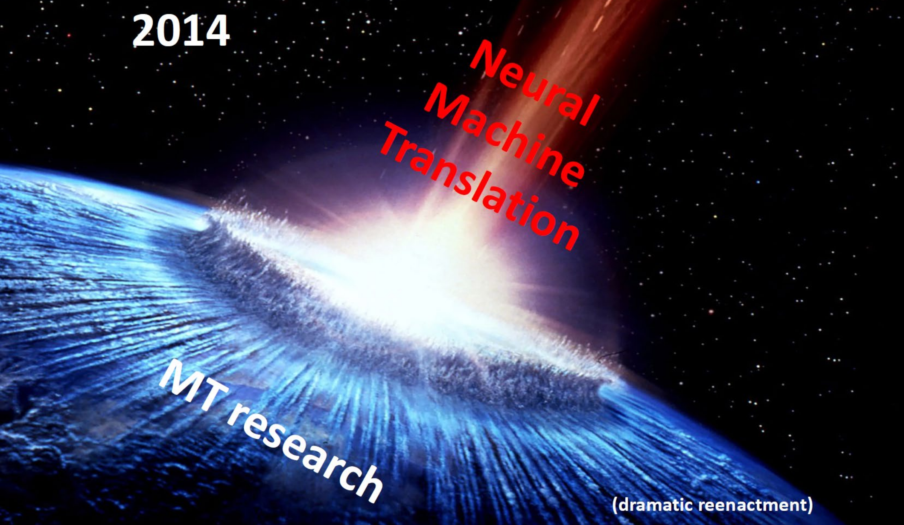

在NIPS2014上，Seq2Seq模型被提出，它的想法很简单:使用两个RNN $f_{enc}$ 和 $f_{dec}$ ，分别表示编码器和解码器.编码器读输入的序列，然后把最后一个隐藏层的输出作为解码器的初始隐藏层的输入，然后解码器根据贪心算法(或者beam search)一个一个词地生成输出序列，示意图如下:


通过这个模型，理论上来说它可以记住前面所有的输入保留在隐藏层里，然后根据这个信息生成输出，训练时我们只要采用MLE Training,最大化答案的（对数）概率。所以，这个模型可以有效地解决摘要，对话，翻译的需要，甚至用VAE的思想引入latent variable，还可以拥有Condition Generation的能力 $\dots$ 吗？并不行！

> 当时这篇论文是oral的论文，我正好在场。宣读论文的时候就有人challenge，说这个方法肯定不work，当时场面还一度尴尬。(Yi Wu)

事实上，最原始的Seq2Seq模型有个很大的问题导致实际上根本没法应用：可供记忆的空间太小了！在经过整个文本以后， $f_{enc}$ 的输出只有一个隐藏层，这在文本序列很长的时候天然会有信息的损失，就好像把一整本书给一个人看，然后看完以后让它默写翻译一样，当这个人的记忆空间有限的时候，这是非常困难的。然而，我们在实际翻译的时候，真的是这样的吗？并不是！事实上，翻译后的句子和原来的句子有很强的对应关系，而人类在翻译的时候，也大多是先读一遍了解大概结构，然后在针对某些特定的词逐词翻译，基于这个思想，我们能否让机器也这样做呢？这就引出了一个拥有跨时代意义的概念的提出：Attention. 在之后我们会逐渐看到，这个想法是如何一步步推动NLP，乃至AI的发展的。

Attention的概念是这样的：在decoder的第 $t$ 步中，我们本来只能获得上一步的隐藏层信息 $h_{t-1}^{dec}$ 和上一个词 $y_{t-1}$ ，但是我们希望它能在原来的文本里找到它想要的对应信息！于是，我们给它一个额外的信息 $h_{att,t-1}=\sum p_{i,t-1}h_i^{enc}$ ,和 $h_{t-1}^{dec}$ 拼接在一起，然后再输入到解码器中,其中， $p$ 是一个概率分布，代表此时解码器对于不同位置的关注程度，我们定义

$$
p_{i,t-1}=softmax(h_{t-1}^{dec}\cdot h_i^{enc})
$$

这个定义在直观上可能有点奇怪！为什么 $h_{t-1}^{dec}$ 和 $h_i^{enc}$ 的相似就可以代表它们相关性大呢？这确实不是显然的，但是我们可以认为模型可以学到一个合适的 $h$ 表示让这一点成立，而且这里的小问题也为之后的QKV注意力机制埋下了伏笔，我们将在之后讨论。

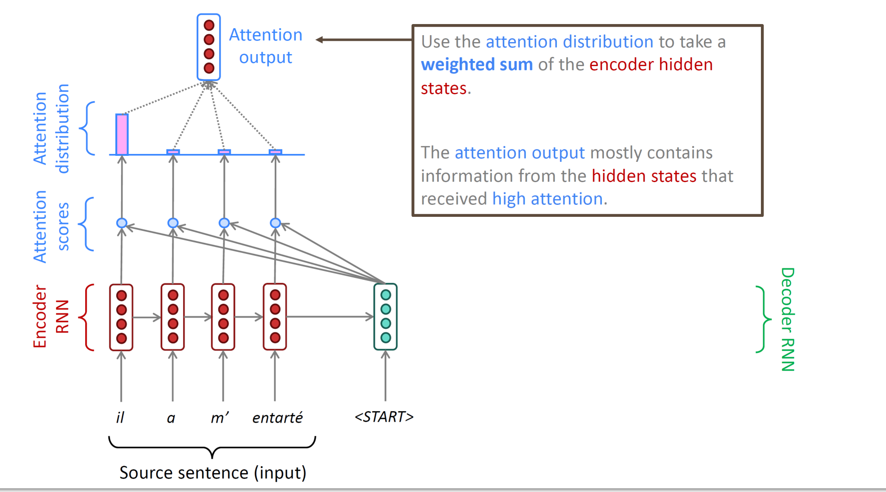

注意力机制是语言模型中里程碑式的发现，它极大增加了Seq2Seq模型的能力，同时也让NMT的性能有了质的飞跃，彻底取代了传统的专家系统。同时，注意力机制的实质是关注当前某个特定生成任务对历史输入的依赖性，这个思想不仅可以用于NMT，还可以用于其他生成任务，例如BigGAN等模型中，也引入了这一机制。

在2014到2017年间，应用注意力机制的Seq2Seq模型几乎成了NLP的convention,几乎所有的NLP任务都是基于这一模型上再做微调的结果。直到2017年Google的一篇重磅炸弹论文的推出，彻底打破了已经逐渐平静的NLP界，并接下来在DL，乃至AI领域掀起了一场巨大的风暴。

#### 3.5.2 Enhancing: Transformer

接下来，我们来介绍一下这篇论文的结果:Transformer.

Transformer的想法从论文简单粗暴的标题就可以看出:**Attention is All You Need**(~~这也开启了论文标题党的先河~~) 既然在加上attention 之后，Seq2Seq的模型有了那么大的改善，看上去这完全是attention 的功劳啊，既然如此我们为什么还要原来的RNN呢?于是，transformer的思想就是完全采用attention进行序列转换，而在生成的时候除了原来的attention,再使用对自己的self-attention来代替RNN中上一步隐藏层的作用。

这个想法看上去比较自然，为什么过了整整三年才有人提出？事实上，这个看上去很完美的想法存在着三个问题:

- 1.我们可以发现，实际上attention的机制并没有体现任何位置信息！然而一个句子中的词的顺序是非常重要的，这个问题在有RNN的时候并没那么关键，因为RNN本身就有位置信息，但是在没有RNN的时候，这个问题就显得尤为突出.
- 2.attention的机制里，所有东西都是矩阵乘法和加法，导致模型表现力有限，最终只是一个线性的模型，无法表达一些复杂的关系.
- 3.self-attention看上去很有道理，可是实际生成的时候，我们并不知道后面词的信息，然而attention机制的注意力计算需要用到整个序列的信息，这就导致了一个很大的问题：我们在生成的时候，实际上是在用未来的信息来生成当前的词，这是不合理的。

接下来，我们来看看Transformer是如何解决这些问题的。

**Positional Encoding**

为了解决第一个问题，Transformer引入了位置编码(Positional Encoding)的概念，它的想法是，我们把每个词的embedding再拼接上一个
向量代表它的位置信息。这听上去很简单，可是要对任意长的序列设计
位置编码，还是有一定的技巧的。Transformer 使用了一种很巧妙的方法，它使用了正弦和余弦函数来编码位置信息，具体地，对于位置 $pos$ ，我们定义

$$
PE_{(pos,2i)}=sin(pos/10000^{2i/d})
$$

$$
PE_{(pos,2i+1)}=cos(pos/10000^{2i/d})
$$

这个 $d$ 维的向量PE就是位置编码，然后我们把它和词的embedding拼接在一起，就得到了新的embedding.

值得一提的是，在原始论文中的这个位置编码并不是最优的，之后有很多论文研究了更好的位置编码，例如可学习的位置编码和相对位置编码等，这里就不再赘述。

**Activation Layer**

上面提到的第二个问题其实很好解决：我们只要在每个attention层后面加上一个全连接层，然后再加上一个激活函数就可以了，这样就可以提高模型的表现力。

**Masked Self-Attention**

对于第三个问题，一个简单的方法是每次一个一个词生成，然后计算关于前面的注意力系数，可是这样无法并行。于是，Transformer引入了Masked Self-Attention的概念，它的想法是，我们在计算attention的时候，把未来的信息乘上一个只含0,1的mask，把“非法信息”mask掉，这样就不会用到未来的信息了。也就是说，我们先算出所有的 $p_{i,j}$ ,然后把 $p_{i,j}$ 乘上一个下三角全为1,其余为0的mask矩阵，然后再对非零部分进行softmax，这样就可以保证生成的时候不会用到未来的信息，并且这是可以并行计算的。（实际实现上其实有另外一种更简单的方法：把 $p_{i,j}$ 加上一个下三角全为0,其余为 $-\infty$ 的矩阵，这样就可以让softmax时需要mask的部分变成0）

**Multi-Headed K-Q-V Attention**

除了解决了上面的三个问题以外，transformer还对注意力机制做了一个很大的改进。还记得我们上面就提出过的问题：为什么 $h_{t-1}^{dec}$ 和 $h_i^{enc}$ 的相似就可以代表它们相关性大呢？事实上，直观上来说，我们也应该像学习word embedding把一个词分为word embedding和context embedding一样，分开处理。具体地说，我们给一个词建立三个hidden state: Key, Query, Value， 直观地说key表示当前存储着什么信息，Query表示当前想要什么信息，Value表示当前的信息。基于这个，我们的attention机制可以写成:
$h_{att}=\sum_i softmax(Q_t\cdot K_i)V_i$
也就是说我们寻找"当前想要的"和"当前存储的"尽可能接近的信息的value给到解码器，这就很符合我们的直觉了。

前面在介绍attention的时候，你还有可能注意到另一个不完全符合直觉的地方：把所有的 $h_i^{enc}$ 加权求和这个操作真的合理吗？比如说如果当前词的翻译依赖于前面的两个词，那我把这两个词对应的value加权和，会不会导致混乱？于是，Transformer引入了Multi-Headed Attention的概念，它的想法是，我们不只是用一个attention，而是用多个attention，然后把它们的输出拼接在一起而不是加权和，这样就可以保证它可以同时注意到不同的信息。

具体地，为了不增加维度，我们把向量 $Q,K,V$ 都拆成 $l$ 份(原文中 $l=8$ )，然后让
$h_{att}=cat(h^1,h^2,\dots,h^l)$ ,其中 $h^k=\sum_i softmax(Q^k_t\cdot K^k_i)V^k_i$ .

这两个改进就被称为Multi-Headed Q-K-V Attention，也是Transformer的核心。

**Architecture Modification**

除了上面的改进以外，Transformer还做了一些架构上的改进，例如在每个attention层后面加上一个全连接层，然后再加上一个残差连接和Layer Normalization，这样可以提高模型的表现力，另外，有一个小问题是当 $d$ 足够大的时候，我们的 $Q\cdot K$ 的量级可能会变大，导致一些梯度消失的问题(因为我们要取softmax! 想象假如两个词的 $Q\cdot K$ 分别是1,2,那么后者的概率应该是前者的 $\frac{1}{e}$ ,这听上去还可以，但是如果变成了100,200,那后者的概率就变成了前者的 $\frac{1}{e^{100}}$ !).

于是, Transformer引入了Scaled Dot-Product Attention的概念，也就是把 $h^k$ 中的系数 $softmax(Q^k_t\cdot K^k_i)$ 换成 $softmax(\frac{Q^k_t\cdot K^k_i}{\sqrt{d/l}})$ ,这样就有效保证了模型对不同输入维度的稳定性。

从而，结合上面所有内容，我们就得到了大名鼎鼎的Transformer模型，这是它的结构图：


#### 3.5.3 Blooming: Applications, Pretrained Transformer, and LLM

Transformer刷新了当前NLP领域的几乎所有state-of-the-art,并迅速在NLP领域占据了统治地位。同时，transformer原架构的一些问题也在被不断改进，例如注意力矩阵的 $d^2$ 大小所带来的计算复杂性问题可以利用其稀疏性进行优化等。

同时，除了NLP领域，甚至图片处理领域也在被transformer占据，ViT(Vision Transformer)是google的一项工作，其思想就是把图片拆成16 $\times$ 16的patch，然后把每个patch当成一个word来处理，这篇名叫An Image is Worth 16x16 Words的论文也在CV领域引起了巨大的反响，刷新了CV领域的几乎所有state-of-the-art. CVPR2021的最佳论文Swin Transformer也是在这之上，通过分层的方法强化了不同patch之间相邻关系，取得了更好的效果。

接下来，我们将介绍另一个非常重要的，甚至改变了人类生活的应用: Pretrained Transformer.

Pretrained Transformer的想法也是直接的，还记得之前的ELMo吗？它运用双向的RNN给word embedding增加上下文信息，从而起到了提高模型性能的效果。而Transformer的结构和它也很类似，并且能力更为强大，那么，预训练好的transformer结构是不是可以起到很好的作用呢？既然transformer有两个结构，一个是encoder，一个是decoder，那么我们可以只用encoder部分，也可以都用，也可以只用decoder部分，这就引出了三种不同的预训练模型，我们将分别介绍。注意到encoder和decoder的结构是类似的，最主要的区别就是encoder是双向的，也就是说，它可以看到整个句子，而decoder是单向的，只能看到前面的词，这就导致了encoder的预训练模型更适合做一些embedding任务，而decoder的预训练模型更适合做生成任务。

**BERT**

BERT(Bidirectional Encoder Representations from Transformers)是Google在2018年提出的预训练模型，它就是预训练了一个decoder,而训练的想法是，我们把一个句子中的某些词mask掉，然后让模型预测这些词，这样就可以让模型学到双向的信息，这个任务事实上和word embedding是有些类似的，可是现在我们的模型架构已经变得很强大了。事实上，为了激发模型的能力，BERT的具体训练目标是这样一个任务:找出15%的词，然后对这些词做如下操作:80%概率变成[MASK]，10%概率变成随机词，10%概率不变，然后让模型预测所有的[MASK]所对应的词。

在这个任务下训练出来的decoder在翻译领域的benchmark上全面超越了之前的所有模型，体现了transformer的强大能力。

**T5**

T5(Text-to-Text Transfer Transformer)是Google在2019年提出的预训练模型，它的训练任务是给定一些问题以及回答，然后把问题和回答中的一些词都mask掉，然后让模型预测。这样就可以同时训练encoder和decoder，而且可以在很多任务上都有很好的表现。在训练的过程中，人们发现T5模型有了一些能力，可以预测一些并不在语料库中的词，这时候，Transformer的神奇能力已经开始显现了。

**Pretrained Transformer(Decoder)**

最后，我们来介绍预训练的decoder, 由于decoder的auto-regressive的特性，我们可以用它来做生成任务，所以，它还有一个广为人知的名字:**Generative Pretrained Transformer(GPT)**.

Open AI 在2020年的文章：GPT-3: Language models are few-shot learners 中表述了这个模型的惊人性质，它可以在只给出几个例子的情况下，完成很多任务，例如翻译，摘要，对话等。并且随着模型的参数的增加，它的能力也在不断涌现，在视频等领域甚至也起到了惊人的效果。同时，加大参数量带来的惊人变化也使LLM(Large Language Model)成为了当前NLP领域的重大热点。

> 基于LLM的很多应用，甚至已经开始改变人们的生活方式：例如，ChatGPT可以和人进行对话，DALL-E可以根据描述生成图片，GPT-3可以完成很多任务，甚至可以写出一篇文章，这些都是LLM的应用。(Github Copilot)
