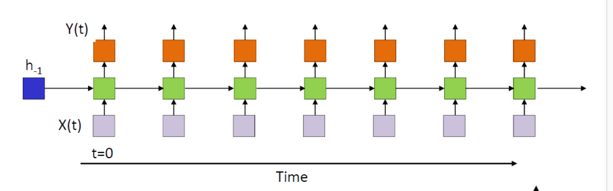
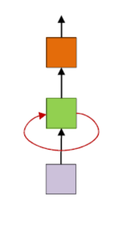
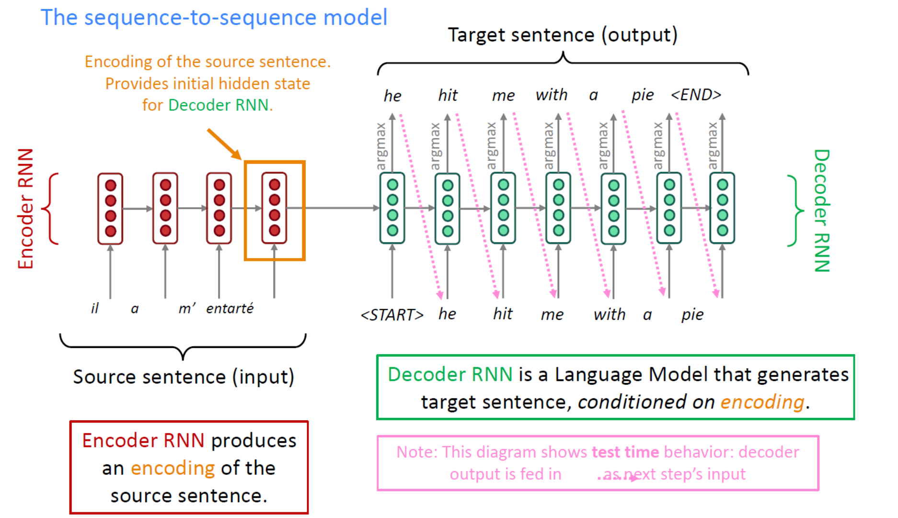

# 3. Sequence Modeling

## 3.1 Introduction

在上面的讨论中，我们都默认了 $x$ 是一个已知维度的向量，然而，生活中还有一类数据形式：序列。序列数据是一种非常常见的数据形式，比如文本，音频，视频等等。它的特点是维度未知，例如文本的长度，并不确定。那么我们如何处理这种数据呢？一个简单的办法是卷积，然而卷积的感受野的大小也是固定的，对于输入很长的数据，并不能有效处理。于是，我们需要一些新的网络结构。

## 3.2 Recurrent Neural Network(RNN)

### 3.2.1 Intro

循环神经网络(Recurrent Neural Network)的思路很简单，我们希望通过一个神经网络不断循环地处理数据，同时保存一个"hidden state"作为这个神经网络的记忆。这样，我们就可以处理任意长度的数据了！具体地，我们有

$$
h_t=f(h_{t-1},X_t)
$$

$$
Y_t=g(h_t)
$$

其中 $h_t$ 是hidden state, $X_t$ 是输入， $Y_t$ 是输出。RNN的示例图如下：

我们也可以更简单地化成下面的形式：

### 3.2.2 Backpropagation Through Time(BPTT)

对于一个RNN，我们如何计算梯度?一般来说，RNN的损失函数是关于输出序列 $Y$ 的函数，设为 $L(Y)$ ,那么我们的目标是求 $\nabla_{\theta}L(Y)$ ,其中 $\theta$ 是所有的参数。所以，我们事实上可以通过链式法则，从后往前累积梯度，这个过程被称为BPTT.

### 3.2.3 Issues

上面的想法看上去很美好，但事实上这个结构存在一些严重的问题。我们先考虑一个简单的只有线性层的RNN，那么，它的结构可以表示为:

$$
h_t=W_1h_{t-1}+W_2X_t
$$

从而，我们可以得到

$$
h_t=W_1^th_0+\sum_{i=1}^tW_1^{t-i}W_2X_i
$$

我们发现，如果 $W_1$ 的特征值大于1,那么 $h_t$ 会随着 $t$ 的增大而指数增长，这就是所谓的梯度爆炸。而如果 $W_1$ 的特征值小于1,那么 $h_t$ 会随着 $t$ 的增大而指数减小，这就是所谓的梯度消失。现在，让我们再加上激活函数 $f$ ,也就是说

$$
h_t=f(W_1h_{t-1}+W_2X_t)
$$

我们发现，

$$
\frac{\partial Y_{t+1}}{\partial h_0} \propto \prod_{i=1}^t W_1f'(W_1h_{i-1}+W_2X_i)
$$

$$
= W_1^t\prod_{i=1}^tf'(W_1h_{i-1}+W_2X_i)
$$

但我们一般的激活函数的导数小于1,于是这个梯度在 $W_1$ 的特征值小于1的时候会消失，而在大于1的时候会爆炸，而就算 $W_1$ 特征值比较好，仍然会有梯度消失的问题。（当然，也许你可能会觉得，没准 $W_1$ 特征值大于1,和f'小于1正好起到抵消的效果，但这其实几乎不可能，因为 $f'$ 的大小和数据关系很大，当序列很长的时候，这种情况几乎不可能发生）

事实上，我们并没有很好的通用办法解决这些问题，在应用中，我们只能用一个妥协的办法：Gradient Clipping,也就是说，当梯度的大小超过一个阈值的时候，我们把它截断。另外，我们让 $W_1$ 的初始最大特征值为1,这样可以减缓梯度爆炸的问题。但是，当循环次数过多(一般7次左右),末态对初始值梯度消失的问题仍然得不到好的解决，于是，我们需要一些新的结构。这就引出了著名的LSTM.

## 3.3 Long Short-Term Memory(LSTM)

### 3.3.1 Intro

LSTM 的想法是这样的，既然很多轮之前的数据因为经过了太多次的activation而消失，我们不如再加上一个cell来记录一个长时记忆，这就是LSTM的思想。

### 3.3.2 Structure

具体地，我们有

$$
f_t=\sigma(W_f[h_{t-1},X_t]+b_f)
$$

$$
i_t=\sigma(W_i[h_{t-1},X_t]+b_i)
$$

$$
o_t=\sigma(W_o[h_{t-1},X_t]+b_o)
$$

$$
\tilde{C_t}= \tanh(W_c[h_{t-1},X_t]+b_c)
$$

$$
c_t=f_t\circ c_{t-1}+i_t\circ\tilde{C_t}
$$

$$
h_t=o_t\circ \tanh(c_t)
$$

这看上去有点复杂，但其实很直观，我们保存两个东西，一个是长时记忆 $c_t$ ,一个是短时记忆 $h_t$ .

$c_t$ 的更新通过两个门确定:一个是 $f_t$ ，被称为遗忘门(forget gate)来控制 $c_{t-1}$ 在 $c_t$ 中的系数，另一个门是 $i_t$ ，被称为输入门(input gate)，来控制 $\tilde{C_t}$ 的系数。 $\tilde{C_t}$ 是根据当前的短时记忆和输入计算出来的。

而 $h_t$ 则是通过一个门控 $o_t$ 来控制输出。这样，我们就可以通过一个cell来控制长时记忆和短时记忆的交互，从而解决了梯度消失的问题。实验上，LSTM 大约能记住100个时间步的信息。

### 3.3.3 Invariants

现实生活中，根据需求的不同，也有许多人在LSTM上进行了一些调整，产生了一些变种。

#### 3.3.3.1 Peephole Connection

Peephole Connection的想法是，我们可以让 $f_t,i_t,o_t$ 不仅仅依赖于 $h_{t-1},X_t$ ,还依赖于 $c_{t-1}$ ,这样可以增加一些信息的传递。

数学上说，实际上就是把

$$
f_t=\sigma(W_f[h_{t-1},X_t]+b_f)
$$

$$
i_t=\sigma(W_i[h_{t-1},X_t]+b_i)
$$

$$
o_t=\sigma(W_o[h_{t-1},X_t]+b_o)
$$

变成

$$
f_t=\sigma(W_f[h_{t-1},X_t,c_{t-1}]+b_f)
$$

$$
i_t=\sigma(W_i[h_{t-1},X_t,c_{t-1}]+b_i)
$$

$$
o_t=\sigma(W_o[h_{t-1},X_t,c_{t-1}]+b_o)
$$

这样可以在参数翻倍的代价下，取得更好的效果。

#### 3.3.3.2 Simplified LSTM

Simplified LSTM的想法是，我们可以把 $f_t$ 和 $i_t$ 合并成一个门，这样可以减少参数的数量，同时也可以减少一些计算量, 事实上，如果我们假设它的“记忆量”不变的话，我们可以不用计算 $f_t$ ，而是直接用 $1-i_t$ 代替，这就是Simple LSTM。

#### 3.3.3.3 GRU

看了前面的小改动之后，有一个更新的想法，我们能不能把 $c$ 和 $h$ 合并到一起？事实证明确实可以，这就是GRU(Gated Recurrent Unit)的想法。它的结构如下：

$$
z_t=\sigma(W_z[h_{t-1},X_t])
$$

$$
r_t=\sigma(W_r[h_{t-1},X_t])
$$

$$
\tilde{h_t}=\tanh(W[h_{t-1},r_t\circ X_t])
$$

$$
h_t=(1-z_t)\circ h_{t-1}+z_t\circ \tilde{h_t}
$$

## 3.4 Language Model

### 3.4.1 LSTM Language Model

我们接下来关注一类特殊的模型:Language Model.
具体地，我们要训练一个模型，给定 $x_1,x_2,...,x_{t-1}$ ,我们希望预测下一个词 $x_t$ 的概率分布

$$
p(x_t|x_1,x_2,...,x_{t-1})
$$

LSTM Language Model的结构很简单，我们只需要把LSTM的输出接一个softmax层即可。

$$
P(x_t|x_{i<t})= Y_t
$$

$$
h_t,c_t,Y_t = LSTM(h_{t-1},c_{t-1},x_{t-1})
$$

如果我们定义一个句子的概率为

$$
P(x_1,x_2,...,x_T)=\prod_{t=1}^TP(x_t|x_{i<t})
$$

那么，我们就可以用MLE训练这个模型了！

而对于生成，我们可以通过贪心算法，每次生成概率最大的词，然后把它作为下一个词的输入。

### 3.4.2 Word Embedding

事实上，我们可以发现，我们一直处理的都是向量的运算，但是如何把自然语言转化成向量(序列)?这被称为embedding.一个最简单的办法就是用一个 $d$ 维向量表示，其中 $d$ 是所有可能单词的数量，第i个单词用一个one-hot向量(第i维是1,其他全0)表示，但是这种embedding显然有两个问题：1.维度太高 2.没有语义信息。于是，如何获得一个好的embedding就成了一个问题。总的来说，我们希望维度不要太高，并且包含一些语义信息，相似的词在向量空间中也应该比较接近。这就引出了word2vec.

Word2Vec的想法是，我们希望通过一个神经网络，把一个词映射到一个低维向量，同时让相似的词在向量空间中比较接近。具体地，我们有两种结构：CBOW和Skip-gram.

CBOW的想法是，我们希望通过embedding的信息，通过上下文来预测中心词,从而学到一个好的embedding.

> “You shall know a word by the company it keeps.”
> (J. R. Firth 1957: 11)

具体地说，我们给每个词t两个向量 $w_t,c_t$ （实际使用中需要让模长大小有一定限制）,分别表示它作为上下文和中心词的embedding,然后我们认为一个词 $y$ 出现在上下文" $x_{-k}x_{-k+1}...x_{-1}*x_1x_{k-1}x_{k}$ "中的概率为

$$
\prod p(w_y|c_{x_{-k}})
$$

而每个 $p(w_y|c_{x_{-k}})$ 可以用softmax来表示

$$
p(w_y|c_{x_{-k}})=\frac{\exp(c_{x_{-k}}\cdot w_y)}{\sum_{i=1}^d\exp(c_{x_{-k}}\cdot w_i)}
$$

需要注意的是，这个概率并没有任何严格的数学推导，只是一个假设，因为我们希望一个词的embedding和它的上下文的内容有关，于是我们就用这个形式来表示。

但是，这个表示虽然正确，却难以训练，因为我们需要对所有的词做softmax，这样的计算量太大了。于是，我们转而来把这个问题转化为一个二分类问题，即给定一个中心词和一个上下文，我们希望判断这个词是否在这个上下文中出现过。

我们假定

$$
Pr(y,+|x_{-k}x_{-k+1}...x_{-1}*x_1x_{k-1}x_{k})=\prod_{i=-k,i\neq 0}^k{\frac{1}{1+\exp(-c_{x_i}\cdot w_y)}}
$$

从而，我们就可以用MLE训练这个模型了！但事实上，如果你足够细心，你可能会发现一点问题，如果我们要优化

$$
\frac{1}{|C|}\sum_{c=(x_{-k}x_{-k+1}...x_{-1}yx_1x_{k-1}x_{k})\in C} \log Pr(c,+)
$$

的话，事实上我们的最优解总是让所有向量都一样，这样可以让每个概率都最大化！问题在哪里？我们发现对于一个二分类问题，我们不仅需要正例，还需要负例，但是我们的模型中并没有负例！于是，我们引入了负采样(negative sampling)的概念：我们对于上下文，随机采样作为负例，然后我们希望

$$
L(w,c) = \sum_{c=(x,y)\in D^+} \log Pr(c,+)+\sum_{c=(x,y)\in D^-} \log Pr(c,-)
$$

尽量大，其中 $D^+$ 是正例集合， $D^-$ 是负例集合。

另一种结构是Skip-gram,它的想法是，我们希望通过一个词来预测它的上下文，从而学到一个好的embedding.具体地，我们在训练语料 $x_{-k}x_{-k+1}\dots x_{-1}yx_1 \dots x_{k-1}x_{k}$ 的中的 ${x_i}$ 里随机选择 $R$ 个词作为 $y$ 的上下文 $x$ ,然后把这些 $(x,y)$ 作为正例，然后随机采样 $R$ 个词构成 $\tilde{x}$ ,让 $(\tilde{x},y)$ 作为负例，然后进行一样的训练。

### 3.4.3 Some Techniques on Language Model

#### 3.4.3.1 Make Training Fast: Noise Contrastive Estimation(NCE)

tldr:这一小节讲了一个加速训练的方法:NCE,它的想法和之前类似，把多分类问题转化为二分类问题。本节主要是数学计算，如果不感兴趣，可以跳过，对理解整体内容没有太大影响。

回顾我们的Language Model的训练，具体地，我们希望我们模型输出的概率分布和真实分布（训练的时候，就是训练语料的分布）接近，于是我们用MLE的方法优化我们的模型，在这里，我们先定义一些符号:

$$
h:上文，w:下一个词
$$

$$
\tilde{p}(w|h):真实(训练语料)的分布 
$$

$$
c_{\theta}(w,h):模型对于w和h输出的结果 
$$

$$
u_{\theta}(w,h)=e^{c_{\theta}(w,h)}:模型预测的未归一化的概率 
$$

$$
p_{\theta}(w|h)=softmax(c_{\theta})=\frac{u_{\theta}(w,h)}{Z_{\theta,h}}:模型预测的概率 
$$

$$
Z_{\theta,h}=\sum_{w} u_{\theta}(w,h):归一化因子
$$

这里要注意，我们之后会用到很多的不同的概率分布，请不要弄混，另外下标带 $\theta$ 说明与模型有关，否则与模型无关. 如果你在中间某步突然不能理解，请检查一下是不是弄混了不同的概率分布！

我们的目标是:

$$
p_{\theta}(w|h) \approx \tilde{p}(w|h)
$$

你可能会有疑问，为什么训练集合是个概率分布？这是因为i同一个词可能多次出现，比如说训练语料集合是  {"我是人","你很强","我爆零了","我是吊打"} ,那么给定上文"我",下一个词应该是一个概率分布:("是", $p=\frac{2}{3}$ ),("爆", $p=\frac{1}{3}$ ),(else, $p=0$ ).我们希望我们的模型生成的概率也是这样。

从而，我们使用MLE优化，它的损失函数定义为:

$$
L=E_{w\sim \tilde{p}(w|h)}\log p_{\theta}(w|h)
$$

那么，我们可以进行计算:

$$
\nabla L = \nabla E_{w\sim \tilde{p}(w|h)}\log p_{\theta}(w|h)
$$

$$
= E_{w\sim \tilde{p}(w|h)}\nabla \log p_{\theta}(w|h)
$$

$$
= E_{w\sim \tilde{p}(w|h)}[\nabla \log \frac{u_{\theta}(w,h)}{Z_{\theta,h}}]
$$

$$
= E_{w\sim \tilde{p}(w|h)}[\nabla c_{\theta}(w,h)]-\nabla \log Z_{\theta,h}
$$

$$
= E_{w\sim \tilde{p}(w|h)}[\nabla c_{\theta}(w,h)]-\frac{\sum_{w}\nabla u_{\theta}(w,h)}{Z_{\theta,h}}
$$

$$
= E_{w\sim \tilde{p}(w|h)}[\nabla c_{\theta}(w,h)]-\frac{\sum_{w}e^{c_{\theta}(w,h)}\nabla c_{\theta}(w,h)}{Z_{\theta,h}}
$$

$$
= E_{w\sim \tilde{p}(w|h)}[\nabla c_{\theta}(w,h)]-\sum_{w}p_{\theta}(w,h)\nabla c_{\theta}(w,h)
$$

$$
= E_{w\sim \tilde{p}(w|h)}[\nabla c_{\theta}(w,h)]-E_{w\sim p(w|h)}[\nabla c_{\theta}(w,h)]
$$

这里我们默认所有的 $\nabla$ 都是对 $\theta$ 求梯度，所以和 $\theta$ 无关的项可以被当成常数。虽然最后梯度化成了很优美的形式，但是有一个很严重的问题：第二项根本不好估计！为了从 $p(w|h)$ 里面采样，我们需要对每个词都算出对应的概率取softmax,而这对计算力的要求是很高的(但是也有好消息，因为这些计算之间两两无关，所以可以并行进行，从而随着GPU算力的提高，越来越多模型直接用MLE来优化)。或许你会说，我们是不是可以用类似Importance Sampling的估计方法来采样？然而，这依然不现实，因为事实上， $p$ 的分布在模型有一定能力的时候应该非常不平均，少数的词占有几乎所有概率(想象给定一段上文，下一个合理的单词可能比上全部单词的集合是多么小！)，导致proposal distribution里采样大概率全都是对后面一项没有任何贡献的东西，导致方差极大，而想要取到有用的样本，在可行的词很少的情况下期望上需要的采样次数和词库的量级相等！当然，如果真的要采这么多样，还不如直接全部算一遍呢。

不幸的是，这个问题是由MLE的本身性质决定的，并没有很好的解决方法。所以，在算力不足的情况下，我们只能转而考虑别的优化对象，为了不跑很大的softmax,受到之前的启发，我们何不转化成一个二分类问题？然而，我们应该如何定义这个二分类问题呢? 这里我们不能像上面一样自己乱定义概率了，因为在word embedding里，概率的数值没有数学上的严格推导，只是我们假定的定义，用来学embedding,但这里的概率是有严格定义的。这就引出了我们接下来要说的Noise Contrastive Estimation(NCE).

NCE定义正样本集是：给定 $h$ ，先从分布中采样一个 $w$ 作为正样本(标签为 $+$ )，再从某个随机分布 $q$ (一般是均匀分布或者出现频率)中采样k个 $w$ 作为负样本（标签为 $-$ ）。
这样，我们就把本来的二元分布 $p(w,h)$ 变成了三元分布 $p^{\star}(Y,w,h)$ ,其中 $Y \in \{+,-\}$ 是标签。

我们对模型的分布也做同样的操作，然后我们希望这两个三元分布相等，从而可以变为优化给定w,h,判断标签的概率相等！这样就被转化成了一个二分类问题。

总结一下，我们干的事情是:

我们希望

$$
p_{\theta}(w|h) \approx \tilde{p}(w|h)
$$

从而优化

$$
 L=E_{w\sim \tilde{p}(w|h)}\log p_{\theta}(w|h)
$$

可是计算量过大，因为**w类数太多**!从而，我们把 $\tilde{p}(w,h)$ 和 $p_{\theta}(w,h)$ 按照上面的方式选出正负例，就得到了两个三元分布

$$
\tilde{p}^{\star}(Y,w,h);p_{\theta}^{\star}(Y,w,h)
$$

然后，我们的目标变成让这两个三元分布接近，转化成让

$$
\tilde{p}^{\star}(Y|w,h) \approx p_{\theta}^{\star}(Y|w,h)
$$

 也就是优化

 

$$
L^{\star}=E_{(Y,w)\sim \tilde{p}^{\star}(Y,w|h)}\log p_{\theta}^{\star}(Y|w,h)
$$

注意期望是 $\tilde{p}^{\star}(Y,w|h)$ 采样，而 $\log$ 里是 $p_{\theta}^{\star}(Y|w,h)$ .这样，我们的问题就变成了**二分类问题**，从而可以快速计算！

这里有两个可能引起误解的点:

- 1. $\tilde{p}^{\star}$ 是由 $\tilde{p}$ 经过上面的特定方法生成的三元分布，而它并不只是简单地给每个句子加上标签，也就是说它的边缘分布 $\tilde{p}^{\star}(+,w|h)+\tilde{p}^{\star}(-,w|h)$ 一般来说并不等于 $\tilde{p}(w|h)$ !
- 2.我们为什么可以优化这个对象？我们将接下来证明，在某些假定下， $L^{\star}$ 的梯度和 $L$ 是相等的！所以我们可以把 $\nabla L^{\star}$ 当成 $\nabla L$ 的近似。

现在，我们来推导 $\nabla L^{\star}$ 和 $\nabla L$ 的关系.我们首先来计算 $\tilde{p}^{\star},p_{\theta}^{\star}$ 的分布:

$$
\tilde{p}^{\star}(+,w|h)=\tilde{p}^{\star}(+|h)\tilde{p}^{\star}(w|+,h) =\frac{1}{k+1} \tilde{p}(w|h)
$$

$$
\tilde{p}^{\star}(-,w|h)=\tilde{p}^{\star}(-|h)\tilde{p}^{\star}(w|-,h)=\frac{k}{k+1} q(w)
$$

$$
\to \tilde{p}^{\star}(w|h)=\frac{1}{k+1} \tilde{p}(w|h)+\frac{k}{k+1} q(w)
$$

$$
 \tilde{p}^{\star}(+|w,h)=\frac{\tilde{p}^{\star}(+,w|h)}{\tilde{p}^{\star}(w|h)}=\frac{\tilde{p}(w|h)}{kq(w)+\tilde{p}(w|h)}
$$

$$
 \tilde{p}^{\star}(-|w,h)=\frac{\tilde{p}^{\star}(-,w|h)}{\tilde{p}^{\star}(w|h)}=\frac{kq(w)}{kq(w)+\tilde{p}(w|h)}
$$

类似的，我们可以计算 $p_{\theta}^{\star}$ 的分布:

$$
p_{\theta}^{\star}(+|w,h)=\frac{p_{\theta}^{\star}(+,w|h)}{p_{\theta}^{\star}(w|h)}=\frac{p_{\theta}(w|h)}{kq(w)+p_{\theta}(w|h)}
$$

 

$$
p_{\theta}^{\star}(-|w,h)=\frac{p_{\theta}^{\star}(-,w|h)}{p_{\theta}^{\star}(w|h)}=\frac{kq(w)}{kq(w)+p_{\theta}(w|h)}
$$

从而，我们可以计算 $L^{\star}$ :

$$
L^{\star}=E_{(Y,w)\sim \tilde{p}^{\star}(Y,w|h)}\log p_{\theta}^{\star}(Y|w,h)
$$

$$
=\sum_w (\tilde{p}^{\star}(+,w|h)\log p_{\theta}^{\star}(+|w,h)+\tilde{p}^{\star}(-,w|h)\log p_{\theta}^{\star}(-|w,h))
$$

$$
=\sum_w (\frac{1}{k+1} \tilde{p}(w|h)\log \frac{p_{\theta}(w|h)}{kq(w)+p_{\theta}(w|h)}+\frac{k}{k+1} q(w)\log \frac{kq(w)}{kq(w)+p_{\theta}(w|h)})
$$

$$
= \frac{1}{k+1}\sum_w(\tilde{p}(w|h)\log \frac{p_{\theta}(w|h)}{kq(w)+p_{\theta}(w|h)}+kq(w)\log \frac{kq(w)}{kq(w)+p_{\theta}(w|h)})
$$

在这里，我们要做一个不太自然的假设：假设归一化系数约等于1. 这一假设看上去没什么道理，但是事实上，在实践中，发现用这个方法优化出来的模型的归一化系数都很接近1. 这背后也有一些理论支持，但是这里不做讨论，如果感兴趣可以参考[论文1](#https://arxiv.org/abs/1206.6426) 和 [论文2](https://arxiv.org/abs/1410.8251) 。

这样，我们可以得到 $p_{\theta}(w|h)\approx u_{\theta}(w,h)$ (还记得这些符号的[定义](#def)吗？)，从而我们可以得到(为了方便起见，我们省略最前面的常数 $\frac{1}{k+1}$ ):

$$
L^{\star}=\sum_w(\tilde{p}(w|h)\log \frac{u_{\theta}(w,h)}{kq(w)+u_{\theta}(w,h)}+kq(w)\log \frac{kq(w)}{kq(w)+u_{\theta}(w,h)})
$$

故我们可以来计算 $\nabla L^{\star}$ (为简单起见，我们在下面的中间过程里用 $q$ 表示 $q(w)$ , $u_{\theta}$ 表示 $u_{\theta}(w,h)$ ):

$$
\nabla L^{\star}=\sum_w \nabla(\tilde{p}(w|h)\log \frac{u_{\theta}}{kq+u_{\theta}}+kq\log \frac{kq}{kq+u_{\theta}})
$$

$$
=\sum_w \tilde{p}(w|h)\nabla (\log \frac{u_{\theta}}{kq+u_{\theta}})+kq\nabla (\log \frac{kq}{kq+u_{\theta}})
$$

$$
=\sum_w \tilde{p}(w|h)\cdot\frac{kq+u_{\theta}}{u_{\theta}}\cdot \frac{kq\nabla u_{\theta}}{(kq+u_{\theta})^2}+kq\cdot\frac{kq+u_{\theta}}{kq}\cdot \frac{-kq\nabla u_{\theta}}{(kq+u_{\theta})^2}
$$

$$
=\sum_w \tilde{p}(w|h)\cdot\frac{kq\nabla u_{\theta}}{u_{\theta}(kq+u_{\theta})}+\frac{-kq\nabla u_{\theta}}{kq+u_{\theta}}
$$

$$
=\frac{kq}{kq+u_{\theta}}\sum_w (\tilde{p}(w|h)\frac{\nabla u_{\theta}}{u_{\theta}}-\nabla u_{\theta})
$$

$$
=\frac{kq}{kq+u_{\theta}}\sum_w (\tilde{p}(w|h)-u_{\theta})\nabla(\log u_{\theta})
$$

而我们上面已经计算过(~~我猜你已经忘了~~):

$$
\nabla L = E_{w\sim \tilde{p}(w|h)}[\nabla c_{\theta}(w,h)]-E_{w\sim p(w|h)}[\nabla c_{\theta}(w,h)]
$$

$$
=\sum_w (\tilde{p}(w|h)-p_{\theta}(w,h))\nabla c_{\theta}(w,h)
$$

$$
=\sum_w (\tilde{p}(w|h)-u_\theta))\nabla (\log u_\theta)
$$

其中最后一步还是用到了 $p_{\theta}(w|h)\approx u_{\theta}(w,h)$ .

从而，我们推出了，当 $k$ 足够大的时候， $\nabla L^{\star} \approx \nabla L$ ！

(严格地，是 $(k+1)\nabla L^{\star} \approx \nabla L$ ，别忘了我们之前省略了系数)

读到这里，你可能会有点奇怪，这个方法究竟是怎么绕开原来的softmax问题的？事实上很简单，上面直接把计算量最大的归一化系数当成了1来算！你可能还会说，那既然这样，我们在MLE估计的时候直接把归一化系数当成1不是照样很好算吗，可是我们可以发现，如果这样的话，MLE训练时将会让每个 $u$ 越来越大，导致损失函数到无穷大，从而毫无意义！所以这个方法最大的intuition就是说，通过同时采样正例和负例，从而避免了归一化系数过大或者过小可以cheat的方法，然后把归一化系数假设成1来加速计算！

其实前面你可能就会注意到，优化

$$
L^{\star}=E_{(Y,w)\sim \tilde{p}^{\star}(Y,w|h)}\log p_{\theta}^{\star}(Y|w,h)
$$

根本没让问题变得更好算啊，因为

$$
p_{\theta}^{\star}(+|w,h)=\frac{p_{\theta}(w|h)}{kq(w)+p_{\theta}(w|h)}，p_{\theta}^{\star}(-|w,h)=\frac{kq(w)}{kq(w)+p_{\theta}(w|h)}
$$

里面的 $p_\theta$ 还是要归一化系数！

> A conceptually simple way to deal with the normalization constraint would be to consider the normalization constant $Z(α)$ as an additional parameter of the model. This approach is, however, not possible
> for Maximum Likelihood Estimation (MLE). **The reason is that the likelihood can be made arbitrarily large
> by making $Z(α)$ go to zero.** Therefore, methods have
> been proposed which estimate the model directly using
> $p^0_m(.; α)$ without computation of the integral which defines the normalization constant; the most recent ones
> are contrastive divergence (Hinton, 2002) and score
> matching (Hyv¨arinen, 2005).

上面这段话来自NCE的[原始论文](#http://proceedings.mlr.press/v9/gutmann10a/gutmann10a.pdf)，其中提到，事实上，基于一些别的损失函数的模型训练中，可以直接采用用模型来估计归一化系数 $Z$ 或者直接使用 $p^0$ (也就是我们的没有归一化的概率，相当于把 $Z$ 当成1)，只是在MLE的时候，会出现明显问题(如果模型估计 $Z$ ,那非常趋近于0导致loss是负无穷,如果 $Z$ 当成1,让 $u$ 很大也是一个道理)。于是只要避免这个明显的问题，我们就可以用同样的方法了！从这里我们也可以看到深度学习理论和实践之间的差距，许多理论并没有特别严格的数学解释保证一定正确，只要解决trivial的问题避免模型简单地cheat,在实际应用中就可能是可行的。

#### 3.4.3.2 Make Inferencing Better: Beam Search

在模型生成的时候，我们一般是给定上文，然后使用贪心算法，每次找当前概率最大的词 $w_t=\argmax_w{p(w|w_1w_2\dots w_{t-1})}$ ,然而，这样真的能保证最后生成的句子 $w_1w_2\dots w_T$ 是最好的吗？抛开概率大小和好坏的关系不谈，这个甚至不一定是概率最大的！从数学上来说，如果要找到概率最大的句子，我们需要遍历所有可能的句子，这是不现实的。但是，如果使用贪心算法，又容易因为某个词被"带偏",陷入局部最优解。举个具体例子，假如我们现在有某个模型，给定上文"我爱"，它的概率分布是:(苹果，p=0.45),(大象, p=0.1),(大人, p=0.08),(大妈, p=0.12), (大便, p=0.05), (大军, p=0.05),(大米, p=0.08),(大姐, p=0.07).（按照道理来说，应该生成的是条件概率，但是为了方便，我们直接用概率来表示）,那么，如果我们使用贪心算法，第二个字应该会生成"大"(p=0.55),然后最终就生成了"我爱大妈"，可是这个句子的概率并不是最大的！事实上，最大的句子应该是"我爱苹果"！这就是贪心算法的局限性。

为了解决这个问题，我们引入了Beam Search的概念。Beam Search的想法是，我们不仅仅保留一个最优解，而是保留k个最优解，然后每次生成下一个词的时候，我们生成k个可能的词，然后从中选出概率最大的k个，然后继续生成，直到生成了一个终结符或者达到了最大长度。下图就是一个Beam Search的例子，k=2.

#### 3.4.3.3 Make Understanding Accurate: Contextualized Word Embedding

在我们之前的例子里，Word Embedding都是固定的，然而，同一个词在不同的上下文里有可能差别很大，例如"I can't bear this" 和 "This is a bear"的bear的encoding理论上来说应该很不一样，可是在我们之前的假定里，他们对应同一个向量。基于这个思想，我们可以先训练正向/反向两个RNN模型，然后把它的隐藏层序列和word本身的embedding拼接在一起，作为这个词的新的embedding，这就是ELMo(Embeddings from Language Models),在这个新的embedding下，我们发现模型的能力有了很大的提升。

## 3.5 Machine Translation: From Seq2Seq to Transformer

### 3.5.1 Emerging: Seq2Seq and Attention

接下来，我们来讨论一个具体的问题: 机器翻译(Machine Translation),并沿着历史的时间线来看看这个问题是如何一步步推动语言模型的发展，最终达到令人惊叹的结果。

在2014年前，机器翻译的问题都在被所谓“专家系统”(Expert System)所主导，这种方法需要大量语言学的专家构建大量的规则来进行翻译，然而，这种方法不仅准确性得不到保证，而且对于每种语言都要不同的人构建不同的系统，代价及其巨大。

2014年，Nerual Machine Translation的出现，给机器翻译界带来了一场巨变。

在NIPS2014上，Seq2Seq模型被提出，它的想法很简单:使用两个RNN $f_{enc}$ 和 $f_{dec}$ ，分别表示编码器和解码器.编码器读输入的序列，然后把最后一个隐藏层的输出作为解码器的初始隐藏层的输入，然后解码器根据贪心算法(或者beam search)一个一个词地生成输出序列，示意图如下:

通过这个模型，理论上来说它可以记住前面所有的输入保留在隐藏层里，然后根据这个信息生成输出，训练时我们只要采用MLE Training,最大化答案的（对数）概率。所以，这个模型可以有效地解决摘要，对话，翻译的需要，甚至用VAE的思想引入latent variable，还可以拥有Condition Generation的能力 $\dots$ 吗？并不行！

> 当时这篇论文是oral的论文，我正好在场。宣读论文的时候就有人challenge，说这个方法肯定不work，当时场面还一度尴尬。(Yi Wu)

事实上，最原始的Seq2Seq模型有个很大的问题导致实际上根本没法应用：可供记忆的空间太小了！在经过整个文本以后， $f_{enc}$ 的输出只有一个隐藏层，这在文本序列很长的时候天然会有信息的损失，就好像把一整本书给一个人看，然后看完以后让它默写翻译一样，当这个人的记忆空间有限的时候，这是非常困难的。然而，我们在实际翻译的时候，真的是这样的吗？并不是！事实上，翻译后的句子和原来的句子有很强的对应关系，而人类在翻译的时候，也大多是先读一遍了解大概结构，然后在针对某些特定的词逐词翻译，基于这个思想，我们能否让机器也这样做呢？这就引出了一个拥有跨时代意义的概念的提出：Attention. 在之后我们会逐渐看到，这个想法是如何一步步推动NLP，乃至AI的发展的。

Attention的概念是这样的：在decoder的第 $t$ 步中，我们本来只能获得上一步的隐藏层信息 $h_{t-1}^{dec}$ 和上一个词 $y_{t-1}$ ，但是我们希望它能在原来的文本里找到它想要的对应信息！于是，我们给它一个额外的信息 $h_{att,t-1}=\sum p_{i,t-1}h_i^{enc}$ ,和 $h_{t-1}^{dec}$ 拼接在一起，然后再输入到解码器中,其中， $p$ 是一个概率分布，代表此时解码器对于不同位置的关注程度，我们定义

$$
p_{i,t-1}=softmax(h_{t-1}^{dec}\cdot h_i^{enc})
$$

这个定义在直观上可能有点奇怪！为什么 $h_{t-1}^{dec}$ 和 $h_i^{enc}$ 的相似就可以代表它们相关性大呢？这确实不是显然的，但是我们可以认为模型可以学到一个合适的 $h$ 表示让这一点成立，而且这里的小问题也为之后的QKV注意力机制埋下了伏笔，我们将在之后讨论。

注意力机制是语言模型中里程碑式的发现，它极大增加了Seq2Seq模型的能力，同时也让NMT的性能有了质的飞跃，彻底取代了传统的专家系统。同时，注意力机制的实质是关注当前某个特定生成任务对历史输入的依赖性，这个思想不仅可以用于NMT，还可以用于其他生成任务，例如BigGAN等模型中，也引入了这一机制。

在2014到2017年间，应用注意力机制的Seq2Seq模型几乎成了NLP的convention,几乎所有的NLP任务都是基于这一模型上再做微调的结果。直到2017年Google的一篇重磅炸弹论文的推出，彻底打破了已经逐渐平静的NLP界，并接下来在DL，乃至AI领域掀起了一场巨大的风暴。

### 3.5.2 Enhancing: Transformer

接下来，我们来介绍一下这篇论文的结果:Transformer.

Transformer的想法从论文简单粗暴的标题就可以看出:**Attention is All You Need**(~~这也开启了论文标题党的先河~~) 既然在加上attention 之后，Seq2Seq的模型有了那么大的改善，看上去这完全是attention 的功劳啊，既然如此我们为什么还要原来的RNN呢?于是，transformer的思想就是完全采用attention进行序列转换，而在生成的时候除了原来的attention,再使用对自己的self-attention来代替RNN中上一步隐藏层的作用。

这个想法看上去比较自然，为什么过了整整三年才有人提出？事实上，这个看上去很完美的想法存在着三个问题:

- 1.我们可以发现，实际上attention的机制并没有体现任何位置信息！然而一个句子中的词的顺序是非常重要的，这个问题在有RNN的时候并没那么关键，因为RNN本身就有位置信息，但是在没有RNN的时候，这个问题就显得尤为突出.
- 2.attention的机制里，所有东西都是矩阵乘法和加法，导致模型表现力有限，最终只是一个线性的模型，无法表达一些复杂的关系.
- 3.self-attention看上去很有道理，可是实际生成的时候，我们并不知道后面词的信息，然而attention机制的注意力计算需要用到整个序列的信息，这就导致了一个很大的问题：我们在生成的时候，实际上是在用未来的信息来生成当前的词，这是不合理的。

接下来，我们来看看Transformer是如何解决这些问题的。

**Positional Encoding**

为了解决第一个问题，Transformer引入了位置编码(Positional Encoding)的概念，它的想法是，我们把每个词的embedding再拼接上一个
向量代表它的位置信息。这听上去很简单，可是要对任意长的序列设计
位置编码，还是有一定的技巧的。Transformer 使用了一种很巧妙的方法，它使用了正弦和余弦函数来编码位置信息，具体地，对于位置 $pos$ ，我们定义

$$
PE_{(pos,2i)}=sin(pos/10000^{2i/d})
$$

$$
PE_{(pos,2i+1)}=cos(pos/10000^{2i/d})
$$

这个 $d$ 维的向量PE就是位置编码，然后我们把它和词的embedding拼接在一起，就得到了新的embedding.

值得一提的是，在原始论文中的这个位置编码并不是最优的，之后有很多论文研究了更好的位置编码，例如可学习的位置编码和相对位置编码等，这里就不再赘述。

**Activation Layer**

上面提到的第二个问题其实很好解决：我们只要在每个attention层后面加上一个全连接层，然后再加上一个激活函数就可以了，这样就可以提高模型的表现力。

**Masked Self-Attention**

对于第三个问题，一个简单的方法是每次一个一个词生成，然后计算关于前面的注意力系数，可是这样无法并行。于是，Transformer引入了Masked Self-Attention的概念，它的想法是，我们在计算attention的时候，把未来的信息乘上一个只含0,1的mask，把“非法信息”mask掉，这样就不会用到未来的信息了。也就是说，我们先算出所有的 $p_{i,j}$ ,然后把 $p_{i,j}$ 乘上一个下三角全为1,其余为0的mask矩阵，然后再对非零部分进行softmax，这样就可以保证生成的时候不会用到未来的信息，并且这是可以并行计算的。（实际实现上其实有另外一种更简单的方法：把 $p_{i,j}$ 加上一个下三角全为0,其余为 $-\infty$ 的矩阵，这样就可以让softmax时需要mask的部分变成0）

**Multi-Headed K-Q-V Attention**

除了解决了上面的三个问题以外，transformer还对注意力机制做了一个很大的改进。还记得我们上面就提出过的问题：为什么 $h_{t-1}^{dec}$ 和 $h_i^{enc}$ 的相似就可以代表它们相关性大呢？事实上，直观上来说，我们也应该像学习word embedding把一个词分为word embedding和context embedding一样，分开处理。具体地说，我们给一个词建立三个hidden state: Key, Query, Value， 直观地说key表示当前存储着什么信息，Query表示当前想要什么信息，Value表示当前的信息。基于这个，我们的attention机制可以写成:
$h_{att}=\sum_i softmax(Q_t\cdot K_i)V_i$
也就是说我们寻找"当前想要的"和"当前存储的"尽可能接近的信息的value给到解码器，这就很符合我们的直觉了。

前面在介绍attention的时候，你还有可能注意到另一个不完全符合直觉的地方：把所有的 $h_i^{enc}$ 加权求和这个操作真的合理吗？比如说如果当前词的翻译依赖于前面的两个词，那我把这两个词对应的value加权和，会不会导致混乱？于是，Transformer引入了Multi-Headed Attention的概念，它的想法是，我们不只是用一个attention，而是用多个attention，然后把它们的输出拼接在一起而不是加权和，这样就可以保证它可以同时注意到不同的信息。

具体地，为了不增加维度，我们把向量 $Q,K,V$ 都拆成 $l$ 份(原文中 $l=8$ )，然后让
$h_{att}=cat(h^1,h^2,\dots,h^l)$ ,其中 $h^k=\sum_i softmax(Q^k_t\cdot K^k_i)V^k_i$ .

这两个改进就被称为Multi-Headed Q-K-V Attention，也是Transformer的核心。

关于Attention,有一个直观的解释，可以看成它在根据上下文update每个词对应的向量。

举个例子，假如有这么一句话，" a little pink pig"，最开始pig这个词会被embedd到空间中的一个特定向量，可以想象它
表示general的pig,那么我们希望把"pig"对应的向量"更新"成更加精细的"pink pig"对应的某个向量。我们
可以想象整个空间中有某种方式把"X"对应到"pink X"，(事实上，在提出word embedding的时候，就有人注意到
woman - man 约等于 queen - king的情况)。

我们应该怎么更新呢？在这个例子里，我们可以想象每个名词都会生成某个特定方向的Query向量，而每个类似于pink的形容词对应同一个方向的Key向量，同时Value向量是这个形容词本身会对名词产生的影响，那么，pig会对应到"名词"方向的Query向量，与"pink"的Key向量点乘以后产生很大的权重，于是
"pink"的Value就会和原始pig的embedding放在一起，从而进行更新。那么为什么要多层呢？考虑这个句子"Pink is my favorite color, and a pig of this color is very cute." 这个时候， "color"这个词应该在第一层的时候被更新成pink color,
从而第二轮pig被更新后的"this color"更新为"pink pig".这也可以somehow解释这个模型具有根据上下文推理的能力，
想象有一个题目，最后是"the answer is.",那么前面的题目中每个词和概念都会被multi-layer 的KQV attention不断更新，
最后answer获得了及其丰富的信息，以至于我们可以直接补全答案！

**Architecture Modification**

除了上面的改进以外，Transformer还做了一些架构上的改进，例如在每个attention层后面加上一个全连接层，然后再加上一个残差连接和Layer Normalization，这样可以提高模型的表现力，另外，有一个小问题是当 $d$ 足够大的时候，我们的 $Q\cdot K$ 的量级可能会变大，导致一些梯度消失的问题(因为我们要取softmax! 想象假如两个词的 $Q\cdot K$ 分别是1,2,那么后者的概率应该是前者的 $\frac{1}{e}$ ,这听上去还可以，但是如果变成了100,200,那后者的概率就变成了前者的 $\frac{1}{e^{100}}$ !).

于是, Transformer引入了Scaled Dot-Product Attention的概念，也就是把 $h^k$ 中的系数 $softmax(Q^k_t\cdot K^k_i)$ 换成 $softmax(\frac{Q^k_t\cdot K^k_i}{\sqrt{d/l}})$ ,这样就有效保证了模型对不同输入维度的稳定性。

从而，结合上面所有内容，我们就得到了大名鼎鼎的Transformer模型，这是它的结构图：

### 3.5.3 Blooming: Applications, Pretrained Transformer, and LLM

Transformer刷新了当前NLP领域的几乎所有state-of-the-art,并迅速在NLP领域占据了统治地位。同时，transformer原架构的一些问题也在被不断改进，例如注意力矩阵的 $d^2$ 大小所带来的计算复杂性问题可以利用其稀疏性进行优化等。

同时，除了NLP领域，甚至图片处理领域也在被transformer占据，ViT(Vision Transformer)是google的一项工作，其思想就是把图片拆成16 $\times$ 16的patch，然后把每个patch当成一个word来处理，这篇名叫An(./assets/image is Worth 16x16 Words的论文也在CV领域引起了巨大的反响，刷新了CV领域的几乎所有state-of-the-art. CVPR2021的最佳论文Swin Transformer也是在这之上，通过分层的方法强化了不同patch之间相邻关系，取得了更好的效果。

接下来，我们将介绍另一个非常重要的，甚至改变了人类生活的应用: Pretrained Transformer.

Pretrained Transformer的想法也是直接的，还记得之前的ELMo吗？它运用双向的RNN给word embedding增加上下文信息，从而起到了提高模型性能的效果。而Transformer的结构和它也很类似，并且能力更为强大，那么，预训练好的transformer结构是不是可以起到很好的作用呢？既然transformer有两个结构，一个是encoder，一个是decoder，那么我们可以只用encoder部分，也可以都用，也可以只用decoder部分，这就引出了三种不同的预训练模型，我们将分别介绍。注意到encoder和decoder的结构是类似的，最主要的区别就是encoder是双向的，也就是说，它可以看到整个句子，而decoder是单向的，只能看到前面的词，这就导致了encoder的预训练模型更适合做一些embedding任务，而decoder的预训练模型更适合做生成任务。

**BERT**

BERT(Bidirectional Encoder Representations from Transformers)是Google在2018年提出的预训练模型，它就是预训练了一个decoder,而训练的想法是，我们把一个句子中的某些词mask掉，然后让模型预测这些词，这样就可以让模型学到双向的信息，这个任务事实上和word embedding是有些类似的，可是现在我们的模型架构已经变得很强大了。事实上，为了激发模型的能力，BERT的具体训练目标是这样一个任务:找出15%的词，然后对这些词做如下操作:80%概率变成[MASK]，10%概率变成随机词，10%概率不变，然后让模型预测所有的[MASK]所对应的词。

在这个任务下训练出来的decoder在翻译领域的benchmark上全面超越了之前的所有模型，体现了transformer的强大能力。

**T5**

T5(Text-to-Text Transfer Transformer)是Google在2019年提出的预训练模型，它的训练任务是给定一些问题以及回答，然后把问题和回答中的一些词都mask掉，然后让模型预测。这样就可以同时训练encoder和decoder，而且可以在很多任务上都有很好的表现。在训练的过程中，人们发现T5模型有了一些能力，可以预测一些并不在语料库中的词，这时候，Transformer的神奇能力已经开始显现了。

**Pretrained Transformer(Decoder)**

最后，我们来介绍预训练的decoder, 由于decoder的auto-regressive的特性，我们可以用它来做生成任务，所以，它还有一个广为人知的名字:**Generative Pretrained Transformer(GPT)**.

Open AI 在2020年的文章：GPT-3: Language models are few-shot learners 中表述了这个模型的惊人性质，它可以在只给出几个例子的情况下，完成很多任务，例如翻译，摘要，对话等。并且随着模型的参数的增加，它的能力也在不断涌现，在视频等领域甚至也起到了惊人的效果。同时，加大参数量带来的惊人变化也使LLM(Large Language Model)成为了当前NLP领域的重大热点。

> 基于LLM的很多应用，甚至已经开始改变人们的生活方式：例如，ChatGPT可以和人进行对话，DALL-E可以根据描述生成图片，GPT-3可以完成很多任务，甚至可以写出一篇文章，这些都是LLM的应用。(Github Copilot)
