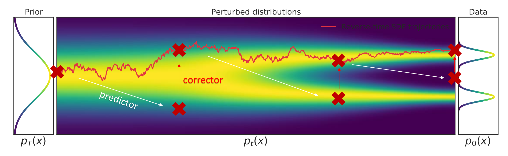
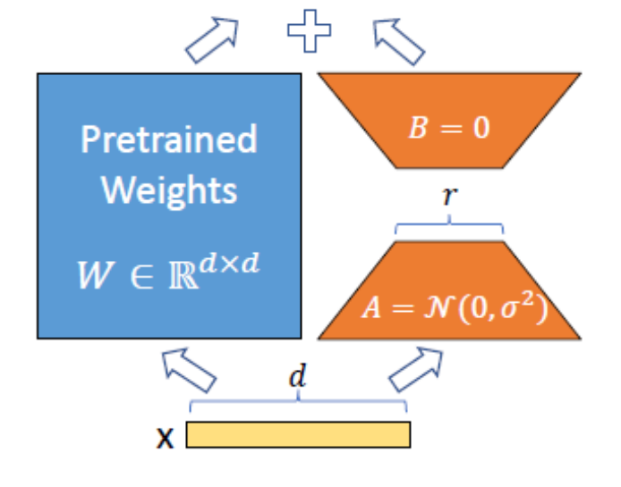
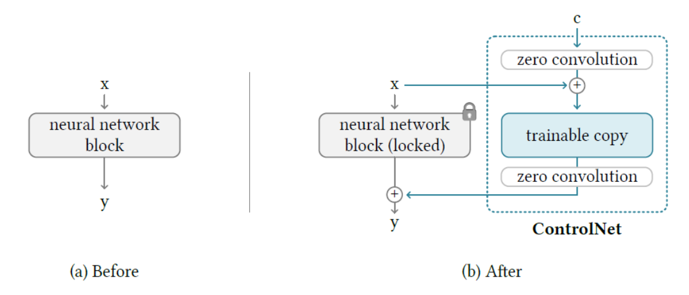
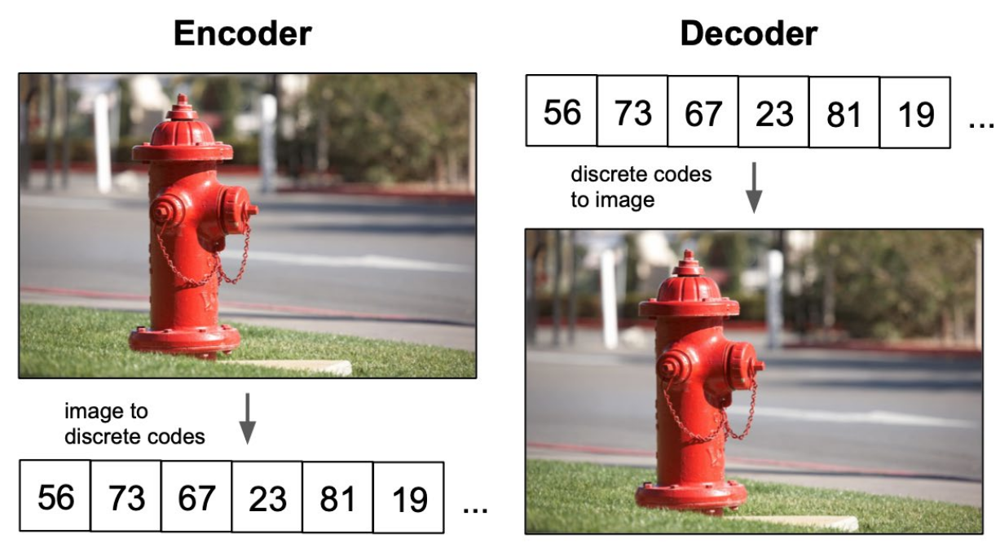
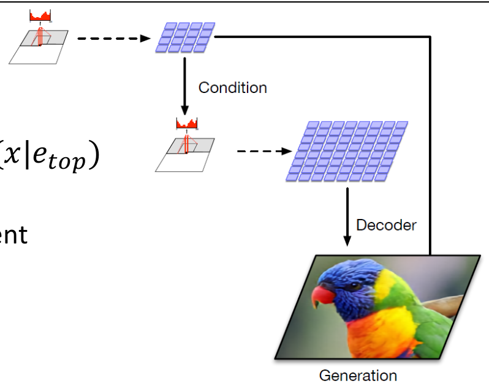
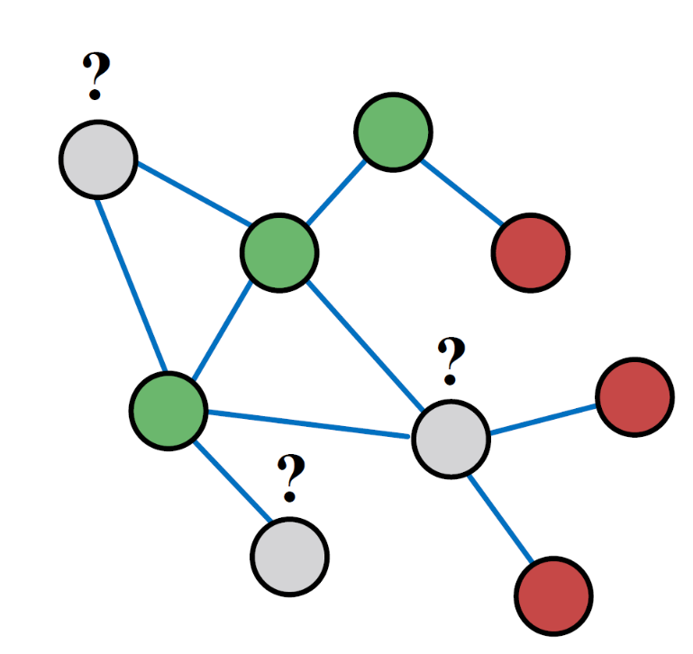
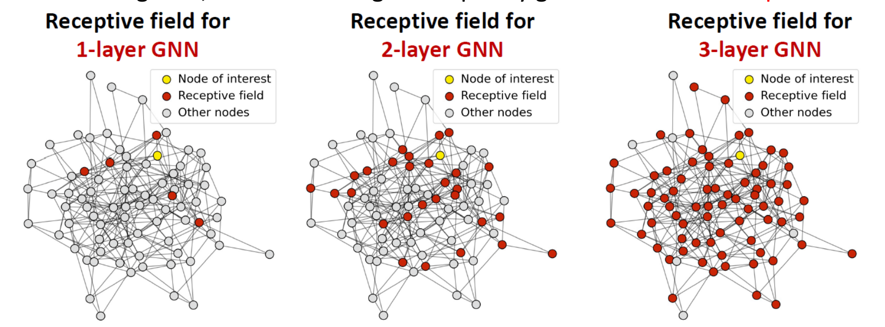
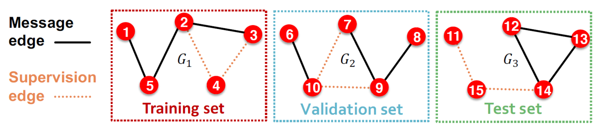
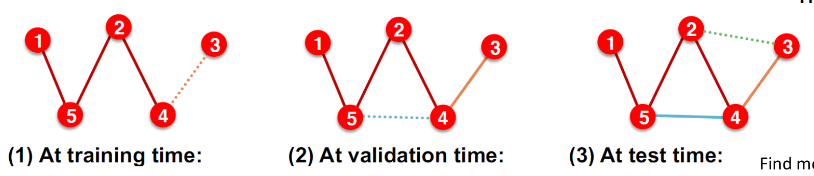

# 4. Modern Generative Models

## 4.1 Diffusion Models

**Diffusion Models**是近年来的一个重大研究成果。它在实践中有着极强的表现。究竟什么是Diffusion Model呢？

Diffusion Model的操作过程是这样的：我们从中取样出，随即进行**Forward Diffusion Process**，也就是不断给数据加噪声：

$$
q(x_t|x_{t-1})\sim \text{Normal}(\sqrt{1-\beta_t}x_{t-1},\beta_t I)
$$

而当我们采样的时候，我们从各向同性的高斯分布出发，反向去除噪声得到原始图片。更加具体的，我们先不加证明给出训练和采样的过程：

其中注意： $\epsilon_\theta(\cdot,t)$ 是我们的模型，其第二个参数只能是离散的时间 $t=1,2,\cdots,T$ 。注意不要把 $\epsilon_\theta$ 和 $\epsilon$ 搞混。此外， $T\sim 10^3$ , $\alpha_t\sim [1-10^{-2},1-10^{-4}]$ ， $\sigma_t$ 都是可调整的超参数，而

$$
\bar{\alpha_t}=\prod_{i\le t}\alpha_t.
$$

上面的训练和采样过程来自著名的**DDPM**（Denoising Diffusion Probabilistic Models） paper。如果你之前完全没有了解过Diffusion Model，你一定会大声喊出：这为什么会work？就让我们来从背后的道理出发。

### 4.1.1 Score-Based Model

#### 4.1.1.1 Basic Ideas
我们如何表示一个分布？在物理学中，是一个标量，可以理解为某种“势”；而每一个“势”一定和一个“场”相互对应。这使得人们想到定义**score function**，它就是对应的场：

$$
s(x)=\nabla \log p(x)
$$

在这种情况下，如何设定loss来描述我们的模型和实际数据的接近程度呢？我们可以用两个score function之间的**Fisher Divergence**：

$$
L=\frac{1}{2}E_{x\sim p_{\text{data}}}\left[\left|\nabla \log p_{\text{data}}(x)-\nabla \log p_\theta (x)\right|^2\right]
$$

但是我们一般不知道 $p_{\text{data}}$ 的具体形式（~~否则还训个牛魔模型~~），所以需要分部积分消去这一项：

$$
L=C+\frac{1}{2}E_{x\sim p_{\text{data}}}-\int p_{\text{data}}(x)(\nabla \log p_{\text{data}}(x))^T(\nabla \log p_\theta(x))dx\\
=\frac{1}{2}E_{x\sim p_{\text{data}}}+\int p_{\text{data}}(x)\text{tr}(\nabla \nabla \log p_{\theta}(x))dx+\text{Const}.
$$

这时，我们可以注意到使用score function的一个重大优势：比如这时我们想要写

$$
p_{\theta}(x)=\frac{f_\theta(x)}{Z(\theta)}
$$

那么我们立刻就可以**摆脱之前最头大的partition function**：

$$
L=E_{x\sim p_{\text{data}}}\left[\frac{1}{2}|\nabla f_\theta(x)|^2+\text{tr}\nabla\nabla f_\theta(x)\right]
$$

由此可见，Score-based Model是在Energy-based Model的基础上的一个提升，解决了partition function不好处理的问题。
	
一般地，我们给出score model的目标：score model学习 $s_\theta(x)$ （注意它是一个**向量**），其loss function为

$$
L(\theta)=E_{x\sim p_{\text{data}}}(\frac{1}{2}|s_\theta(x)|^2+\text{tr}\nabla s_\theta(x))
$$

这样的操作叫做**score matching**。我们当然希望把 $s_\theta$ 设置成一个neural network，但是问题在于后面的trace Jacobian：这样的一个计算至少需要 $O(d)$ 次反向传播，其中是数据的维度！这导致score matching并不scalable。我们需要设法解决这个问题。

#### 4.1.1.2 Effective Training
我们发现直接的score matching计算消耗非常大，进而需要找到一些解决方案。第一个方案就是**denoising score matching**。这个方法超级神奇，请看好：

之前我们说

$$
L(\theta)=\frac{1}{2}E_{x\sim p_{\text{data}}}[|\nabla \log p_{\text{data}}(x)-s_\theta(x)|^2]=E_{x\sim p_{\text{data}}}(\frac{1}{2}|s_\theta(x)|^2+\text{tr}\nabla s_\theta(x))
$$

这样的计算太costly了。那你看看这样好不好：我们给 $x$ 加一个小噪声：

$$
q_{\sigma}(\tilde{x}|x)\sim \text{Normal}(x,\sigma^2 I)
$$

然后转而计算

$$
L^{\text{denoised}}(\theta)=\frac{1}{2}E_{\tilde{x}\sim q_{\sigma}}[|\nabla \log q_{\sigma}(\tilde{x})-s_\theta(\tilde{x})|^2]
$$

然后我们来变魔术，注意每一步都是**恒等**的。注意

$$
L^{\text{denoised}}(\theta)=\frac{1}{2}E_{\tilde{x}\sim q_{\sigma}}[|s_\theta(\tilde{x})|^2]-\int q_\sigma(\tilde{x})\nabla_{\tilde{x}}\log q_\sigma(\tilde{x})^Ts_{\theta}(\tilde{x})d\tilde{x}+C
$$

而

$$
\int q_\sigma(\tilde{x})\nabla_{\tilde{x}}\log q_\sigma(\tilde{x})^Ts_{\theta}(\tilde{x})d\tilde{x}
=\iint \nabla_{\tilde{x}} \left({q_{\sigma}(\tilde{x},x)}\right)^Ts_{\theta    }(\tilde{x})d\tilde{x}dx\\
=\iint p_{\text{data}}(x)\nabla_{\tilde{x}} \left(\frac{q_{\sigma}(\tilde{x    },x)}{p_{\text{data}}(x)}\right)^Ts_{\theta}(\tilde{x})d\tilde{x}dx\\
=\iint p_{\text{data}}(x)\nabla_{\tilde{x}} q_\sigma(\tilde{x}|x)^Ts_{\theta}(\tilde{x})d\tilde{x}dx\\
=\iint p_{\text{data}}(x)q_\sigma(\tilde{x}|x)\nabla_{\tilde{x}}\log q_\sigma(\tilde{x}|x)^Ts_{\theta}(\tilde{x})d\tilde{x}dx\\
=E_{x\sim p_{\text{data}}(x),\tilde{x}\sim q_\sigma(\tilde{x}|x)}[\nabla_{\tilde{x}}\log q_\sigma(\tilde{x}|x)^Ts_{\theta}(\tilde{x})]
$$

因此

$$
L^{\text{denoised}}(\theta)=\frac{1}{2}E_{\tilde{x}\sim q_{\sigma}}[|s_\theta(\tilde{x})|^2]-E_{x\sim p_{\text{data}}(x),\tilde{x}\sim q_\sigma(\tilde{x}|x)}[\nabla_{\tilde{x}}\log q_\sigma(\tilde{x}|x)^Ts_{\theta}(\tilde{x})]\\
=\frac{1}{2}E_{\tilde{x}\sim q_{\sigma}}[|\nabla \log q_{\sigma}(\tilde{x}|x)-s_\theta(\tilde{x})|^2]+\text{Const}.
$$

但是我们发现莫名其妙地，现在剩下的这一项非常容易计算！因为直接就有

$$
\nabla \log q_{\sigma}(\tilde{x}|x)=-\frac{\tilde{x}-x}{\sigma^2}
$$

接下来，我们还可以再进一步化简去掉这个未知的分布。我们可以运用reparameterization trick得到

$$
L^{\text{denoised}}(\theta)=\frac{1}{2}E_{x\sim p_{\text{data}}}E_{z\sim N(0,I)}[|\frac{z}{\sigma}+s_\theta(x+\sigma z)|^2]
$$

这就是denoising score matching 的objective。很明显，为了和原始的目标尽量的接近，我们必须选取 $\sigma\to 0$ 。但是另一方面， $\sigma\to 0$ 的时候，右边的 $\frac{z}{\sigma}$ 这一项会爆炸——它方差趋于无穷大！这也就是denoising score matching的情况——虽然大大减少计算量，并且推导的每一步都很严格，但是结果的准确程度和计算难度（方差越大取样个数越多）也形成了trade-off。

另外一个方法是**Sliced Score Matching**。这个方法关注到之前的问题的实质：我们之前通过分部积分巧妙地处理掉了 $\nabla \log p_{\text{data}}(x)$ ，但是剩下的trace Jacobian的计算需要 $O(d)$ 次反向传播。但这个 $O(d)$ 在1维就不是问题了！因此，Sliced Score Matching的思路是，我们随机选取若干个方向，每一次对于一个方向 $v$ ，把所有的 $s_{\theta}$ 向量、 $\nabla \log p_{\text{data}}$ 向量和 $v$ 做点乘再进行1维的score matching。具体写出来，就是

$$
L^{\text{Sliced}}(\theta)=\frac{1}{2}E_{x\sim p_{\text{data}},v\sim N(0,I)}[|v^T\nabla \log p_{\text{data}}(x)-v^T s_{\theta}(x)|^2]\\
=E_{x\sim p_{\text{data}}}\left[\frac{1}{2}|v^Ts_\theta(x)|^2+v^T\nabla s_\theta(x)v\right]+\text{Const}.
$$

这个时候，我们发现计算只需要一次反向传播就可以了，因为

$$
v^T\nabla s_{\theta}(x)v=\nabla(v^Ts_{\theta}(x))v^T=\frac{d(v^Ts_{\theta}(yv))}{dy}
$$

其中 $y$ 是一个数。

对于这两种方法的对比，实验上发现，Sliced Score Matching虽然比Denoising Score Matching消耗的时间略长，但是精确度和稳定程度都显著高于Denoising Score Matching。

#### 4.1.1.3 Sampling
根据我们前面介绍的score matching方法，我们已经可以完成score-based model的训练了。那么有了score function（也就是每个点处的梯度信息）后，我们应该如何生成sample呢？我们自然想到**Langevin dynamics**，它需要的梯度信息恰好是我们有的：

$$
x^t=x^{t-1}+\frac{\epsilon}{2}\nabla_x\log p_{\text{data}}(x)|_{x^{t-1}}+\sqrt{\epsilon}N(0,I)\approx x^{t-1}+\frac{\epsilon}{2}s_{\theta}(x^{t-1})+\sqrt{\epsilon}N(0,I)
$$

理论上，只要 $\epsilon\to 0$ ，我们就可以在足够长的步数后得到一个分布恰是 $p_{\text{data}}$ 的sample。但是实际上呢？完全失败了！按照这个方法，模型生成的全部是噪声。为什么失败了？人们提出三种可能的原因。

1. **Manifold Hypothesis**。所有可能的数据在相比较你收集的数据集而言维度大得多的一个空间内！比如如果MNIST的所有图片在一个100维空间内，那么所有可能的手写数字图片很有可能在一个500维开外的空间里。这种时候，如果你按照数据集的概率分布画出分布图，数据点所在区域一定**有一个非常锐利的边界，而在边界上的梯度非常大**。（比如想象二维平面上一群“接近一维”的数据点构成一个圆环，那么在这个圆环的两侧 $p\approx 0$ ，而内部 $p$ 是均匀的，可以料想到在圆环的边界上gradient会巨大，而里面的gradient几乎消失。）实验测量到的情况也是如此——score loss有时特别大，有时特别小，波动非常严重。

2. **Challenge in Low Data Density Regions**。还记得我们score matching的原始目标是

$$
L(\theta)=\frac{1}{2}E_{x\sim p_{\text{data}}}[|\nabla \log p_{\text{data}}(x)-s_\theta(x)|^2]
$$

那么，可以想象到，对于 $p_{\text{data}}\approx 0$ 的区域，我们基本上得不到 $s_\theta$ 的信息。换句话说，我们的estimate score function只是在大概率的区域比较准确。然而随机采样的时候，非常关键的就是如何从小概率区域通过score function的指引走向大概率区域。这样，我们依然遇到很大的困难。

3. **Slow Mixing of Langevin Dynamics between Data Modes**。Langevin Dynamics对于disjoint的modes给出的sample并不好。作为一个小的例子，我们考虑由两个disjoint的概率密度函数组成的分布：

$$
p_{\text{data}}=\alpha p_A+(1-\alpha)p_B;p_A(x)p_B(x)=0(\forall x)
$$

那么

$$
\nabla \log p_{\text{data}}(x)=\begin{cases}
\nabla \log p_A(x), p_A(x)\ne 0\\
\nabla \log p_B(x), p_B(x)\ne 0\\
\end{cases}
$$

我们发现 $\alpha$ 的信息完全丢失了，也就是说Langevin Dynamics 完全无法体现不同mode之间的权重关系。当然，实际情况也没有绝对disjoint的分布，因此实际的问题体现在Langevin Dynamics要想得到一个准确体现各个mode相对大小的结果，还需要非常长时间的mixing。

看起来，我们的 Score-based Model在好不容易克服重重困难完成training后，在sampling又遇到了很多难以解决的问题。我们马上来介绍一个极其重要的引入，它立刻瓦解了这三个挑战。

#### 4.1.1.4 Add Gaussian to Data

如何解决问题？我们给数据**加高斯噪声**！这样我们可以解决……

1. Manifold Hypothesis。也许所有可能的数据在相比较你收集的数据集而言维度大得多的一个空间内，但是我们增加的高斯噪声可以延展到整个空间！因为高斯在每个点都有良好的梯度，我们也不必担心梯度爆炸的问题；

2. Challenge in Low Data Density Regions。也许对于 $p_{\text{data}}\approx 0$ 的区域，我们基本上得不到 $s_\theta$ 的信息。但是，只要加入高斯噪声的方差足够大，我们就可以让每个数据点都被以较大的概率取到。这样，我们也就获得了“偏远地区”的score function的信息；

3. Slow Mixing of Langevin Dynamics between Data Modes。也许Langevin Dynamics对于disjoint的modes给出的sample并不好，但是现在我们有了扩展到全空间的高斯分布，它们如同搭建了在原来 $p\approx 0$ 区域的一个“桥梁”，使得Langevin Dynamics能够感受到来自不同mode之间的权重信息。这样，我们也可以加速mixing。

但是加多少的噪声？这很明显又有一个trade-off：噪声大了，我们的score estimation（这个estimation是指对加了噪声之后的gradient）就更加精确，但是与此同时我们的数据本身已经偏离了原来的；噪声小了，虽然我们的数据更接近于，但是之前的三个问题也会更加明显。此时，人们想到：与其艰难地在这两个标准间找到平衡，不如我们**取一系列的 $\sigma_1>\sigma_2>\cdots>\sigma_l$ **，依次施加这样大小的噪声。开始的时候，噪声虽然大，但是score精确，samples能够按照我们的意愿运动到大致的位置；而随着的逐渐下降，我们的数据点逐渐逼近于各个data mode，而分布也越来越精确。这个方法就叫做所谓**Annealed Langevin Dynamics**。实验上，它有着极好的效果。

> Annealed Langevin Dynamics

- 固定 $\sigma_1,\cdots,\sigma_l$ ，步长 $\alpha_1,\cdots,\alpha_l$
- 对 $i=1,2,\cdots,l$ ：
	- 重复若干次：
		- 每次按照 $x_i^t=x_i^{t-1}+\frac{\alpha_i}{2}s_\theta(x_i^{t-1};\sigma_i)+\sqrt{\alpha_i}N(0,I)$
		更新。
	- 把最后一次的 $x_i^{(\text{final})}$ 设为 $x_{i+1}^0$
- 输出最后的结果 $x_l^{(\text{final})}$ 。

上面是具体的流程，包含了原则上待定的步长 $\alpha_i$ 。但是实际中，可以想象，因为我们希望Langevin Dynamics的噪声程度（以 $\alpha_i$ 为方差的量级）和数据的噪声程度（以为 $\sigma_i^2$ 方差的量级）尽量接近，所以我们选取

$$
\alpha_i=k\sigma_i^2
$$

其中 $k$ 是某个待定参数。

但是在此之前，让我们首先想一想该怎么训练——因为现在对于每一个噪声等级，都相当于有一个不同的dataset（就是原来的dataset加上相应的噪声）。很明显，不应该对每一个噪声等级单独训练，否则消耗时间太长了。因此，我们不如一起来训练：

$$
L^{\text{NSCN}}(\theta)=\frac{1}{l}\sum_{i=1}^l\lambda_i E_{\tilde{x}\sim q_{\sigma_i}}\left[\left|\nabla \log q_{\sigma_i}(\tilde{x})-s_{\theta}(\tilde{x};\sigma_i)\right|^2\right]
$$

其中 $\lambda_i$ 是一个待定参数（注意对于每一个 $\sigma_i$ ，我们相当于有一个单独的score function网络。当然，这也可以理解为**一个大的 $s_\theta$ 网络，其中一个输入就是 $\sigma$这个数**。这样的网络就叫做Noise Conditional Score Network （**NCSN**））。

那么对于NCSN，我们该采用哪种score matching的近似形式呢？十分明显­——既然我们本身数据集就是从noise中加上来的，我们当然要用Denoising Score Matching。我们来重写前面的loss：

$$
L^{\text{NSCN}}(\theta)=\frac{1}{l}\sum_{i=1}^l\lambda_i E_{\tilde{x}\sim q_{\sigma_i}}\left[\left|\frac{z}{\sigma_i}+s_{\theta}(\tilde{x}+\sigma_i z;\sigma_i)\right|^2\right]
$$

此时此刻， $\lambda_i$ 的选取方式也基本明确了——就从 $\frac{z}{\sigma_i}$ 的这一项看，我们希望不同的noise level给出的项大小相近。因此，我们可以选取

$$
\lambda_i=\sigma_i^2
$$

此时，表达式就成为

$$
L^{\text{NSCN}}(\theta)=\frac{1}{l}\sum_{i=1}^l\lambda_i E_{x\sim \text{data}}E_{\epsilon\sim N(0,1)}\left[\left|\epsilon_{\theta}(\tilde{x}-\sigma_i \epsilon;\sigma_i)-\epsilon\right|^2\right]
$$

其中 $\epsilon=-z$ 是随机数，而 $\epsilon_{\theta}(\cdot ;\sigma_i)=\sigma_is_\theta(\cdot;\sigma_i)$ 是我们的模型。这就是最终**NCSN的Loss function**。当然，注意实际上的训练完全可以不这样进行——一般按照下面的方式：

>NCSN training

- 固定 $n$ 为batch size。
- 重复：
	- 随机选取一系列 $x_1,\cdots,x_n\sim \text{data}$ ；随机选取 $\epsilon_1,\cdots,\epsilon_n\sim N(0,1)$ ；随机选取 $i_1,i_2,\cdots,i_n\in \{1,2,\cdots,l\}$
	- 对 $\frac{1}{n}\sum_{m=1}^n|\epsilon_\theta(x_m-\sigma_{i_m}\epsilon_m)-\epsilon_m|^2$
	进行一步梯度下降。

最后，我们可以把我们换元得到的 $\epsilon_\theta$ 代入回到Annealed Langevin Dynamics中，这样就得到了：

>NCSN sampling

- 固定 $\sigma_1,\cdots,\sigma_l,k$ ;
- 对 $i=1,2,\cdots,l$ ：
	- 重复若干次：
		- 每次按照 $x_i^t=x_i^{t-1}+\frac{k\sigma_i}{2}\epsilon_\theta(x_i^{t-1};\sigma_i)+\sqrt{k}\sigma_iN(0,I)$ 更新。
	- 把最后一次的 $x_i^{\text{final}}$ 设为 $x_{i+1}^{(0)}$
- 输出最后的结果 $x_l^{(\text{final})}$ 。

也许你此时会发现有些眼熟——的确，这就几乎和最开始的DDPM具有一样的形式！事实上，DDPM只是在NSCN的基础上增加了一些修改使得训练更加稳定。当然，如果要得到DDPM的严格数学公式，必须按照论文的原始思路进行推导，这里只是给出一个大概的观点。

我们现在终于可以回答一开始的问题了——**为什么DDPM会work？**

1. 我们的模型究竟代表什么？**它基本上就是score function，因此给出每一个点梯度的估计**。你也许一开始会奇怪，也许Diffusion Model加噪声可以做一些乱七八糟的事，但是为什么它最终能去掉噪声回到一张干净的图片？这其实就是因为在这个过程中，看起来是在学习“噪声”的 $\epsilon_\theta$ 实际上给出了梯度的信息。

2. 那为什么我们要给一张数据集里好端端的图片加噪声？也许在Diffusion Model的语境下很难理解，但是实际上在NCSN中，这就是因为之前介绍的denoising score matching的方式。我们由此也可也理解为什么 loss会有着

$$
|\epsilon_\theta(\cdots)-\epsilon|^2
$$

的形式，这其实就是因为我们要学习某个位置的梯度信息。

3. 通俗地解释Diffusion Model（或者NCSN）在做什么，就是：
我们从一个地方 $x_m$ 迈出一步到达 $x_m-\sigma_{i_m}\epsilon_m$ ，同时希望假设我们在 $x_m-\sigma_{i_m}\epsilon_m$ 处，我们的模型也能通过

$$
\epsilon_\theta(x_m-\sigma_{i_m}\epsilon_m;\sigma_{i_m})
$$

确定出来我们迈了多远，从而能在 $x_m-\sigma_{i_m}\epsilon_m$ 走回 $x_m$ 。换句话说，**我们给模型加噪声，同时希望模型学会噪声是怎么加的（通过训练最小化 $\epsilon$ 的差）。这样，模型只要在反过来的时候把噪声去掉，就能回到真实图片**。

最后，值得一提，实际应用中选取各个 $\epsilon_i$ 的大小也不是随便进行的。我们一般会取

$$
\frac{\sigma_1}{\sigma_2}=\cdots=\frac{\sigma_{l-1}}{\sigma_l}
$$

并取 $\sigma_1$ （最大的方差）基本是两个数据点之间的距离（这样可以使得数据点之间相互沟通），而 $\sigma_l$ 要足够小（比如，人眼分辨不出的噪声）。

### 4.1.2 Advanced Diffusion Models

通过前面的介绍，我们终于理解了Diffusion Model的基本原理和训练方法。但是，实际上，Diffusion Model还有很多进阶的方法和应用。

#### 4.1.2.1 From Finite to Infinite

我们回顾NCSN的sampling过程，它引入了一系列 $\sigma_i$ ，并对于每一个值做Langevin Dynamics若干次。我们很自然发现可以把它变为一个**连续的过程**：从递推关系

$$
x_i^t=x_i^{t-1}+\frac{k\sigma_i}{2}\epsilon_\theta(x_i^{t-1};\sigma_i)+\sqrt{k}\sigma_iN(0,I)
$$

我们可以把 $x_i^t-x_i^{t-1}$ 写为 $dx$ ，而右边写为函数乘 $dt$ ，从而使他变成一个**随机微分方程(SDE)**

$$
dx=-\sigma(t)^2s_\theta(x,t)dt+\sigma(t)dw
$$

其中 $dw$ 代表一个方差为 $dt$ 的高斯分布， $\sigma(t)$ 是方差随时间的函数，而符号反过来是因为这是一个“Reverse-time SDE”。训练的目标也可以写为

$$
L=\frac{1}{T}\int_0^T E_{\tilde{x}\sim q_t}\left[|\nabla \log q_t(\tilde{x})-s_\theta(\tilde{x},t)|\right]dt
$$

当然，我们并不拿这个积分来训练（怎么可能！），而是仍然采用之前的训练方式。

写成连续过程的最重要好处在于更方便的sampling。Sampling的过程被写为一个SDE，因此我们可以直接调包来求解。但是SDE求解包的精确度并不高，因此我们还需要时不时地用Langevin Dynamics进行一个correction。这样，我们就有了所谓的**Predictor-Corrector Sampling**：数值SDE求解工具包作为predictor，带我们跳一大步，节约很多sampling的计算；然后每隔一段时间使用Langevin Dynamics更新若干轮，以保证数据准确。实验上，这样的方法果然有着很好的效果。

人们还可以再进一步——SDE solver仍然需要做一定的计算，我们能不能把这个时间也省略了？事实上是可以的：反正微分方程的解具有确定性质，我们总是可以从给出。因此，不如交给Neural Network来做！这个方法被称为**Consistency Models**，我们学习一个

$$
f_\theta(x_t,t)=x_0
$$

来帮助我们更高效地sample。实际训练的方式是确保consistency： $f_\theta$ 总是把一个微分方程轨迹上的点映射到它所在的轨迹上另外一个点。

#### 4.1.2.2 Extensions and Applications

一个重要的拓展是Controllable Generation。这里Diffusion Model的巧妙之处在于，**不需要额外训练就可以做Conditioned Generation**！具体地，我们的sampling过程相当于是

$$
dx=-\sigma(t)^2\nabla_x \log p_t(x|y)dt+\sigma(t)dw
$$

注意到我们唯一不知道的一项可以写为

$$
\nabla_x \log p_t(x|y)=\nabla_x\log\frac{p_t(y|x)p_t(x)}{p_t(y)}=\nabla_x\log p_t(y|x)+\nabla_x\log p_t(x)
$$

我们发现第一项刚好是我们之前的score function，因此只需要给出第二项即可。但是第二项很明显可以通过classification等简单模型迅速给出。因此，我们发现，只要训练好diffusion model，就可以做各式各样的conditional generation。

上面的公式还提醒我们需要打开对“conditional generation”的观念。不只是给定label，我们还可以让是固定一些pixel，这样 $p_t(y|x)$ 也可以很容易给出。此外， $y$ 还可以是黑白照片，生成对应的彩色照片。

但是如果我们有一个diffusion model但不合心意（比如MNIST上面训练好的模型要被投入用来生成CIFAR的图片），该怎么办呢？研究发现，我们也并不需要完全从头开始训练：我们可以使用称为**LORA**（Low-rank Adaptation of Large Language Models）的方法。直观上来说，我们认为神经网络的参数本身虽然很多，但是实际上处于一个较低维的空间里。因此，我们可以如图所示地训练两个net $A$ 和 $B$ ，其参数量都较小，但是也可也实现整个模型的适应。

另外一个应用是所谓**ControlNet**：比如给定一个可以生成图片的Diffusion Model，我们通过一定的训练使得它可以condition on 一些其他信息，比如文字或者动作。对于这样复杂的任务，我们就不能再“空手套白狼”了，而是应该训练一个和原先模型一样的copy，再加入一些用来decode和encode额外信息的层（图中的zero convolution只是在一个情况中的示例）。这样我们可以保证trainable copy在原有的基础上做出一些改动，使得最后符合 $c$ 的要求。

## 4.2 Structures in Deep Learning
### 4.2.1 Structured Priors in Generative Models

我们之前的很多基于latent variable的generative models都是从一个来自均匀高斯分布的latent variable $z$中采样来生成图片的。当时我们提出，这样的采样方式并没有太大的问题，因为本身latent variable代表什么就是由我们的模型定义的.但实际上Gaussian（或者说任何连续的分布）都会带来一定的问题：
- Mode Collapse：因为$z$本身是uni-modal的，因此我们的模型也会倾向于生成uni-modal的图片；
- Blurry Samples：考虑到 $z$本身是可以以无穷小的精度连续变化的，但$z$的很小的变化一定会带来图片在两个mode之间的渐变，因此我们的模型很可能生成模糊的图片。

一个直接的想法是我们把$z$变成**离散的**。具体地，我们把每一个图片$x$对应的latent variable $z$设置为一个序列$z_1,z_2,\cdots,z_h$（$h$仍然是之前的hidden dim），并且取
$$
z_i\in \text{Uniform}(0,1,\cdots,K-1).
$$
这样直接解决了这样两个问题。

可以看到，我们的这个更改对于VAE最为友善：我们完全不需要修改encoder的具体形式，它仍然是 $p(x|z;\theta)$；而decoder则可以简单地修改为一个softmax，取
$$
z_i\sim q_i(z_i|x;\phi)=\text{softmax}(\mathbf{l_i}(x;\phi))
$$
（这里粗体的$\mathbf{l_i}$表示一个向量，维度为$K$.）
但当我们看到原先的VAE的loss function的时候，就会意识到一个严重的问题：
$$
J(\theta,\phi)=E_{z\sim q(z|x;\phi)}[\log p(x|z;\theta)]-\text{KL}(q(z|x;\phi)||p(z))
$$
第二项总归是好说的，但第一项现在就**不能用之前的reparameterization trick了**：我们必须遍历离散分布中所有可能的$z$。这并不实际可行——它的计算量随着$h$的增大呈指数级增长。我们需要一些新的方法。

#### 4.2.1.1 Gumbel-Softmax VAE
我们来介绍一个极其逆天的trick。先别管我们在干什么，请看下去……

定义一个全新的分布——**Gumbel distribution**，它的PDF是
$$
f_{\text{Gumbel}}(x)=\frac{1}{\beta}\exp(-z-e^{-z}), z=\frac{x-\mu}{\beta}.
$$
容易看出它有一个close form CDF：
$$
F_{\text{Gumbel}}(x)=e^{-e^{-z}}.
$$
这使得它可以被有效地sample：设$u\sim \text{Uniform}(0,1)$，则
$$
X=\mu-\beta\log (-\log u)\sim \text{Gumbel}(\mu,\beta).
$$

好的，但这有什么用处呢？那让我们来看最重要的一个结论：

> **Lemma. (Gumbel Softmax Trick)**

如果$X_i\sim \text{Gumbel}(\mu_i,1)$，$1\le i\le K$，则
$$
\text{argmax} X_i\sim \text{softmax}(\mu_1,\cdots,\mu_K).
$$

> **Proof.**
计算$X_1$最大的概率：
$$
p_1=\int_{-\infty}^\infty e^{-z_1-e^{-z_1}}dz_1\cdot e^{-e^{-(z_1+\mu_1-\mu_2)}}\cdots e^{-e^{-(z_1+\mu_1-\mu_K)}}
$$

$$
=\int_0^{\infty}\exp(-t-e^{\mu_2-\mu_1}t-\cdots-e^{\mu_K-\mu_1}t)dt.
$$

$$
=\frac{e^{\mu_1}}{e^{\mu_1}+\cdots+e^{\mu_K}}.\qquad \Box
$$

此时，也许你逐渐知道我们想要干什么了——回顾之前$z\sim q(x|z;\phi)$的高斯分布可以用reparameterization trick写成$z=\beta(x;\phi)+\sigma(x;\phi)\cdot \epsilon$的形式，而刚才我们发现softmax的categorical的分布看起来不能这样做。但现在我们发现**完全可以**这样做：原来的
$$
z_i\sim \text{softmax}(\mathbf{l_i}(x;\phi))
$$
可以立刻被改写为
$$
z_i=\text{argmax}\left[{\mathbf{l_i}(x;\phi)-\log (-\log \mathbf{u})}\right], u_j\sim \text{Uniform}(0,1).
$$
我们就可以作reparameterization trick了：
$$
E_{z\sim q(z|x;\phi)}[\log p(x|z;\theta)]=E_{u\sim \text{Uniform}(0,1)}[\log p(x|\text{argmax}[\mathbf{l}(x;\phi)-\log (-\log \mathbf{u})];\theta)].
$$
当然，因为argmax会丢失一定的gradient信息，实际一般采用一个比例的softmax代替argmax（注意这里的softmax和之前的softmax已经不是一个来源了）：
$$
J(\theta;\phi)=E_{u\sim \text{Uniform}(0,1)}\left[\log p\left(x\mid\text{softmax}\left[\frac{\mathbf{l}(x;\phi)-\log (-\log \mathbf{u})}{\tau}\right];\theta\right)\right]-\text{KL term},
$$
这里$\tau$取的比较小，甚至可以采用annealing的方法。这样最后得到的模型就是2017年提出的著名的**Gumbel-Softmax VAE**。

可以看出，Gumbel-Softmax VAE解决了之前我们Loss对hidden size $h$指数级别依赖性的问题。但它依然不是特别优秀——有一个costly的softmax operator（对$K$个数计算softmax），这使得它仍然只能把$K$扩展到100左右，只是普通VAE的水准。对于更大、更为modern的模型，$K$一般要是几千，这样的方法依然吃不消。

#### 4.2.1.2 VQ-VAE (Vector Quantized VAE)

同是2017年提出的VQ-VAE认为我们应该改变思路：如果一个固定的$x$直接给出固定的$z$，就**根本不需要计算期望**了！这一模型提出，我们可以用nearest neighbor刻画最后选出的$z$：创造一个dictionary $E$，包含$K$个向量$e_1,\cdots,e_K$。对每一个$x$，我们根据一个neural net计算一个向量$\mathbf{g}(x;\phi)$，然后计算
$$
z_i=\text{argmin}_j||\mathbf{g}(x;\phi)_i-e_j||.
$$

但是另外一个问题就是，现在的proposal $q$不容易训练。回想之前，我们通过加入KL divergence penalty来保证proposal和真实的latent variable的分布尽量接近；但现在$q(z|x)$是一个“狄拉克分布”，我们没有办法再用KL刻画。VQ-VAE并不试着解决这个问题，而是决定另辟蹊径，直接用一个新的loss function来训练dictionary $E$（注意其中的$K$个向量都是可训练的）和neural net $\mathbf{g}$。

直观上来说，我们希望每一次抽中的 $\mathbf{g}(x;\phi)$都尽量接近于一个dictionary中的真实向量。这启示我们在loss中加入一项
$$
L_{\text{dict}}=\sum_{i=1}^h|e_{z_i}-\mathbf{g}(x;\phi)_i|^2.
$$
但这样naive的构造存在cheating solution：所有$z_i$全都和$\mathbf{g}$聚到一起。VQ-VAE通过构造两个Loss并分别stop gradient解决这个问题：
$$
L_{\text{dict}}=\sum_{i=1}^h|e_{z_i}-\text{SG}[\mathbf{g}(x;\phi)_i]|^2+\beta \sum_{i=1}^h|\text{SG}[e_{z_i}]-\mathbf{g}(x;\phi)_i|^2,
$$
其中$\beta$是超参数。这样总的loss就是（注意每个$x$唯一确定了$z$）
$$
L=\log p(x|z({x;\phi});\theta)+\sum_{i=1}^h|e_{z_i}-\text{SG}[\mathbf{g}(x;\phi)_i]|^2+\beta \sum_{i=1}^h|\text{SG}[e_{z_i}]-\mathbf{g}(x;\phi)_i|^2
$$

当然实验上也有许多技巧，比如对变得很快的neural net $\mathbf{g}(x;\phi)$求running average等等。

> 你可能会疑问：之前我们的VAE的推导中，KL的那一项不是为了约束ELBO和真实的目标尽量接近而引入的吗？那去掉这一项为什么还能work？这里，有一个解释：可以不要把目标看作是VAE的目标，而是一个“随机化”的AE的目标——我们依然是给一个 $x$，生成一个 $z$，然后再生成一个 $x$；只不过，现在给定$z$生成$x$的过程含有随机性。这样，我们的目标当然就是让数据集里面的 $x$的log prob最大。

最后，我们还要面对一个问题——我们该如何sample呢？之前，我们只需要从标准高斯分布中随机采出$z$即可；但现在我们完全不知道训练出来的$q(z)$是什么样子！但别急——我们还可以**再训练一个neural network** $p(z;\psi)$，让他来近似 $q(z)$。

如何设计这样的一个$p(z;\psi)$呢？考虑到我们的$z$本身就是一个每个分量都是index的vector，对于图片我们自然选用离散的pixelCNN，而对于音频等sequential data我们可以用WaveNet或者Transformer。具体训练过程就是，当整个VQ-VAE训练完毕后，我们对每一个数据集中的元素$x$用encoder生成$z$，再把所有的这些$z$做成数据集来训练$p(z;\psi)$。

> **Implement Details**
>
> 你可能会奇怪：我们之前提到的PixelCNN的输入是一个图片，而现在我们encoder给出的latent variable是一列数字（参看上面的插图），那该怎样训练PixelCNN呢？这是因为我们前面的介绍只是一个概念上的描述：实际应用中的encoder中的 $\mathbf{g}$ 是一个卷积网络，其输出是一个图片一样的feature map。我们在找nearest neighbor的时候也是固定一个$(h,w)$对，对所有的$c=0,1,\cdots,C-1$得到一个向量 $\mathbf{g}_{h,w}\in \mathbb{R}^C$，然后在dictionary里面找这个向量的nearest neighbor。这样，可以看到latent variable并非之前图片里展示的那样是一个数列，而是一个$H\times W$的index tensor。

实验上，VQ-VAE和它的scale up版本在生成图片的实际质量方面吊打（尤其是在avoid mode collapse方面）当时最强的BigGAN。这是VAE的发展跨出的巨大一步，阐释了structured prior的重要性。

#### 4.2.1.3 VAE with Discrete Latent: Further Applications

许多吊打的图片生成模型都是基于含有Discrete Latent Variable的VAE的（主要是我们前面提到的Gumbel-Softmax VAE和VQ-VAE）。下面简单介绍几个这样的模型和它们的改进思路：

**VQ-VAE 2**： 它的改进在于叠两层VQ-VAE：Top Level负责获得全局的信息，而Bottom Level用来给出细节。两层encoder都使用ResNet，而decoder也采用ResNet来upsample。

 

在sample的时候，我们训练一个PixelCNN和Attention结合的模型，并让生成底层的$x$的时候用到上层$z$的信息。

**DALL-E**：DALL-E实现了zero-shot text to image generation：只需要给出一段文字就可以产生图片。它并非采用VQ-VAE，而是采用高维度的Gumbel-Softmax VAE。对于文字，它采用Transformer来处理，在生成图片的时候加入对文字的cross attention。

### 4.2.2 Deep Learning For Structured Data

设想这样的一个问题：一个朋友圈中有若干人，每个人的年龄、性别、职业、爱好等等信息都是已知的。同时，我们还知道一些人之间存在关系（比如，是朋友）。现在，假设有一件产品需要推销，如果已知一部分人接受了这个产品（比如记作绿色），另一部分人拒绝了（记作红色），我们希望根据这些信息预测其他人的接受程度。我们能否训练一个神经网络完成这个任务呢？

容易发现，这样的问题可以抽象为一个图。这就引出了**Graph Neural Network**的概念：神经网络需要学习出来图中的某种结构，然后根据这个结构进行预测。这样的任务也就被称为**Graph Learning**。

#### 4.2.2.1 Representation Learning

解决一般的Graph Learning问题的通常思路是通过给定的Graph来学习一个 graph的representation。具体地，一个图包含的信息是：
- 顶点集 $V$ 和已知的邻居 $N(V)$；
- 每一个节点的feature $x(v)$, $v\in V$；
- 若干partial label $y(v)\in \{0,1,\text{Unknown}\}$

而一个representation是对每一个$v$ 给出一个 $z(v)$，并且这个特征可以直接用作预测（比如对于分类的问题，直接把 $z(v)$接一个MLP就可以给出$y(v)$）。但注意$z(v)$必须用到顶点集中其他顶点的信息，否则就丢失了图具有的额外特性。

为了解决这个问题，**Graph Convolutional Network**（GCN）诞生了。

#### 4.2.2.2 GCNs

在图片中，我们知道卷积提取相近的pixel中的信息；而现在，我们在图中希望干一样的事情。但问题在于，之前一个图片的pixel周围一定恰好是8个pixel，因此我们可以固定一个卷积核；但现在每一个图中节点的邻居个数是未知的。因此，我们必须采用一个新的方法。

GCN使用**Message Aggregation**的思路解决这一问题：我们给每一个点$v$创造一个信息$h(v)$，再让它的邻居把自己的信息传给这个节点。这样，每个点可以具有自己的信息和邻居的信息，从而获得了更多的判断依据来使用MLP等结构作出更好的representation。当然，具体处理这些aggregate到的信息的方式带来了很多variants。最早的message aggregation方案是简单地把信息进行average pooling（即求平均数）。

当然，很容易想到，我们肯定不希望只获得到邻居这一层的信息，因此我们可以作multi-layer aggregation：这也很好理解，我们从一个节点出发bfs两层，并按照层数分别整理信息。这就把一个简单的Graph Convolution升级成为了一个**Graph Convolution Network**。

我们可以看到，在GCN中，图只是作为拓扑结构出现（决定了计算树的形状）；而其最关键的思想就是从边上传递信息作aggregation。

我们也可以把GCN用数学公式表达出来。首先，我们写出Graph Convolution的表达式：
$$
z(v)=\sigma\left(W\frac{1}{\text{deg}(v)}\sum_{u\sim v}x(u)+B\cdot x(v)\right),
$$
其中$W,B$是两个矩阵（当然，也可以换成MLP）。这整个过程可以抽象为
$$
Z=\text{GC}(G,X),
$$
其中$X$代表图上每个vertex的feature组合出来的集合，而$Z$代表输出的每个vertex的representation。然后，我们可以用多层GC组合出GCN：
$$
H^{(l)}=\text{GC}(G,H^{(l-1)}), l=1,\cdots,L.
$$
其中$H^{(0)}=X,H^{(L)}=Z$就分别是我们想要的输入和输出。

#### 4.2.2.3 Aggregation Functions

我们前面提到，不同的Aggregation方式会产生不同的GCN variants。现在就让我们介绍一些（除了前面最简单的average pooling之外）常见的Aggregation方法。

**GraphSage**这篇2017年的paper介绍了几种aggregation的方式：我们可以把信息拿过来过MLP，再做max pooling；也可以使用LSTM。但注意到LSTM的处理方式对信息的顺序有依赖，因此我们可以先做一个random shuffle再过LSTM。同时，在训练的时候，我们可以采用layer norm，也可以对节点或者feature进行dropout。

当然，你可能会想到，对于这样的permutation invariant的问题，我们为何不采用attention呢？2018年在attention刚提出后立刻产生的**GAT**（Graph Attention Network）就是这样的一个模型。它的思路就是对每个节点，从自己向其他所有邻居计算attention。我们甚至可以用multi-head的版本。值得一提，**GAT也可以被视作一种transformer**，只不过在极大量级的输入长度（等于图的节点个数）上大量的attention都被mask掉了，只剩下邻居之间的互相attention。

另外一个研究从representation power的方向考虑。他发现，之前许多基于pooling的aggregation很容易丢失信息。就从最直观的例子而言，以average pooling为例，我们的模型不能区分
$$
\dbinom{1.0}{0.5},\dbinom{0.5}{1.0}
$$

和

$$
\dbinom{0.75}{0.75},\dbinom{0.75}{0.75}
$$
这两种完全不同的，邻居传来的信息。因此，2019年提出了**Graph Isomorphism Network**（GIN）：我们用**求和**作Aggregaton Function！直观上，如果normalize的合适，我们的模型应该能学会区分上面两种情况。不仅如此，数学上还证明了这样的模型可以具有和判断图isomorphism 的WL-test相同的表现力。粗略地说，WL-test的算法是给每个点赋值一个$h$，然后不断按照
$$
h(v)^{(l)}=\text{hash}\left(h(v)^{(l-1)};h(N(v))^{(l-1)}\right),
$$
更新，直到不变。可以看出，isomorphic的图最后得到的各个$h$一定排序后是一样的。可以看出，我们的GIN的hidden state的更新方式
$$
h(v)^{(l)}=\text{MLP}\left(h(v)^{(l-1)};\sum_{u\in N(v)}h(u)^{(l-1)}\right)
$$
和WL-test十分相像。这也就是为什么它具有很强的表现能力。（当然，具体的数学证明是十分复杂的）

#### 4.2.2.4 More On Representation Powers: Can we stack GCs?

Deep Learning的一个好习惯是把所有的东西都搞的非常deep。但在GCN这里，结论是：**更多层的GC aggregation并不会增强模型的表现能力**。这里的问题叫做**Over-smoothing**：叠了太多层GC之后，所有的点的representation都倾向于变成一个相同的数。这一问题的来源在于receptive field：就如同“世界上任何两个人都是六步之内的朋友”，几层叠加后，每一个点都感受到了所有节点的信息。这样就会使得所有的点的representation被磨平。

为了解决这个问题，提出了许多pratical skills。
- **Increase the capability within layer**, instead of stacking layers：我们可以别搞那么多层，只要把每一层里面的MLP搞得表现力很强，就也可以增强模型的表现力。同时，也可以加入"pre process"和"post process"的MLP。
- **Add virtual edges/nodes**：我们可以在图中加入一些虚拟的边或者节点，这样可以在保持模型GC层数不便的情况下增加每个点的receptive field，从而增强模型的表现力。具体地，比如edge augmentation，把所有最短路为2的点连边；或者在找朋友的问题中，可以建一个大的节点代表一个社区或者共性（比如，把所有清华的学生和“清华”这个virtual node连边）。
- **Skip Connection**：

#### 4.2.2.5 Edge Prediction

我们来考虑另外一类在Graph Learning方面十分有趣的问题：**Edge Prediction**。这个问题的设定是，我们有一个图，有一些边已知相连或不相连，但是有一些边是未知的。我们希望根据已知的边来预测缺失的边。这个问题在很多实际应用中都有着很多应用，比如在社交网络中可以判断两个未见面的人是否会互相关注，或者作**recommandation system**：给定一个User-Item的二部图，我们可以根据用户已经买过的商品来推荐他可能会喜欢的商品。

可以想到，这个问题可以用之前的GCN解决：可以试着用两个点的representation $z(v)$来预测它们之间是否有边。但这一问题的主要难点实际上是如何**寻找数据集**。

可能有些反直觉的是，这个问题的表述一般不是说给定一堆图（比如 $10^4$张），在这些图上训练后投入一个新的图的计算；而是说给定**一张很大的图**（比如$10^4$个节点），其中已知很多连边和不连边（比如，连了$10^6$条边），但现在我们需要判断剩下一些边（比如 $10^4$条）是否相连。这样，如何利用已知信息进行训练就成了一个比较大的问题。

第一种解决方法被称为**Inductive Link Prediction Split**：把一张图分成若干部分，第一个部分用作train，第二部分用作valid，第三部分用作test。每一部分都有一系列message edge（代表给定的已经连接的边，GCN就用这些边传递信息）和supervision edge（代表需要预测的信息）。在不同部分之间的边则直接被我们丢弃。

容易看出，这种方法可能丢掉很重要的关系，也可能带来实际应用的不便：最后需要预测的边可能在第一部分和第三部分之间。因此，另一种方法被提出：**Transductive Link Prediction Split**。这种方法的思路是，我们把所有的边分为四份：
1. Training Message Edges
2. Training Supervision Edges
3. Validation Edges
4. Test Edges

在训练的时候，模型拿着1预测2；在valid的时候，模型拿着1,2预测3；在test的时候，模型拿着1,2,3预测4。如图所示。

因为任何时刻模型都可以看到所有节点，因此这种方法更加强大，也因此更为popular。

结束了？不！就如我们在Word Embedding中提到的那样，但凡是二分类问题，我们必须又有正例，又有负例。这个问题该如何选取负例呢？当然，可以随机选取；但如果仔细思考，有些问题随机选取负例不是特别有效：比如判断两个人是否是朋友，如果你选取两个从未谋面的人（比如一个在中国，一个在美国）作为负例，那么这个负例的信息量就不是特别大。因此，在具体问题中，人们一般会有很specific的heuristic来选取负例。